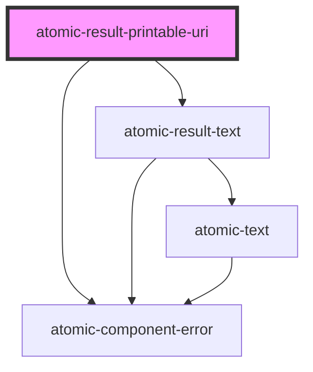

# atomic-result-uri

<!-- Auto Generated Below -->

## Properties

| Property           | Attribute             | Description                                                                                                                                                | Type     | Default |
| ------------------ | --------------------- | ---------------------------------------------------------------------------------------------------------------------------------------------------------- | -------- | ------- |
| `maxNumberOfParts` | `max-number-of-parts` | The maximum number of Uri parts to display. This has to be over the minimum of `3` in order to be effective. Putting `Infinity` will disable the ellipsis. | `number` | `5`     |

## Shadow Parts

| Part                                    | Description                                        |
| --------------------------------------- | -------------------------------------------------- |
| `"result-printable-uri-link"`           | A clickable link in a printable URI result.        |
| `"result-printable-uri-list"`           | A list of results as printable URIs.               |
| `"result-printable-uri-list-element"`   | An element in the list of printable URIs.          |
| `"result-printable-uri-list-ellipsis"`  | The clickable ellipsis of a result URI.            |
| `"result-printable-uri-list-expanded"`  | The expanded list of printable URIs.               |
| `"result-printable-uri-list-separator"` | The visual separator between each part of the URI. |

## Dependencies

### Depends on

- [atomic-result-text](../atomic-result-text)
- [atomic-component-error](../../atomic-component-error)

### Graph

----------------------------------------------

*Built with [StencilJS](https://stenciljs.com/)*
