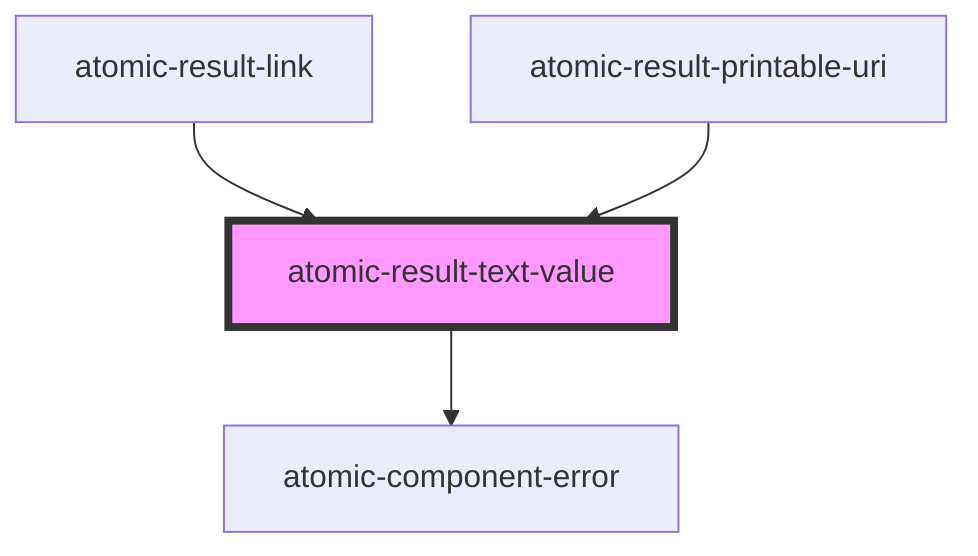

# atomic-result-text-value

<!-- Auto Generated Below -->

## Properties

| Property                | Attribute          | Description                                                                                                                                                                                                             | Type      | Default     |
| ----------------------- | ------------------ | ----------------------------------------------------------------------------------------------------------------------------------------------------------------------------------------------------------------------- | --------- | ----------- |
| `property` _(required)_ | `property`         | The result property which the component should use. Will look in the Result object first and then in the Result.raw object for the fields. It is important to include the necessary fields in the ResultList component. | `string`  | `undefined` |
| `shouldHighlight`       | `should-highlight` | If true, will look for the corresponding highlight property use it if available.                                                                                                                                        | `boolean` | `true`      |

## Shadow Parts

| Part                      | Description                                   |
| ------------------------- | --------------------------------------------- |
| `"result-text-highlight"` | The highlighted elements from the text value. |

## Dependencies

### Used by

 - [atomic-result-link](../atomic-result-link)
 - [atomic-result-printable-uri](../atomic-result-printable-uri)

### Depends on

- [atomic-component-error](../../atomic-component-error)

### Graph

----------------------------------------------

*Built with [StencilJS](https://stenciljs.com/)*
