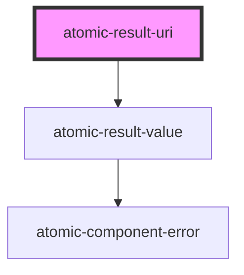

# atomic-result-uri

<!-- Auto Generated Below -->

## Shadow Parts

| Part           | Description    |
| -------------- | -------------- |
| `"result-uri"` | The result uri |

## Dependencies

### Depends on

- [atomic-result-value](../atomic-result-value)

### Graph

----------------------------------------------

*Built with [StencilJS](https://stenciljs.com/)*
