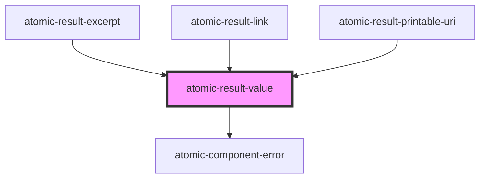

# atomic-result-value

<!-- Auto Generated Below -->

## Properties

| Property              | Attribute               | Description                                          | Type                  | Default     |
| --------------------- | ----------------------- | ---------------------------------------------------- | --------------------- | ----------- |
| `shouldHighlightWith` | `should-highlight-with` | Which highlight should the value be highlighted with | `string \| undefined` | `undefined` |
| `value` _(required)_  | `value`                 | Which result value should the component render       | `string`              | `undefined` |

## Dependencies

### Used by

 - [atomic-result-excerpt](../atomic-result-excerpt)
 - [atomic-result-link](../atomic-result-link)
 - [atomic-result-printable-uri](../atomic-result-printable-uri)

### Depends on

- [atomic-component-error](../../atomic-component-error)

### Graph

----------------------------------------------

*Built with [StencilJS](https://stenciljs.com/)*
