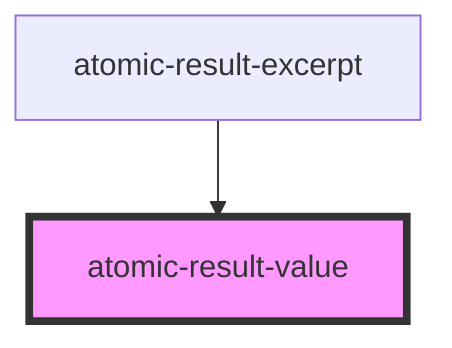

# atomic-result-value

<!-- Auto Generated Below -->

## Properties

| Property              | Attribute               | Description | Type                                                                                                                                     | Default     |
| --------------------- | ----------------------- | ----------- | ---------------------------------------------------------------------------------------------------------------------------------------- | ----------- |
| `shouldHighlightWith` | `should-highlight-with` |             | `"excerptHighlights" \| "firstSentencesHighlights" \| "printableUriHighlights" \| "summaryHighlights" \| "titleHighlights" \| undefined` | `undefined` |
| `value`               | `value`                 |             | `string`                                                                                                                                 | `''`        |

## Dependencies

### Used by

 - [atomic-result-excerpt](../atomic-result-excerpt)

### Graph

----------------------------------------------

*Built with [StencilJS](https://stenciljs.com/)*
