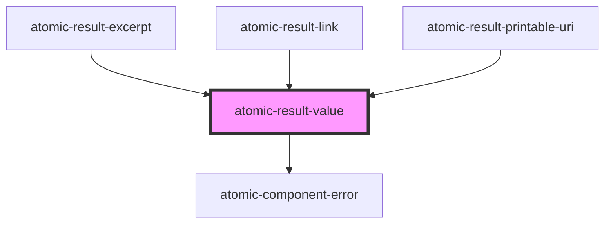

# atomic-result-value

<!-- Auto Generated Below -->

## Properties

| Property              | Attribute               | Description                                                                                                                                                                 | Type                                         | Default      |
| --------------------- | ----------------------- | --------------------------------------------------------------------------------------------------------------------------------------------------------------------------- | -------------------------------------------- | ------------ |
| `currency`            | `currency`              | When the `format` is `currency`, allows to define which currency to display.                                                                                                | `string`                                     | `'USD'`      |
| `dateFormat`          | `date-format`           | When the `format` is `date`, defines the format of the date itself. Available formats: https://day.js.org/docs/en/display/format                                            | `string`                                     | `'D/M/YYYY'` |
| `format`              | `format`                | The format in which to display the result value. Possible values are `text`, `date`, `number` or `currency`.                                                                | `"currency" \| "date" \| "number" \| "text"` | `'text'`     |
| `numberOfDigits`      | `number-of-digits`      | When the `format` is `number`, allows to define the number of digits.                                                                                                       | `number \| undefined`                        | `undefined`  |
| `shouldHighlightWith` | `should-highlight-with` | Which highlight should the value be highlighted with. Possible values are `firstSentencesHighlights`, `excerptHighlights`, `printableUriHighlights` or `summaryHighlights`. | `string \| undefined`                        | `undefined`  |
| `value` _(required)_  | `value`                 | Which result value should the component render                                                                                                                              | `string`                                     | `undefined`  |

## Dependencies

### Used by

 - [atomic-result-excerpt](../atomic-result-excerpt)
 - [atomic-result-link](../atomic-result-link)
 - [atomic-result-printable-uri](../atomic-result-printable-uri)

### Depends on

- [atomic-component-error](../../atomic-component-error)

### Graph

----------------------------------------------

*Built with [StencilJS](https://stenciljs.com/)*
