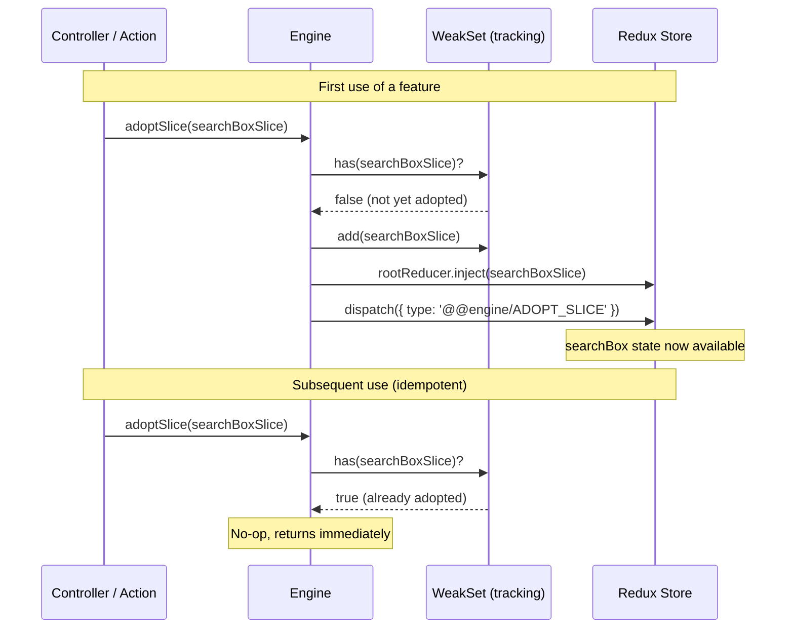

# Slice Adoption Mechanism

> Part of the [Headless Future architecture](docs/architecture.md). See the [Glossary](docs/glossary.md) for term definitions.

## Overview

The store implements a **dynamic slice adoption** pattern, starting with no slices and only adopting them as needed when upper layers access them.

## Lifecycle



## How It Works

### 1. Initialization

When `initialize()` is called, the store starts with **zero slices**:

```typescript
import {initialize} from '@coveo/headless-future/core';

initialize(); // Store is created but empty
```

### 2. Automatic Adoption

Slices are automatically adopted when:

- A **pre-defined selector** is used
- A **mutation** is dispatched

```typescript
import {
  read,
  mutate,
  searchSelectors,
  searchMutations,
} from '@coveo/headless-future/core';

// This automatically adopts the 'search' slice
const query = read(searchSelectors.query);

// This also adopts the 'search' slice (if not already adopted)
mutate(searchMutations.setQuery('laptops'));
```

### 3. Idempotent Adoption

Once a slice is adopted, subsequent operations on that slice work seamlessly:

```typescript
// First access - adopts the slice
const page1 = read(paginationSelectors.currentPage); // Adopts 'pagination'

// Subsequent accesses - slice already adopted
mutate(paginationMutations.setPage(2)); // No re-adoption
const page2 = read(paginationSelectors.currentPage); // No re-adoption
```

## Available Slices

The following slices can be adopted:

- `searchBox` - Search query string
- `results` - Search results collection, loading state, and errors
- `result` - Per-result ephemeral UI state (selected, expanded)
- `facets` - Facet definitions and selections
- `pagination` - Page navigation state
- `configuration` - API credentials and settings

## Best Practices

### ✅ Recommended: Use Pre-defined Selectors

Pre-defined selectors automatically adopt slices:

```typescript
// Recommended - automatic slice adoption
const query = read(searchSelectors.query);
const results = read(searchSelectors.results);
```

### ⚠️ Custom Selectors: Use Optional Chaining

If you need custom selectors, use optional chaining since slices may not be adopted:

```typescript
// Custom selector with optional chaining
const customSelector = (state: State) => state.search?.query ?? '';
const query = read(customSelector);
```

### ❌ Avoid: Direct Property Access Without Adoption

This will fail if the slice hasn't been adopted:

```typescript
// DON'T DO THIS - may fail
const query = read((state) => state.search.query); // Error if search not adopted
```

## Implementation Details

### Internal Mechanism

The adoption mechanism works by:

1. **Tracking adopted slices** in a `WeakSet<Slice>` on the Engine instance
2. **Using RTK's `combineSlices().inject()`** to dynamically add slice reducers
3. **Dispatching a sentinel action** (`@@engine/ADOPT_SLICE`) to trigger state recomputation
4. **Idempotent checks** — if the slice is already in the `WeakSet`, adoption is a no-op

The `WeakSet` (rather than `Set`) ensures that slices can be garbage collected if no longer referenced.

### Layer 3 `WeakSet<Engine>` Pattern

Actions (Layer 3) use a separate `WeakSet<Engine>` at the module level to track which engines have already adopted a given slice. This provides an additional layer of idempotency across multiple action calls:

```typescript
const loadedEngine = new WeakSet<Engine>();

export const setQuery = (engine: Engine) => {
  if (!loadedEngine.has(engine)) {
    engine.adoptSlice(searchBoxSlice);
    loadedEngine.add(engine);
  }
  return (query: string) => engine.mutate(searchBoxMutations.setQuery(query));
};
```

See the [Glossary](docs/glossary.md#weaksetengine-pattern) for more details.

### State Type

The `State` interface has all properties as optional to reflect that slices may not be present:

```typescript
interface State {
  search?: SearchState;
  facets?: Record<string, FacetState>;
  pagination?: PaginationState;
  configuration?: ConfigurationState;
}
```

## Benefits

1. **Smaller initial footprint** - Only load what's needed
2. **Lazy loading** - Slices are added on-demand
3. **Flexibility** - Upper layers control what features to use
4. **Type safety** - TypeScript enforces optional chaining where needed
5. **Zero configuration** - Developers don't manually register slices

## Verification

Run the verification scripts to see the mechanism in action:

```bash
# Build the package
pnpm build

# Verify slice adoption
node dist/js/verify-slice-adoption.js

# Verify Layer 0 interface
node dist/js/verify-layer0.js

# Verify no side effects
node dist/js/verify-no-side-effects.js
```
