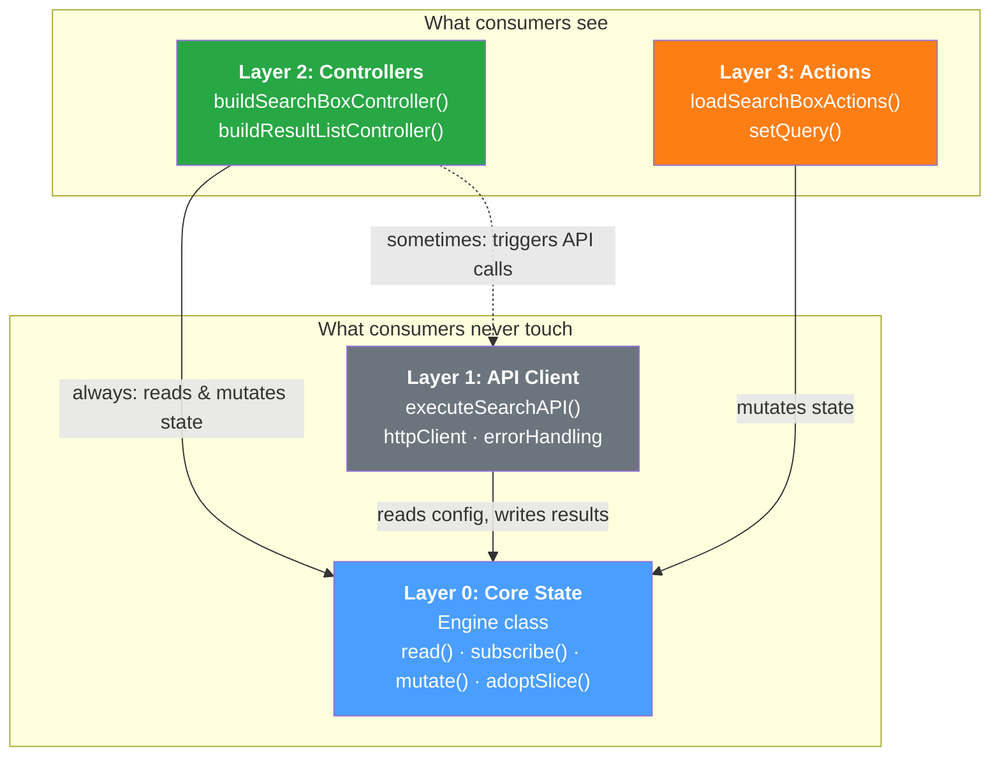
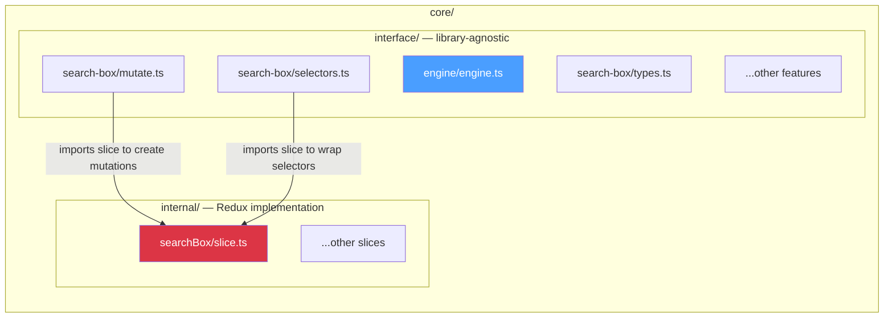
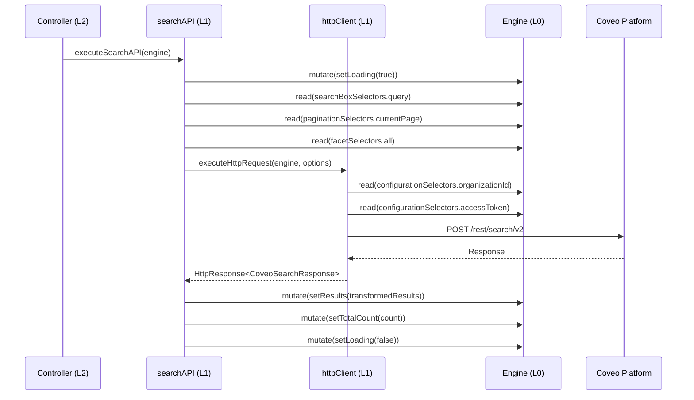
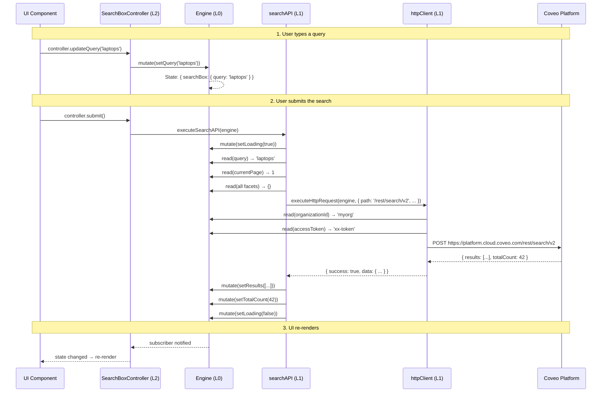

# Architecture Guide

This document explains how Headless Future's library is structured, why each layer exists, and how they connect. It's written for Coveo engineers — you don't need deep knowledge of the current `@coveo/headless`, but Coveo context (org IDs, access tokens, search API) is assumed.

## The Core Idea

Today's `@coveo/headless` exposes Redux concepts to consumers (action creators, reducers, middleware). Headless Future's thesis: **wrap Redux behind a library-agnostic abstraction so the state management library becomes a swappable implementation detail.**

If the abstraction works, you could replace Redux with Zustand in a day — and every controller, action, and API client would keep working unchanged.

## The Four Layers



### Dependency Rules

| From → To   | Layer 0 |    Layer 1    | Layer 2 | Layer 3 |
| ----------- | :-----: | :-----------: | :-----: | :-----: |
| **Layer 0** |    —    |      ❌       |   ❌    |   ❌    |
| **Layer 1** |   ✅    |       —       |   ❌    |   ❌    |
| **Layer 2** |   ✅    | ✅ (optional) |    —    |   ❌    |
| **Layer 3** |   ✅    |      ❌       |   ❌    |    —    |

The fundamental rule: **Layer 0 depends on nothing. Everything else depends on Layer 0. There is no horizontal coupling** (except Layer 2's optional use of Layer 1 for API calls).

---

## Layer 0: Core State

**Directory**: `src/core/`  
**Visibility**: Internal (not exported to consumers, but used by all other layers)  
**Responsibility**: Own all application state. Hide Redux completely.

### The Engine

The `Engine` class is the single entry point for all state operations:

```typescript
class Engine {
  read<T>(selector: StateSelector<T>): T; // Synchronous state read
  subscribe<T>(selector, callback): Unsubscribe; // Reactive state observation
  mutate(mutation: StateMutation): void; // Dispatch a state change
  adoptSlice(slice: Slice): Promise<void>; // Lazily register a feature slice
}
```

- `read()` takes a pure function `(state) => T` and returns the result.
- `subscribe()` takes a selector + callback; only fires when the selected value actually changes (shallow equality).
- `mutate()` takes a `{ type, payload }` object. This is the library-agnostic equivalent of Redux's `dispatch(action)`.
- `adoptSlice()` dynamically registers a Redux slice. The store starts empty. See [Slice Adoption](../SLICE_ADOPTION.md).

Internally, the Engine wraps a Redux Toolkit `configureStore`. But its public surface uses only library-agnostic types:

```typescript
type StateSelector<T> = (state: State) => T;
interface StateMutation {
  type: string;
  payload?: unknown;
}
type Unsubscribe = () => void;
```

No `Draft<T>`, no `PayloadAction`, no `Slice` type in the public API.

### Interface vs Internal

Layer 0 is split into two sub-directories to enforce isolation **by construction**:



| Directory         |            Can import Redux?             |           Exported to other layers?           | Contains                                     |
| ----------------- | :--------------------------------------: | :-------------------------------------------: | -------------------------------------------- |
| `core/interface/` | **No** (except engine.ts which wraps it) |         **Yes** (via `core/index.ts`)         | Types, selector wrappers, mutation factories |
| `core/internal/`  |                 **Yes**                  | **No** (except for `adoptSlice` registration) | Redux slices (`createSlice`), reducers       |

**Why the split?** If you can `grep -r "@reduxjs/toolkit" src/core/interface/` and get zero results (excluding `engine.ts`), you know the abstraction holds. The interface layer's `mutate.ts` and `selectors.ts` files import from `internal/` to wrap Redux-specific implementations, but they only expose library-agnostic types.

### The Pattern Per Feature

Every feature domain (searchBox, results, facets, pagination, configuration) follows the same structure:

```
interface/{feature}/
├── types.ts       → Pure TypeScript interfaces (the state shape)
├── mutate.ts      → Mutation factories: setQuery("foo") → { type, payload }
└── selectors.ts   → Selector wrappers: query(state) → string

internal/{feature}/
└── slice.ts       → Redux createSlice() with reducers and selectors
```

**Mutation factory pattern** — mutations don't directly change state. They create `StateMutation` objects that you then pass to `engine.mutate()`:

```typescript
// In interface/search-box/mutate.ts
export const setQuery = (query: string): StateMutation => {
  return searchBoxSlice.actions.setQuery(query); // Returns { type: 'searchBox/setQuery', payload: 'laptops' }
};

// Usage
engine.mutate(searchBoxMutations.setQuery('laptops'));
```

**Selector wrapper pattern** — selectors from Redux slices are wrapped with narrowed types:

```typescript
// In interface/search-box/selectors.ts
type StateWithSearchBoxSlice = {searchBox: SearchBoxState};

export const query = (state: StateWithSearchBoxSlice) => {
  return searchBoxSlice.selectors.query(state);
};
```

The `StateWithSearchBoxSlice` type narrows from the full optional `State` (where `searchBox?` might be undefined) to a guaranteed-present type. This is safe because callers should only read from an adopted slice.

### State Shape

All properties are optional because slices are adopted dynamically:

```typescript
interface State {
  searchBox?: SearchBoxState; // { query: string }
  result?: ResultMapState; // Record<id, { isSelected, isExpanded }>
  results?: ResultsState; // { results[], isLoading, error }
  facets?: Record<string, FacetState>; // { id, label, values[], selectedValues[] }
  pagination?: PaginationState; // { currentPage, pageSize, totalCount }
  configuration?: ConfigurationState; // { organizationId, accessToken, endpoint? }
}
```

---

## Layer 1: API Client

**Directory**: `src/api/`  
**Visibility**: Internal (used by Layer 2 controllers, never exported to consumers)  
**Responsibility**: HTTP calls to Coveo Platform APIs.

### How It Works

The API client follows the **engine-first pattern**: every function takes an `Engine` as its first argument. It reads configuration (org ID, token, endpoint) from state and writes results back via mutations.



Key files:

- **`search/searchAPI.ts`** — The main search function. Reads query/pagination/facets from state, calls the Coveo Search v2 endpoint, transforms the response, and writes results back.
- **`shared/httpClient.ts`** — Base HTTP utility. Reads configuration from state, builds authenticated requests, handles errors. Returns `HttpResponse<T>` objects (never throws).
- **`shared/errorHandling.ts`** — Coveo-specific error transformation.

### Design Decisions

- **No exceptions**: `httpClient` returns `{ success, data?, error? }` instead of throwing. Callers check `response.success` and handle errors via state mutations.
- **State-driven config**: The HTTP client doesn't accept tokens/endpoints as parameters. It reads them from the engine's configuration state. This means API calls are automatically configured once you set up the engine.
- **`Promise<void>` return type**: `executeSearchAPI()` writes results into state rather than returning them. Consumers observe results via `engine.subscribe()`.

---

## Layer 2: Controllers

**Directory**: `src/public/controllers/`  
**Visibility**: **Public** (exported from the package)  
**Responsibility**: High-level, feature-oriented API for building UIs.

### The Factory Function Pattern

Controllers are **factory functions** that take an `Engine` and return a plain object:

```typescript
export const buildSearchBoxController = (engine: Engine) => {
  engine.adoptSlice(searchBoxSlice); // Ensure the slice is loaded
  return {
    updateQuery: (query: string) => {
      engine.mutate(searchBoxMutators.setQuery(query));
    },
    submit: () => {
      executeSearchAPI(engine);
    },
    get state() {
      return engine.read(stateSelect);
    },
    get query() {
      return engine.read(searchBoxSelectors.query);
    },
    subscribe(callback: () => void) {
      engine.subscribe(stateSelect, callback);
    },
  };
};
```

The returned object has:

- **Methods** for user actions (`updateQuery`, `submit`)
- **`get state()`** accessor for reading current state (memoized via `createSelector`)
- **`subscribe()`** for reactive updates

### What Controllers Do at Initialization

1. **Adopt slices** — `engine.adoptSlice(searchBoxSlice)` ensures the slice is in the store before any reads/writes.
2. **Create memoized selectors** — `createSelector` from RTK composes individual selectors into a combined state object.
3. **Return the API object** — A plain object with methods bound to the engine.

### Available Controllers

| Controller  | Factory                             | Features                                        |
| ----------- | ----------------------------------- | ----------------------------------------------- |
| Search Box  | `buildSearchBoxController(engine)`  | `updateQuery()`, `submit()`, state with `query` |
| Result List | `buildResultListController(engine)` | `state` with `results[]`, `subscribe()`         |

### Known Deviation: RTK in Layer 2

Controllers currently import `createSelector` from `@reduxjs/toolkit` for memoization. This is a pragmatic shortcut — `createSelector` is actually from [Reselect](https://github.com/reduxjs/reselect), which is a standalone library that doesn't depend on Redux. In a production version, this import would be replaced with a direct Reselect import or a Layer 0-provided memoization utility.

---

## Layer 3: Actions

**Directory**: `src/public/actions/`  
**Visibility**: **Public** (exported from the package)  
**Responsibility**: Power-user escape hatch for direct state mutation.

### When to Use Actions vs Controllers

| Use Controllers (Layer 2) when...                       | Use Actions (Layer 3) when...                           |
| ------------------------------------------------------- | ------------------------------------------------------- |
| Building standard search UI features                    | Building custom controllers or frameworks               |
| You want orchestrated workflows (query → API → results) | You need fine-grained control over individual mutations |
| You want reactive state via `subscribe()`               | You're composing state changes in a non-standard way    |

### Two Patterns

**`loadSearchBoxActions(engine)`** — Returns an object of bound mutation functions. Adopts the slice on first call.

```typescript
const actions = loadSearchBoxActions(engine);
actions.setQuery('laptops'); // Directly mutates state
```

**`setQuery(engine)`** — Returns a single curried function for one mutation. Uses a `WeakSet<Engine>` to ensure idempotent slice adoption.

```typescript
const doSetQuery = setQuery(engine);
doSetQuery('laptops'); // Directly mutates state
```

The `WeakSet<Engine>` pattern is worth noting: it tracks which engines have already adopted the searchBox slice, so repeated calls don't re-adopt.

---

## How a Search Request Flows End-to-End

Here's the complete lifecycle when a user types a query and submits:



---

## Comparison with Current Headless

For engineers familiar with the current `@coveo/headless`:

| Concept                    | Current Headless                                             | Headless Future                                                         |
| -------------------------- | ------------------------------------------------------------ | ----------------------------------------------------------------------- |
| **State library**          | Redux exposed to consumers (actions, reducers, middleware)   | Redux hidden behind `Engine` abstraction                                |
| **Creating the engine**    | `buildSearchEngine({ configuration })` with Redux middleware | `new Engine()` — empty store, configure via mutations                   |
| **Dispatching changes**    | `engine.dispatch(updateQuery({ q: 'foo' }))`                 | `engine.mutate(searchBoxMutations.setQuery('foo'))`                     |
| **Reading state**          | `engine.state.search.query` (direct property access)         | `engine.read(searchBoxSelectors.query)` (selector function)             |
| **Subscribing**            | `engine.subscribe(() => { /* check everything */ })`         | `engine.subscribe(selector, callback)` — targeted, only fires on change |
| **Registering features**   | Import reducers, middleware at engine creation               | `engine.adoptSlice(slice)` — lazy, dynamic                              |
| **Controllers**            | Classes: `new SearchBox(engine, { options })`                | Factory functions: `buildSearchBoxController(engine)`                   |
| **Direct mutations**       | `engine.dispatch(someAction())` — all actions accessible     | Actions module: `loadSearchBoxActions(engine)` — curated set            |
| **Redux knowledge needed** | Yes (actions, selectors, thunks, middleware)                 | No (read/subscribe/mutate is the entire API)                            |

---

## Adding a New Feature Domain

To add, say, a `sorting` feature, you'd create:

```
core/internal/sorting/slice.ts          ← Redux createSlice()
core/interface/sorting/types.ts         ← SortingState interface
core/interface/sorting/mutate.ts        ← setSortCriteria() → StateMutation
core/interface/sorting/selectors.ts     ← sortCriteria(state) → string
```

Then wire it:

1. Add `SortingState` to the `State` interface in `core/interface/types.ts`
2. Export types/mutations/selectors from `core/index.ts`
3. Create a controller in `public/controllers/sorting/controller.ts`
4. (Optional) Create actions in `public/actions/sorting.ts`

The pattern is identical for every feature. No changes to the Engine, no changes to Layer 1.
