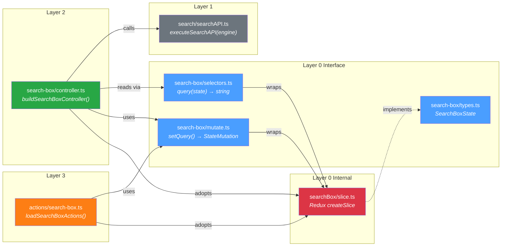
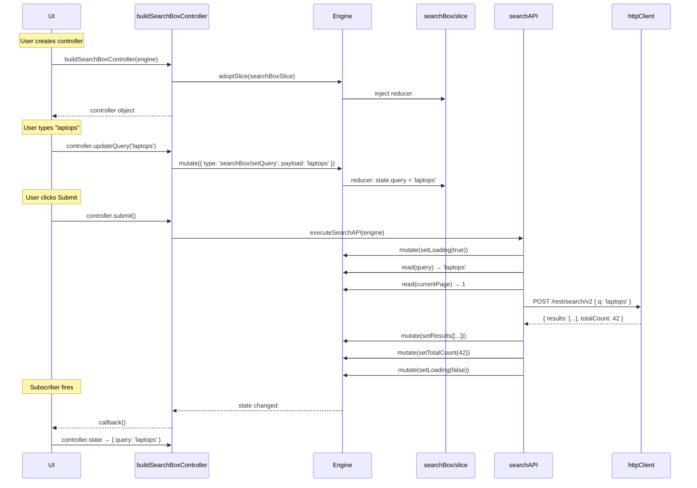

# Feature Walkthrough: Search Box

This document traces the **search-box** feature through every layer of the architecture, file by file. The search box is the canonical example because it touches all four layers and demonstrates every key pattern.

By the end, you'll understand how a user typing "laptops" results in a state change, an API call, and a UI update — and which files are responsible for each step.

## Overview



---

## Layer 0 Internal: The Redux Slice

**File**: [`src/core/internal/searchBox/slice.ts`](../src/core/internal/searchBox/slice.ts)

```typescript
import {createSlice, type PayloadAction} from '@reduxjs/toolkit';
import type {SearchBoxState} from '../../interface/search-box/types.js';

export const initialSearchBoxState: SearchBoxState = {
  query: '',
};

export const searchBoxSlice = createSlice({
  name: 'searchBox',
  initialState: initialSearchBoxState,
  reducers: {
    setQuery: (state, action: PayloadAction<string>) => {
      state.query = action.payload;
    },
  },
  selectors: {
    query: (state) => state.query,
  },
});
```

**What it does**: This is the only file in the search-box feature that touches Redux. It defines:

- **Initial state**: `{ query: '' }`
- **Reducer**: `setQuery` updates the query string (uses Immer under the hood for immutable updates)
- **Selector**: `query` reads the query from this slice's state

**Key pattern**: The slice imports its type from `interface/search-box/types.ts`, not the other way around. Types are owned by the interface layer.

**Who can see this file**: Only other `core/internal/` files and — via `adoptSlice()` — controllers and actions that need to register the slice. The slice object itself flows to `engine.adoptSlice()`, but its Redux types (`PayloadAction`, etc.) never leak beyond this file.

---

## Layer 0 Interface: Types

**File**: [`src/core/interface/search-box/types.ts`](../src/core/interface/search-box/types.ts)

```typescript
/**
 * CRITICAL: NO imports from @reduxjs/toolkit or immer allowed.
 */

export interface SearchBoxState {
  /** Current search query string */
  query: string;
}
```

**What it does**: Defines the pure TypeScript interface for the search box state. No Redux, no Immer, no library-specific types.

**Why it matters**: This is what consumers see. When they inspect the `state` property of a controller, they get something shaped like `SearchBoxState`. It's just a plain interface.

---

## Layer 0 Interface: Mutations

**File**: [`src/core/interface/search-box/mutate.ts`](../src/core/interface/search-box/mutate.ts)

```typescript
import {searchBoxSlice} from '../../internal/searchBox/slice.js';
import type {StateMutation} from '../types.js';

export const setQuery = (query: string): StateMutation => {
  return searchBoxSlice.actions.setQuery(query);
};
```

**What it does**: A **mutation factory**. `setQuery('laptops')` doesn't change state directly — it returns a `StateMutation` object:

```typescript
{ type: 'searchBox/setQuery', payload: 'laptops' }
```

You then pass this to `engine.mutate()` to actually apply the change.

**Pattern**: The three-line function is the complete pattern:

1. Import the Redux slice from `internal/`
2. Call the slice's action creator
3. Return the result typed as `StateMutation` (library-agnostic)

**Boundary**: This file _imports_ from `internal/` (it has to — it wraps the Redux action creator). But its _export signature_ is `(query: string) => StateMutation` — pure TypeScript, no Redux types.

---

## Layer 0 Interface: Selectors

**File**: [`src/core/interface/search-box/selectors.ts`](../src/core/interface/search-box/selectors.ts)

```typescript
import {searchBoxSlice} from '../../internal/searchBox/slice.js';
import type {SearchBoxState} from './types.js';

export type StateWithSearchBoxSlice = {searchBox: SearchBoxState};

export const query = (state: StateWithSearchBoxSlice) => {
  return searchBoxSlice.selectors.query(state);
};
```

**What it does**: Wraps the Redux slice's selector with a type-narrowed function.

**The `StateWithSearchBoxSlice` pattern**: The root `State` has `searchBox?` as optional (because slices are dynamically adopted). But this selector says "I require `searchBox` to be present." If you try to pass a bare `State`, TypeScript will flag it. This is the compile-time enforcement that you must adopt the slice before reading from it.

**Why wrap instead of export directly?** The Redux slice's selector has Redux-typed signatures. The wrapper re-exports with a clean, library-agnostic type signature.

---

## Layer 1: The API Client

**File**: [`src/api/search/searchAPI.ts`](../src/api/search/searchAPI.ts)

This file is longer, so here's the annotated structure:

```typescript
export async function executeSearchAPI(engine: Engine): Promise<void> {
  // 1. Set loading state
  engine.mutate(resultsMutations.setLoading(true));
  engine.mutate(resultsMutations.setError(null));

  try {
    // 2. Read current state to build the API request
    const query = engine.read(searchBoxSelectors.query);
    const currentPage = engine.read(paginationSelectors.currentPage);
    const pageSize = engine.read(paginationSelectors.pageSize);
    const allFacets = engine.read(facetSelectors.all);

    // 3. Build request body (Coveo Search v2 format)
    const requestBody: CoveoSearchRequest = {
      q: query,
      aq: buildAdvancedQueryFromFacets(allFacets) || undefined,
      numberOfResults: pageSize,
      firstResult: (currentPage - 1) * pageSize,
      facets: facetRequests.length > 0 ? facetRequests : undefined,
    };

    // 4. Execute HTTP request (reads config from state internally)
    const response = await executeHttpRequest<CoveoSearchResponse>(engine, {
      path: '/rest/search/v2',
      method: 'POST',
      body: requestBody,
    });

    // 5. On success: write results back to state
    if (response.success) {
      engine.mutate(
        resultsMutations.setResults(
          transformCoveoResults(response.data!.results)
        )
      );
      engine.mutate(
        paginationMutations.setTotalCount(response.data!.totalCount)
      );
      engine.mutate(resultsMutations.setLoading(false));
    } else {
      engine.mutate(
        resultsMutations.setError(response.error || 'Search failed')
      );
      engine.mutate(resultsMutations.setLoading(false));
    }
  } catch (error) {
    engine.mutate(resultsMutations.setError(error.message));
    engine.mutate(resultsMutations.setLoading(false));
  }
}
```

**What it does**: Orchestrates a complete search request lifecycle:

1. Signal "loading" in state
2. Read the current query, pagination, and facet state
3. Build a Coveo Search v2 request body
4. Execute via the HTTP client (which reads org/token from state)
5. Write results (or errors) back to state

**Key patterns**:

- **Engine-first**: Takes `Engine` as the only argument. All configuration is read from state.
- **Returns `Promise<void>`**: Results go into state, not the return value. Consumers subscribe to state changes.
- **Cross-feature reads**: Reads from `searchBox`, `pagination`, and `facets` state to build a complete request. Writes to `results` and `pagination` state. This is the natural place for cross-cutting orchestration.
- **No exceptions**: Errors are caught and written to state as `resultsMutations.setError()`.

**Boundary**: Imports selectors and mutations from `core/interface/` (Layer 0's public surface). Never imports from `core/internal/`.

---

## Layer 2: The Controller

**File**: [`src/public/controllers/search-box/controller.ts`](../src/public/controllers/search-box/controller.ts)

```typescript
import {executeSearchAPI} from '@/src/api/index.js';
import {Engine} from '@/src/core/interface/engine/engine.js';
import {searchBoxSlice} from '@/src/core/internal/searchBox/slice.js';
import * as searchBoxSelectors from '@/src/core/interface/search-box/selectors.js';
import * as searchBoxMutators from '@/src/core/interface/search-box/mutate.js';
import {createSelector} from '@reduxjs/toolkit';

const stateSelect = createSelector([searchBoxSelectors.query], (query) => ({
  query,
}));

export const buildSearchBoxController = (engine: Engine) => {
  engine.adoptSlice(searchBoxSlice);
  return {
    updateQuery: (query: string) => {
      engine.mutate(searchBoxMutators.setQuery(query));
    },
    submit: () => {
      executeSearchAPI(engine);
    },
    get state() {
      return engine.read(stateSelect);
    },
    get query() {
      return engine.read(searchBoxSelectors.query);
    },
    subscribe(callback: () => void) {
      engine.subscribe(stateSelect, callback);
    },
  };
};
```

**What it does**: The consumer-facing API for search box functionality.

**Line by line**:

1. **`createSelector` at module scope**: Creates a memoized selector that combines `searchBoxSelectors.query` into a `{ query }` object. This is evaluated once when the module loads, not per-controller instance.

2. **`engine.adoptSlice(searchBoxSlice)`**: First thing on controller creation — ensures the searchBox slice is in the store. This imports the raw Redux slice from `internal/` which is a known deviation (Layer 2 reaching into Layer 0 internals for registration).

3. **`updateQuery(query)`**: Wraps `engine.mutate(setQuery(query))`. One method = one mutation.

4. **`submit()`**: Calls `executeSearchAPI(engine)` from Layer 1. This is where the Layer 2 → Layer 1 optional dependency manifests. Not all controller methods need the API — `updateQuery` and `query` only need Layer 0.

5. **`get state()`**: Returns `{ query: 'laptops' }` via the memoized selector. The `get` keyword makes it a property accessor, so consumers write `controller.state`, not `controller.state()`.

6. **`subscribe(callback)`**: Subscribes to changes in the memoized state. The callback fires only when the `{ query }` value actually changes.

**Pattern notes**:

- The returned object is a plain JavaScript object — no class, no prototype chain.
- Methods close over the `engine` argument — no `this` binding issues.
- The `namespace import` pattern (`import * as searchBoxMutators`) makes usage read as `searchBoxMutators.setQuery()`, providing clear provenance.

---

## Layer 3: The Actions

**File**: [`src/public/actions/search-box.ts`](../src/public/actions/search-box.ts)

```typescript
import {searchBoxSlice} from '@/src/core/internal/searchBox/slice.js';
import * as searchBoxMutators from '@/src/core/interface/search-box/mutate.js';
import {Engine} from '@/src/core/interface/engine/engine.js';

type MutatorToAction<T> = T extends (...args: infer A) => any
  ? (...args: A) => void
  : never;

type MutatorsToActions<T> = {
  [K in keyof T]: MutatorToAction<T[K]>;
};
const loadedEngine = new WeakSet<Engine>();

export const loadSearchBoxActions = (
  engine: Engine
): MutatorsToActions<typeof searchBoxMutators> => {
  engine.adoptSlice(searchBoxSlice);
  loadedEngine.add(engine);
  return {
    setQuery: (query: string) => {
      engine.mutate(searchBoxMutators.setQuery(query));
    },
  };
};

export const setQuery = (engine: Engine) => {
  if (!loadedEngine.has(engine)) {
    engine.adoptSlice(searchBoxSlice);
    loadedEngine.add(engine);
  }

  return (query: string) => {
    engine.mutate(searchBoxMutators.setQuery(query));
  };
};
```

**What it does**: Provides two ways for power users to mutate search box state directly, without going through a controller.

**Pattern 1: `loadSearchBoxActions(engine)`**

- Adopts the slice immediately
- Returns an object containing all bound mutations for the search box
- The `MutatorsToActions` type utility transforms `(query: string) => StateMutation` into `(query: string) => void` — the dispatch is baked in

**Pattern 2: `setQuery(engine)`**

- Returns a single curried function for the `setQuery` mutation
- Uses `WeakSet<Engine>` to skip adoption if the engine was already seen (via `loadSearchBoxActions` or a previous `setQuery` call)
- `WeakSet` (not `Set`) so engines can be garbage collected

**When to use which**:

- Use `loadSearchBoxActions` when you need multiple mutations from the same feature
- Use `setQuery` (or similar per-mutation exports) when you need just one specific mutation

**Boundary**: Like controllers, this imports the raw slice from `internal/` for adoption. The mutation wrappers come from `interface/`.

---

## Tracing Through: "laptops"

Here's every state change and function call when a user types "laptops" and submits:



---

## Summary: Files Involved

| File                                          | Layer        | Role                                      |
| --------------------------------------------- | ------------ | ----------------------------------------- |
| `core/internal/searchBox/slice.ts`            | L0 Internal  | Redux slice definition                    |
| `core/interface/search-box/types.ts`          | L0 Interface | State type (`SearchBoxState`)             |
| `core/interface/search-box/mutate.ts`         | L0 Interface | Mutation factory (`setQuery`)             |
| `core/interface/search-box/selectors.ts`      | L0 Interface | Selector wrapper (`query`)                |
| `core/interface/engine/engine.ts`             | L0 Interface | Engine (read/subscribe/mutate/adoptSlice) |
| `api/search/searchAPI.ts`                     | L1           | Coveo Search API integration              |
| `api/shared/httpClient.ts`                    | L1           | Authenticated HTTP client                 |
| `public/controllers/search-box/controller.ts` | L2           | `buildSearchBoxController()`              |
| `public/actions/search-box.ts`                | L3           | `loadSearchBoxActions()`, `setQuery()`    |
