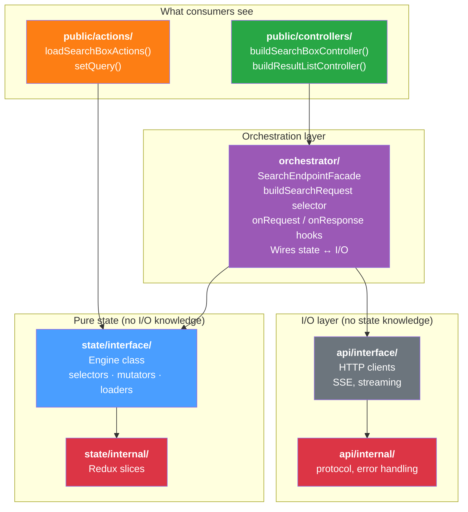

# Alternative Architecture — Orchestrator Layer

> An alternative to the [target architecture](architecture-plan.md) that
> introduces an explicit orchestration layer between `public/` and the two
> isolated peer layers (`state/` and `api/`).

---

## Core Idea

Rename `core/` to `state/` and extract all coordination logic (facades, request
selectors, response dispatching) into a dedicated `orchestrator/` layer. The
result: `state/` and `api/` become fully decoupled peers that know nothing
about each other.

---

## Layer Overview



---

## Dependency Rules

| From | Can import from | Cannot import from |
|------|----------------|-------------------|
| `public/` | `orchestrator/`, `state/interface/` (actions only) | `state/internal/`, `api/` |
| `orchestrator/` | `state/interface/`, `api/interface/` | `state/internal/`, `api/internal/`, `public/` |
| `state/interface/` | `state/internal/` | `api/`, `orchestrator/`, `public/` |
| `state/internal/` | nothing outside `state/` | everything else |
| `api/interface/` | `api/internal/` | `state/`, `orchestrator/`, `public/` |
| `api/internal/` | nothing outside `api/` | everything else |

**Key rule:** `state/` and `api/` are fully isolated peers. Neither imports
from the other. Only `orchestrator/` bridges them.

---

## Folder Structure

```
src/
├── index.ts                              ← re-exports from public/ + Engine
├── public/
│   ├── controllers/
│   │   ├── search-box/
│   │   ├── result-list/
│   │   ├── cart/
│   │   └── conversation/
│   └── actions/
│       ├── search-box/
│       ├── cart/
│       └── configuration/
├── orchestrator/
│   ├── search-endpoint/
│   │   ├── search-endpoint-facade.ts     ← coordinates state ↔ api
│   │   ├── search-request-selector.ts    ← composed selector
│   │   └── search-response-handlers.ts   ← writes responses to state
│   └── conversation-endpoint/
│       ├── conversation-endpoint-facade.ts
│       ├── conversation-request-selector.ts
│       └── conversation-runtime.ts
├── state/
│   ├── index.ts                          ← barrel for interface/
│   ├── interface/
│   │   ├── engine/
│   │   ├── search-box/
│   │   ├── result-list/
│   │   ├── pagination/
│   │   ├── facets/
│   │   ├── configuration/
│   │   └── utils/
│   └── internal/
│       ├── search-box/
│       ├── result-list/
│       ├── pagination/
│       ├── facets/
│       └── configuration/
└── api/
    ├── index.ts                          ← barrel for interface/
    ├── interface/
    │   ├── search-endpoint/
    │   │   ├── search-endpoint-client.ts
    │   │   └── search-endpoint-types.ts
    │   └── conversation-endpoint/
    │       ├── conversation-endpoint-client.ts
    │       ├── conversation-event-stream.ts
    │       └── conversation-endpoint-types.ts
    └── internal/
        ├── protocol/
        └── utils/
```

---

## How It Works

### The orchestrator's role

The orchestrator is the **only place** that knows both state and api exist.
It:

1. Reads state via selectors to build API requests
2. Calls API clients to execute HTTP requests
3. Writes API responses back to state via mutators
4. Exposes `onRequest`/`onResponse` hooks for consumers

```typescript
// orchestrator/search-endpoint/search-endpoint-facade.ts
import { searchBoxSelectors, configurationSelectors, searchEndpointMutators } from '@/src/state/index.js';
import { createSearchEndpointClient } from '@/src/api/index.js';
import { buildSearchRequest } from './search-request-selector.js';

export class SearchEndpointFacade {
  async callEndpoint(): Promise<void> {
    // Read from state/
    const request = this.engine.read(buildSearchRequest);
    const config = {
      organizationId: this.engine.read(configurationSelectors.getOrganizationId),
      accessToken: this.engine.read(configurationSelectors.getAccessToken),
    };

    // Call api/
    const response = await this.#client.call(finalRequest, config);

    // Write back to state/
    this.#responseHandlers.forEach(h => h(response.data));
  }
}
```

### Controllers go through orchestrator

```typescript
// public/controllers/search-box/search-box-controller.ts
import { searchBoxSelectors, searchBoxMutators, loadSearchBox } from '@/src/state/index.js';
import { SearchEndpointFacade } from '@/src/orchestrator/search-endpoint/search-endpoint-facade.js';

export const buildSearchBoxController = (options) => {
  const facade = SearchEndpointFacade.getInstance(engine);
  return {
    submit: () => facade.callEndpoint(),
    // ...
  };
};
```

### Actions go directly to state

```typescript
// public/actions/search-box/search-box-actions.ts
import { searchBoxMutators, loadSearchBox } from '@/src/state/index.js';
// No orchestrator needed — actions are pure state mutations
```

---

## Comparison with Target Architecture

| Aspect | Target (architecture-plan.md) | Alternative (this doc) |
|--------|-------------------------------|------------------------|
| `core/` renamed | No | Yes → `state/` |
| Facade location | `api/interface/` | `orchestrator/` (new layer) |
| `api/` knows about state | Yes (`api/interface/` imports `core/interface/`) | **No** — fully isolated |
| `state/` knows about api | No | No |
| Number of top-level layers | 3 (`public/`, `core/`, `api/`) | 4 (`public/`, `orchestrator/`, `state/`, `api/`) |
| Who bridges state ↔ api | `api/interface/` (facades import from core) | `orchestrator/` (dedicated layer) |
| Loader location | `state/interface/` (with DI for facade) | `orchestrator/` (no DI needed) |

---

## Advantages

1. **True decoupling.** `state/` and `api/` are completely independent. You can
   test, replace, or refactor either without touching the other. No DI hacks
   needed for loaders.

2. **Clearer naming.** `state/` communicates "pure state management" better than
   `core/` (which is vague). `orchestrator/` explicitly says "I coordinate."

3. **Single responsibility per layer.** Each layer has exactly one job:
   - `state/` = own state
   - `api/` = HTTP transport
   - `orchestrator/` = wire them together
   - `public/` = consumer API

4. **No DI workaround for loaders.** In the target architecture, loaders in
   `core/interface/` need the facade injected to register response handlers
   (to avoid `core/ → api/` imports). Here, response handling lives in
   `orchestrator/` naturally — no injection needed.

5. **`api/` becomes truly reusable.** Since it has zero state knowledge, it
   could be extracted as a standalone `@coveo/api-client` package trivially.

6. **Easier to reason about data flow.** All state↔api coordination is in one
   place. No need to trace through multiple layers to understand how a request
   gets built and a response gets dispatched.

---

## Disadvantages

1. **Extra layer = extra indirection.** Four layers instead of three. More files,
   more directories, more barrel exports to maintain.

2. **Orchestrator becomes a coupling magnet.** Every new feature that involves
   both state and api must touch `orchestrator/`. It could grow large and become
   the "god layer" if not carefully scoped.

3. **Response mapping moves away from features.** In the target architecture,
   each feature's loader owns its response mapping (e.g., result-list-loader
   knows how to transform search results). Here, that logic lives in
   `orchestrator/`, separating it from the feature's other code.

4. **More ceremony for simple features.** A feature that just reads state and
   calls an API now spans three layers (`state/` + `api/` + `orchestrator/`)
   instead of two (`core/` + `api/`).

5. **Naming overhead.** `orchestrator/` is a long name. Alternatives:
   `bridge/`, `flow/`, `use-cases/`, `features/`. None are perfect.

6. **Actions bypass orchestrator.** `public/actions/` imports directly from
   `state/`, creating an asymmetry where controllers go through `orchestrator/`
   but actions don't. This is intentional (actions are pure state mutations)
   but may confuse contributors.

---

## When to Prefer This Over the Target

| Choose this alternative when... | Stick with the target when... |
|---------------------------------|-------------------------------|
| You want `api/` extractable as a standalone package | The team is small and extra layers add overhead |
| You anticipate multiple orchestration patterns (search, conversation, analytics) | Most features are simple state + single API call |
| You want zero DI in loaders | DI for loaders is acceptable |
| You value explicit coordination over implicit convention | You prefer fewer files and directories |
| The codebase will grow to 20+ features | The codebase stays at 5-10 features |

---

## Summary

| Concern | Decision | Rationale |
|---------|----------|-----------|
| State layer | `state/` (renamed from `core/`) | Clearer intent — "this is state management" |
| API layer | `api/` (unchanged, fully isolated) | Zero state knowledge — pure HTTP transport |
| Coordination | `orchestrator/` (new layer) | Single place that bridges state ↔ api |
| Controllers | Import from `orchestrator/` + `state/` | Orchestrator for I/O, state for reads/mutations |
| Actions | Import from `state/` directly | Actions are pure state mutations, no I/O |
| Hooks | Live in `orchestrator/` | Extension points belong with coordination logic |
| Response mapping | Lives in `orchestrator/` | Keeps state/ and api/ fully decoupled |
