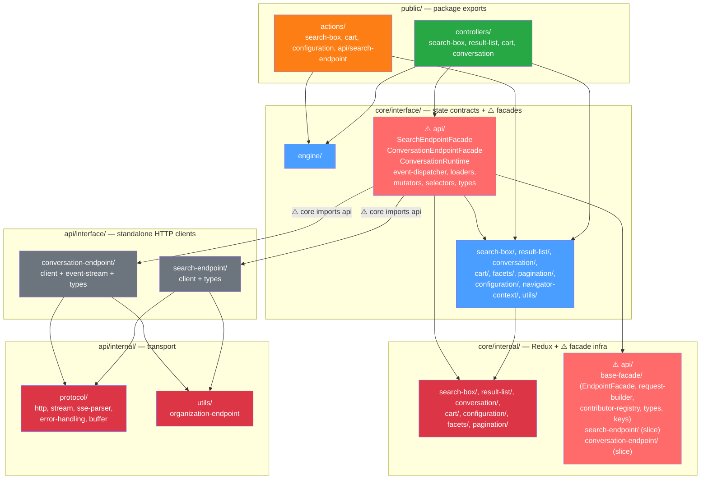

# Current Architecture (Before)

> This document captures the actual state of the `@coveo/headless-future`
> architecture as it exists in code today.

---

## Layer Overview



---

## Folder Structure

```
src/
├── index.ts                          ← exports Engine + public/*
├── public/                           ← package exports
│   ├── controllers/                  ← search-box, result-list, cart, conversation
│   └── actions/                      ← search-box, cart, configuration, api/search-endpoint
├── core/
│   ├── interface/
│   │   ├── engine/                   ← Engine class, types, config
│   │   ├── search-box/              ← selectors, mutators, loader
│   │   ├── result-list/             ← selectors, mutators, loader, types
│   │   ├── conversation/            ← selectors, mutators, loader, types
│   │   ├── cart/                    ← selectors, mutators, loader, types
│   │   ├── facets/                  ← selectors, mutators, types
│   │   ├── pagination/              ← selectors, mutators, types
│   │   ├── configuration/           ← selectors, mutators, types
│   │   ├── navigator-context/       ← types
│   │   ├── utils/                   ← memoized-state-selector
│   │   └── api/                     ← ⚠️ FACADES LIVE HERE
│   │       ├── search-endpoint/     ← SearchEndpointFacade, mutators, selectors, loader, types
│   │       └── conversation-endpoint/ ← ConversationEndpointFacade, runtime, event-dispatcher, loader, mutators, selectors, types
│   └── internal/
│       ├── search-box/              ← slice + selectors
│       ├── result-list/             ← slice
│       ├── conversation/            ← slice
│       ├── cart/                    ← slice
│       ├── configuration/           ← slice + configuration-reader
│       ├── facets/                  ← slice
│       ├── pagination/              ← slice
│       └── api/                     ← ⚠️ BASE FACADE INFRA HERE
│           ├── base-facade/         ← EndpointFacade class, request-builder, contributor-registry, types, keys
│           ├── search-endpoint/     ← search-endpoint-slice
│           └── conversation-endpoint/ ← conversation-endpoint-slice
└── api/
    ├── interface/
    │   ├── search-endpoint/         ← client + types (standalone HTTP client)
    │   └── conversation-endpoint/   ← client + event-stream + types
    └── internal/
        ├── protocol/                ← http, stream, sse-parser, error-handling, buffer, stream-types
        └── utils/                   ← organization-endpoint
```

---

## Dependency Flow

```
public/controllers  → core/interface (selectors, mutators, loaders)
                    → core/interface/api (facades — SearchEndpointFacade, ConversationRuntime)

core/interface/api  → core/internal/api (EndpointFacade base class, contributor registry, request builder)
                    → core/interface/* (selectors to read state)
                    → api/interface (createSearchEndpointClient, createConversationEndpointClient)

core/interface/*    → core/internal/* (slices)

api/interface       → api/internal (HTTP, error handling, URL building)
```

---

## How Request Building Works (Contributor Pattern)

Loaders register zero-argument closures on the facade. At call time, the facade
invokes all contributors and merges their outputs via `deepMerge`:

```typescript
// search-box-loader.ts — registers a contributor
export const loadSearchBox = (engine: FullEngine) => {
  engine.adoptSlice(searchBoxSlice);
  const facade = SearchEndpointFacade.getInstance(engine);
  facade.onRequest(() => ({
    q: engine.read(searchBoxSelectors.getQuery),
  }));
};

// result-list-loader.ts — registers a response handler
export const loadResultList = (engine: FullEngine) => {
  engine.adoptSlice(resultsSlice);
  const facade = SearchEndpointFacade.getInstance(engine);
  facade.onResponse((response) => {
    engine.mutate(setResults(mapResults(response)));
  });
};
```

The facade assembles the request at call time:

```typescript
// EndpointFacade base class
const finalRequest = buildRequest(this.getOrderedRequestContributors());
// buildRequest calls each contributor() and deepMerges results
```

---

## Problems

1. **`core/` depends on `api/`** — Facades in `core/interface/api/` import HTTP
   clients from `api/interface/`, creating a circular conceptual dependency.
   Core should be pure state with zero I/O knowledge.

2. **Contributor pattern is implicit** — Request assembly happens via anonymous
   closures registered at load time. No single place to see the full request.
   Registration order determines collision resolution.

3. **Two separate contributor registries** — `EndpointFacade.onRequest()` (local)
   and `EndpointContributorRegistry.register()` (module-level WeakMap). Used
   inconsistently across endpoints with no documented semantic difference.

4. **Contributors are zero-argument closures** — They can read from anything
   (engine, globals, DOM), breaking the rule that all state access goes through
   the Engine. They are the only non-selector read mechanism in the codebase.

5. **Silent field collisions** — If two contributors provide the same field,
   last one wins via `deepMerge`. Arrays are replaced, not merged. No warning.

6. **Unsubscribe handles discarded** — All loaders discard the return value of
   `onRequest()`. Contributors accumulate for the engine's lifetime.

7. **Base facade infrastructure in `core/internal/api/`** — The contributor
   registry, request builder, and `deepMerge` logic live in the state layer
   despite being I/O orchestration concerns.
