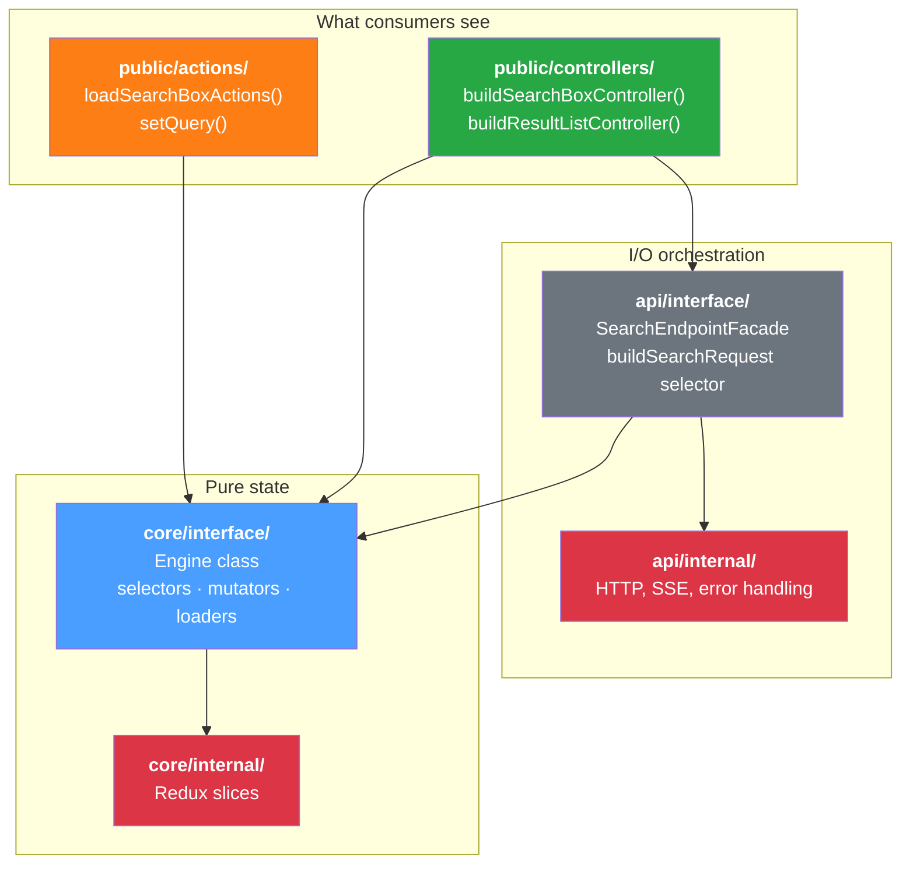
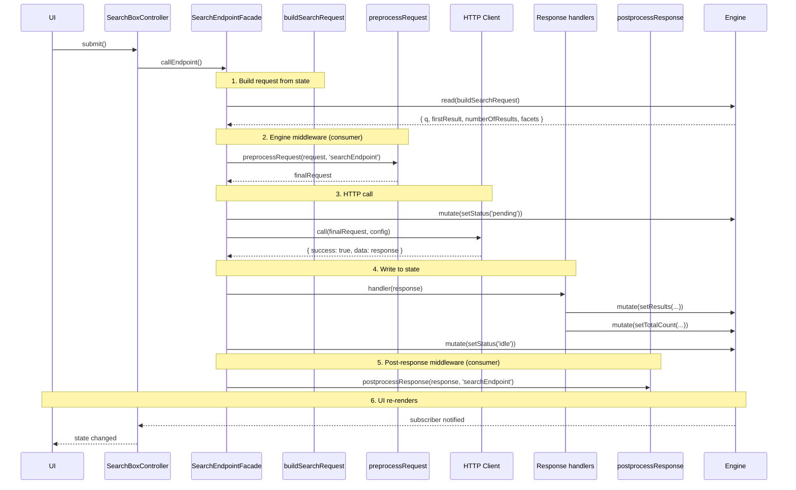

# Target Architecture — Composed Selector + Engine Middleware

> This document describes the target architecture for `@coveo/headless-future`.
> It replaces the contributor pattern (`onRequest` closures) with composed
> selectors for internal request building, and provides global engine-level
> middleware (`preprocessRequest` / `postprocessResponse`) as consumer extension points.

## Table of Contents

- [Design Principles](#design-principles)
- [Layer Overview](#layer-overview)
- [Dependency Rules](#dependency-rules)
- [Package Boundary (Anti-Corruption Layer)](#package-boundary-anti-corruption-layer)
- [Folder Structure](#folder-structure)
- [Optional Slice Selector Pattern](#optional-slice-selector-pattern)
- [The Composed Selector Pattern](#the-composed-selector-pattern)
- [Engine Middleware (preprocessRequest / postprocessResponse)](#engine-middleware-preprocessrequest--postprocessresponse)
- [Loader Pattern](#loader-pattern)
- [End-to-End Flow](#end-to-end-flow)
- [Facade Design](#facade-design)
- [Applying to Each Endpoint](#applying-to-each-endpoint)
- [Migration from Current State](#migration-from-current-state)
- [Enforcement](#enforcement)

---

## Design Principles

1. **Directory-based visibility.** Each layer has `interface/` (public contract)
   and `internal/` (private implementation). Cross a folder boundary → go
   through `interface/`. Stay inside → you can touch `internal/`.
2. **Unidirectional dependencies.** The dependency graph is a DAG. No cycles.
3. **`core/` is pure state.** Zero I/O knowledge. Types, selectors, mutators,
   slices.
4. **`api/` owns I/O orchestration.** Facades, HTTP clients, request assembly,
   hooks.
5. **`public/` is the sole package export.** Consumers never import from
   `core/` or `api/` directly.
6. **Request is derived state.** A composed selector reads from feature slices
   and produces the API request. No contributor registry for internal wiring.
7. **Engine middleware are consumer extension points.** `preprocessRequest` and
   `postprocessResponse` are configured once at engine creation. They run AFTER
   internal mapping — they are interceptors, not builders.

---

## Layer Overview



---

## Dependency Rules

| From | Can import from | Cannot import from |
|------|----------------|-------------------|
| `public/` | `core/interface/`, `api/interface/` | `core/internal/`, `api/internal/` |
| `core/interface/` | `core/internal/` | `api/`, `public/` |
| `core/internal/` | nothing outside `core/` | `api/`, `public/` |
| `api/interface/` | `api/internal/`, `core/interface/` | `core/internal/`, `public/` |
| `api/internal/` | nothing outside `api/` | `core/`, `public/` |

**Key rule:** `core/` never imports from `api/`. The dependency flows
`api/ → core/`, not the reverse.

---

## Package Boundary (Anti-Corruption Layer)

Although `public/` internally imports from `core/interface/` and `api/interface/`,
**nothing leaks to consumers**. The package boundary is enforced by:

1. **`src/index.ts`** — the single entry point. Only re-exports from `public/`
   plus `Engine` and its configuration types.
2. **`package.json` `exports` field** — only exposes `./dist/index.js`. No
   sub-path exports for `core/` or `api/`.

Consumers of the npm package can only reach what `src/index.ts` explicitly
re-exports. Internal imports are compiled away — they are implementation details
invisible to the outside world.

**Rules to maintain this guarantee:**

- Never add sub-path exports (e.g., `"./core"`) to `package.json`
- Never re-export `core/` or `api/` types from `public/` barrel files
- Keep controller/action return types using their own interfaces, not raw
  internal types (except `Engine`, which is intentionally public)

---

## Folder Structure

```
src/
├── index.ts                              ← re-exports from public/ + Engine
├── public/
│   ├── controllers/
│   │   ├── index.ts
│   │   ├── controller-types.ts
│   │   ├── search-box/
│   │   │   └── search-box-controller.ts
│   │   ├── result-list/
│   │   │   ├── result-list-controller.ts
│   │   │   └── result-list-controller-types.ts
│   │   ├── cart/
│   │   └── conversation/
│   └── actions/
│       ├── index.ts
│       ├── search-box/
│       ├── cart/
│       └── configuration/
├── core/
│   ├── index.ts                          ← barrel for interface/
│   ├── interface/
│   │   ├── engine/
│   │   │   ├── engine.ts                 ← Engine class
│   │   │   ├── engine-types.ts
│   │   │   └── engine-configuration.ts
│   │   ├── search-box/
│   │   │   ├── search-box-types.ts
│   │   │   ├── search-box-selectors.ts
│   │   │   ├── search-box-mutators.ts
│   │   │   └── search-box-loader.ts
│   │   ├── result-list/
│   │   │   ├── result-list-types.ts
│   │   │   ├── result-list-selectors.ts
│   │   │   ├── result-list-mutators.ts
│   │   │   └── result-list-loader.ts
│   │   ├── pagination/
│   │   │   ├── pagination-types.ts
│   │   │   ├── pagination-selectors.ts
│   │   │   ├── pagination-mutators.ts
│   │   │   └── pagination-loader.ts
│   │   ├── facets/
│   │   │   ├── facets-types.ts
│   │   │   ├── facets-selectors.ts
│   │   │   └── facets-mutators.ts
│   │   ├── configuration/
│   │   │   ├── configuration-types.ts
│   │   │   ├── configuration-selectors.ts
│   │   │   └── configuration-mutators.ts
│   │   ├── navigator-context/
│   │   │   └── navigator-context-types.ts
│   │   └── utils/
│   │       └── memoized-state-selector.ts
│   └── internal/
│       ├── search-box/
│       │   └── search-box-slice.ts
│       ├── result-list/
│       │   └── result-list-slice.ts
│       ├── pagination/
│       │   └── pagination-slice.ts
│       ├── facets/
│       │   └── facets-slice.ts
│       ├── configuration/
│       │   └── configuration-slice.ts
│       └── conversation/
│           └── conversation-slice.ts
└── api/
    ├── index.ts                          ← barrel for interface/
    ├── interface/
    │   ├── search-endpoint/
    │   │   ├── search-endpoint-facade.ts
    │   │   ├── search-request-selector.ts
    │   │   ├── search-endpoint-client.ts
    │   │   └── search-endpoint-types.ts
    │   └── conversation-endpoint/
    │       ├── conversation-endpoint-facade.ts
    │       ├── conversation-request-selector.ts
    │       ├── conversation-endpoint-client.ts
    │       ├── conversation-event-stream.ts
    │       └── conversation-endpoint-types.ts
    └── internal/
        ├── protocol/
        │   ├── http.ts
        │   ├── stream.ts
        │   ├── stream-types.ts
        │   ├── sse-parser.ts
        │   ├── error-handling.ts
        │   └── buffer.ts
        └── utils/
            └── organization-endpoint.ts
```

---

## Optional Slice Selector Pattern

Slices are loaded lazily via the loader pattern — a slice may not exist in the
store when a selector runs. To keep selectors safe to call at any time, each
feature's root selector uses the nullish coalescing operator (`??`) to fall back
to `initialState` when the slice is absent.

### Pattern

```typescript
// core/internal/api/search-endpoint/search-endpoint-slice.ts
export const initialSearchEndpointState: SearchEndpointState = {
  configuration: {},
  status: 'idle',
  error: null,
};

export const searchEndpointSlice = createSlice({
  name: 'searchEndpoint',
  initialState: initialSearchEndpointState,
  reducers: { /* ... */ },
});
```

```typescript
// core/internal/api/search-endpoint/search-endpoint-selectors.ts
import {initialSearchEndpointState} from './search-endpoint-slice.js';

const getSearchEndpointState = (state: State) =>
  state.searchEndpoint ?? initialSearchEndpointState;

export const getStatus = createSelector(
  getSearchEndpointState,
  (state) => state.status
);
```

### Rules

1. **Export `initialState` from the slice file** — it serves as both the Redux
   initial state and the selector fallback.
2. **Root selector uses `??`** — the single entry-point selector for a feature
   applies `state.sliceName ?? initialState`. Derived selectors compose on top
   of it and never need their own fallback.
3. **Never throw on missing slice** — selectors must be pure and safe. A
   missing slice means the feature hasn't been loaded yet; return defaults.
4. **Type the state broadly** — the root selector accepts `State` (the full
   union), not `StateWithXSlice`, so it can be called from composed selectors
   that don't know which slices are loaded.

### Why

- Controllers and composed request selectors can reference any feature selector
  without guarding against undefined — the fallback is built in.
- Avoids runtime errors when features are loaded in different orders or
  conditionally.
- Keeps the selector layer decoupled from the loader lifecycle.

---

## The Composed Selector Pattern

The API request is **derived state** — a pure function of the current store.
Each feature exports selectors that know how to read their own slice. The
facade's request selector composes them into the final request shape.

### Per-feature selectors (in `core/interface/`)

Each feature exports its standard selectors. No "request fragment" concept
needed — the composed selector in `api/` handles the mapping.

```typescript
// core/interface/search-box/search-box-selectors.ts
export const getQuery = (state: StateWithSearchBoxSlice): string => {
  return searchBoxSlice.selectors.query(state);
};
```

```typescript
// core/interface/pagination/pagination-selectors.ts
export const getCurrentPage = (state: StateWithPaginationSlice): number => {
  return paginationSlice.selectors.currentPage(state);
};

export const getPageSize = (state: StateWithPaginationSlice): number => {
  return paginationSlice.selectors.pageSize(state);
};
```

### Composed request selector (in `api/interface/`)

The facade owns a single memoized selector that reads all relevant feature
state and produces the final `CoveoSearchEndpointRequest`:

```typescript
// api/interface/search-endpoint/search-request-selector.ts
import { createMemoizedStateSelector } from '@/src/core/index.js';
import * as searchBoxSelectors from '@/src/core/interface/search-box/search-box-selectors.js';
import * as paginationSelectors from '@/src/core/interface/pagination/pagination-selectors.js';
import * as facetSelectors from '@/src/core/interface/facets/facets-selectors.js';
import type { CoveoSearchEndpointRequest } from './search-endpoint-types.js';

export const buildSearchEndpointRequest = createMemoizedStateSelector(
  searchBoxSelectors.getQuery,
  paginationSelectors.currentPage,
  paginationSelectors.pageSize,
  facetSelectors.all,
  (query, currentPage, pageSize, facets): CoveoSearchEndpointRequest => ({
    q: query,
    firstResult: (currentPage - 1) * pageSize,
    numberOfResults: pageSize,
    facets: buildFacetRequests(facets),
  })
);
```

### Benefits

- **Testable without mocks:** pass a state object, get a request.
- **Inspectable at any time:** `engine.read(buildSearchRequest)` shows the
  current request without triggering a network call.
- **Deterministic:** no registration order, no implicit merging, no closures.
- **Memoized:** only recomputes when input selectors change.

---

## Engine Middleware (preprocessRequest / postprocessResponse)

Middleware are **global consumer extension points** configured once at engine
creation via `EngineOptions`. They apply to ALL endpoint facades (search,
conversation, etc.) — there is no per-facade hook registration.

### Configuration

```typescript
const engine = new Engine({
  configuration: { organizationId: 'myorg', accessToken: 'xx-token' },
  preprocessRequest: (request, clientOrigin) => {
    // Add analytics tracking to every outgoing request
    return { ...request, analytics: { trackingId: 'abc' } };
  },
  postprocessResponse: (response, clientOrigin) => {
    // Log every response for debugging
    console.log(`[${clientOrigin}]`, response);
  },
});
```

### Type signatures

> Based on `CommerceEngineConfiguration.preprocessRequest` available at
> `packages/headless/src/app/engine-configuration.ts`

```typescript
type ClientOrigin = 'searchEndpoint' | 'conversationEndpoint';

export interface PlatformRequestOptions extends RequestInit {
  url: string;
}

export interface PlatformResponseOptions {
  url: string;
  status: number;
  headers: Headers;
  body: unknown;
}

export interface RequestMetadata {
  /**
   * Method called on the client.
   */
  method: string;
  /**
   * Origin of the client, helps differentiate in between features using the same method.
   */
  origin?: string;
}

export type PreprocessRequest = (
  /**
   * The HTTP request sent to the Platform.
   */
  request: PlatformRequestOptions,
  /**
   * Origin of the request.
   */
  clientOrigin: ClientOrigin,
  /**
   * Optional metadata provided for the request.
   */
  metadata?: RequestMetadata
) => PlatformRequestOptions | Promise<PlatformRequestOptions>;

export type PostprocessResponse = (
  /**
   * The HTTP response received from the Platform.
   */
  response: PlatformResponseOptions,
  /**
   * Origin of the response.
   */
  clientOrigin: ClientOrigin,
  /**
   * Optional metadata provided for the response.
   */
  metadata?: RequestMetadata
) => PlatformResponseOptions | Promise<PlatformResponseOptions>;
```

### EngineOptions

```typescript
export interface EngineOptions {
  configuration?: ConfigurationState;
  navigatorContextProvider?: NavigatorContextProvider;

  /**
   * Global request interceptor.
   * Called AFTER the internal composed selector builds the request.
   * Applies to all endpoint facades (search, conversation, etc.).
   * The returned value becomes the final request sent over HTTP.
   */
  preprocessRequest?: PreprocessRequest;

  /**
   * Global response interceptor.
   * Called AFTER internal response handlers have written to state.
   * Applies to all endpoint facades (search, conversation, etc.).
   * Use for logging, analytics, or side effects — state is already updated.
   */
  postprocessResponse?: PostprocessResponse;
}
```

### Execution order

```
1. engine.read(buildSearchRequest)              → base request (composed selector)
2. preprocessRequest(request, 'searchEndpoint') → final request (consumer middleware)
3. client.call(finalRequest)                    → HTTP call
4. responseHandlers.forEach(h => h(res))        → state writes (loaders)
5. postprocessResponse(response, 'searchEndpoint') → consumer middleware (state already updated)
```

### Use cases

| Use case | Middleware |
|----------|-----------|
| Add analytics tracking fields to request | `preprocessRequest` |
| Inject custom query parameters per deployment | `preprocessRequest` |
| Log/inspect the outgoing request | `preprocessRequest` |
| Log responses for debugging | `postprocessResponse` |
| Trigger side effects after state updates | `postprocessResponse` |
| Send response metadata to analytics | `postprocessResponse` |

### What middleware is NOT for

- Internal feature wiring (use the composed selector)
- Writing API responses to state (use response handlers in loaders)
- Per-endpoint logic (use `clientOrigin` to branch if needed)

### Key differences from current `@coveo/headless`

| Aspect | Current headless | headless-future |
|--------|-----------------|-----------------|
| Scope | `preprocessRequest` per HTTP request (low-level `RequestInit`) | `preprocessRequest` per logical API call (high-level typed request) |
| Typing | Receives raw `PlatformRequestOptions` (url, headers, body) | Receives the domain-level request object (e.g., `CoveoSearchEndpointRequest`) |
| Response | Per-endpoint `postprocessSearchResponseMiddleware` | Single `postprocessResponse` with `clientOrigin` discriminator |
| Registration | Engine config | Engine config (same pattern, unified) |

---

## Loader Pattern

Loaders are the wiring point for each feature. With the composed selector
pattern, loaders become simpler — they no longer register request contributors.

### Responsibilities

1. **Adopt the slice** — ensure the Redux slice is in the store
2. **Register response handlers** — how to write API responses into feature state

### Example: result-list loader

```typescript
// core/interface/result-list/result-list-loader.ts
import { FullEngine } from '@/src/core/interface/engine/engine.js';
import { resultsSlice } from '@/src/core/internal/result-list/result-list-slice.js';
import { setResults } from './result-list-mutators.js';
import type { CoveoSearchEndpointResponse } from '@/src/api/index.js';
import type { SearchResult } from './result-list-types.js';

const loaded = new WeakSet<FullEngine>();

export const loadResultList = (
  engine: FullEngine,
  facade: { registerResponseHandler: (h: (response: CoveoSearchEndpointResponse) => void) => void }
) => {
  if (loaded.has(engine)) return;

  engine.adoptSlice(resultsSlice);

  facade.registerResponseHandler((response: CoveoSearchEndpointResponse) => {
    const results: SearchResult[] = response.results.map((r) => ({
      id: r.uri,
      title: r.title,
      uri: r.uri,
      excerpt: r.excerpt ?? '',
    }));
    engine.mutate(setResults(results));
  });

  loaded.add(engine);
};
```

### Example: search-box loader (simplified)

```typescript
// core/interface/search-box/search-box-loader.ts
import { FullEngine } from '@/src/core/interface/engine/engine.js';
import { searchBoxSlice } from '@/src/core/internal/search-box/search-box-slice.js';

const loaded = new WeakSet<FullEngine>();

export const loadSearchBox = (engine: FullEngine) => {
  if (loaded.has(engine)) return;
  engine.adoptSlice(searchBoxSlice);
  loaded.add(engine);
};
```

No facade interaction needed — searchBox only contributes to the request
(handled by the composed selector) and doesn't consume responses.

### Dependency injection for loaders

Loaders that register response handlers receive the facade as a parameter
(dependency injection) to keep `core/` free of `api/` imports:

```typescript
// Controller passes the facade to the loader
const facade = SearchEndpointFacade.getInstance(engine);
loadResultList(engine, facade);
```

---

## End-to-End Flow

### Search submission



---

## Facade Design

### SearchEndpointFacade

```typescript
// api/interface/search-endpoint/search-endpoint-facade.ts

import type { CoveoSearchEndpointRequest, CoveoSearchEndpointResponse } from './search-endpoint-types.js';
import type { SearchEndpointClient } from './search-endpoint-client.js';
import { buildSearchRequest } from './search-request-selector.js';
import { createSearchEndpointClient } from './search-endpoint-client.js';
import { configurationSelectors, searchEndpointMutators } from '@/src/core/index.js';
import type { FullEngine } from '@/src/core/index.js';

type ResponseHandler = (response: CoveoSearchEndpointResponse) => void;

export class SearchEndpointFacade {
  readonly #engine: FullEngine;
  readonly #client: SearchEndpointClient;
  readonly #responseHandlers: ResponseHandler[] = [];

  static #instances = new WeakMap<FullEngine, SearchEndpointFacade>();

  private constructor(engine: FullEngine) {
    this.#engine = engine;
    this.#client = createSearchEndpointClient();
  }

  static getInstance(engine: FullEngine): SearchEndpointFacade {
    let instance = SearchEndpointFacade.#instances.get(engine);
    if (!instance) {
      instance = new SearchEndpointFacade(engine);
      SearchEndpointFacade.#instances.set(engine, instance);
    }
    return instance;
  }

  // --- Internal wiring (used by loaders) ---

  registerResponseHandler(handler: ResponseHandler): void {
    this.#responseHandlers.push(handler);
  }

  // --- Execution ---

  async callEndpoint(): Promise<void> {
    const engine = this.#engine;

    // 1. Build request from state (composed selector)
    const request = engine.read(buildSearchRequest);

    // 2. Run engine preprocessRequest middleware
    const finalRequest = engine.options.preprocessRequest
      ? engine.options.preprocessRequest(request, 'searchEndpoint')
      : request;

    // 3. Set loading state
    engine.mutate(searchEndpointMutators.setStatus('pending'));
    engine.mutate(searchEndpointMutators.setError(null));

    try {
      // 4. Execute HTTP call
      const config = {
        organizationId: engine.read(configurationSelectors.getOrganizationId),
        accessToken: engine.read(configurationSelectors.getAccessToken),
        endpoint: engine.read(configurationSelectors.getEndpoint),
      };
      const httpResponse = await this.#client.call(
        finalRequest as CoveoSearchEndpointRequest,
        config
      );

      if (!httpResponse.success) {
        engine.mutate(searchEndpointMutators.setError(httpResponse.error));
        return;
      }

      if (!httpResponse.data) return;

      // 5. Notify response handlers (loaders write to state)
      this.#responseHandlers.forEach((handler) => handler(httpResponse.data!));

      // 6. Run engine postprocessResponse middleware
      engine.options.postprocessResponse?.(httpResponse.data, 'searchEndpoint');
    } catch (error) {
      engine.mutate(
        searchEndpointMutators.setError(
          error instanceof Error ? error.message : 'An unexpected error occurred.'
        )
      );
    } finally {
      engine.mutate(searchEndpointMutators.setStatus('idle'));
    }
  }

  // --- Debug ---

  getDebugInfo() {
    return {
      currentRequest: this.#engine.read(buildSearchRequest),
      responseHandlerCount: this.#responseHandlers.length,
    };
  }
}
```

---

## Applying to Each Endpoint

| Endpoint | Request building | Middleware | Response handling |
|----------|-----------------|-----------|-------------------|
| **Search** | Composed selector (`buildSearchRequest`) | Global `preprocessRequest` / `postprocessResponse` | Response handlers registered by loaders |
| **Conversation** | Composed selector (`buildConversationRequest`) | Global `preprocessRequest` / `postprocessResponse` | Streaming handled by `ConversationRuntime` |

Both endpoints use the same global middleware configured in `EngineOptions`.
Consumers use the `clientOrigin` parameter to differentiate between endpoints
if needed.

---

## Migration from Current State

| Current | Target | Action |
|---------|--------|--------|
| `core/interface/api/` (facades) | `api/interface/` | Move facades to api layer |
| `onRequest(() => {...})` in loaders | Composed selector in `api/interface/` | Remove contributor registrations from loaders |
| `onResponse` in loaders | `facade.registerResponseHandler()` | Rename, keep in loaders (injected via DI) |
| `EndpointFacade` base class | Remove or simplify | No longer needs contributor registry |
| `EndpointContributorRegistry` | Remove | Replaced by composed selector |
| `buildRequest()` (deepMerge) | Remove | No longer needed |
| `core/internal/api/` (base-facade) | Remove | Facade logic moves to `api/interface/` |

---

## Enforcement

Add ESLint rules to prevent dependency violations:

```jsonc
// .eslintrc or eslint.config.js
{
  "rules": {
    "no-restricted-imports": ["error", {
      "patterns": [
        {
          "group": ["@/src/core/internal/*"],
          "message": "Only core/interface/ can import from core/internal/. Use core/index.js instead."
        },
        {
          "group": ["@/src/api/internal/*"],
          "message": "Only api/interface/ can import from api/internal/. Use api/index.js instead."
        }
      ]
    }]
  },
  "overrides": [
    {
      "files": ["src/core/interface/**/*"],
      "rules": {
        "no-restricted-imports": ["error", {
          "patterns": [
            { "group": ["@/src/api/*"], "message": "core/ cannot import from api/." },
            { "group": ["@/src/public/*"], "message": "core/ cannot import from public/." }
          ]
        }]
      }
    },
    {
      "files": ["src/api/internal/**/*"],
      "rules": {
        "no-restricted-imports": ["error", {
          "patterns": [
            { "group": ["@/src/core/*"], "message": "api/internal/ cannot import from core/." },
            { "group": ["@/src/public/*"], "message": "api/internal/ cannot import from public/." }
          ]
        }]
      }
    }
  ]
}
```

---

## Summary

| Concern | Decision | Rationale |
|---------|----------|-----------|
| Request building | Composed selector in `api/interface/` | Request is derived state; deterministic, testable, inspectable |
| `preprocessRequest` | Engine-level middleware receiving built request | Global consumer extension point, runs after selector, before HTTP |
| `postprocessResponse` | Engine-level middleware receiving response | Global consumer extension point, runs after state writes |
| Response → state | Loaders register response handlers | Feature-specific mapping stays with the feature |
| Loaders | Keep — adopt slice + register response handler | Clean wiring point, controllers stay focused |
| Facade location | `api/interface/` | I/O orchestration belongs in the I/O layer |
| `core/` purity | No I/O knowledge, no facade imports | Pure state: types, selectors, mutators, slices |
| Dependency direction | `api/ → core/`, never `core/ → api/` | I/O depends on state, not state on I/O |
| Package boundary | `src/index.ts` + `package.json` exports | `public/` is the anti-corruption layer; internals never leak |
| Enforcement | ESLint `no-restricted-imports` | Convention without enforcement erodes |
