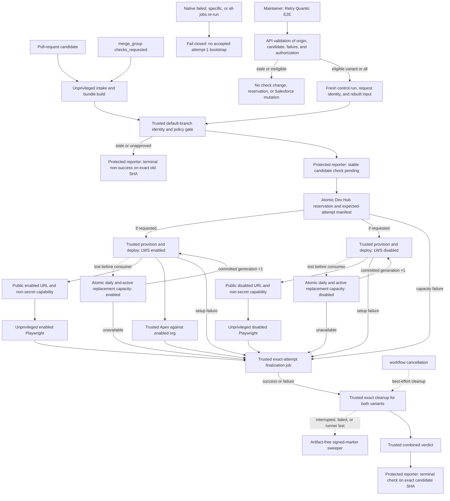

# KIT-6134: Retryable Quantic E2E scratch-org lifecycle

<!-- cspell:words HMAC -->

- **Status:** Proposed spike report
- **Date:** 2026-08-27
- **Decision:** [ADR 0001 — Own Quantic E2E scratch orgs by workflow attempt and LWS variant](../adr/0001-attempt-scoped-e2e-scratch-org-ownership.md)

## Executive Recommendation

Use a protected, base-revision control plane to own one Salesforce scratch-org lease for each `(repository, control workflow run, accepted run attempt, LWS variant)`. Only attempt 1 of a newly accepted lifecycle request may provision or test. GitHub-native failed-job, specific-job, and workflow re-runs are unsupported and fail closed. A supported retry enters through a protected bootstrap, receives a new control run and request identity, and never reuses an earlier request's org or environment output. The LWS-enabled and LWS-disabled lifecycles are independent.

Separate control from test execution:

- Trusted jobs running workflow and lifecycle code from the protected base revision hold Dev Hub credentials and perform reservation, provisioning, candidate metadata deployment, Apex execution, exact cleanup, and reconciliation.
- Pull-request-controlled build and Playwright jobs are unprivileged. They receive only public community URLs and narrowly scoped non-secret browser capabilities. They receive no Dev Hub JWT, scratch-org admin credential, Salesforce CLI auth directory, or privileged `GITHUB_TOKEN`.
- Candidate artifacts and reports are untrusted diagnostics. A trusted finalization job derives the result from an expected-attempt manifest and GitHub's exact job IDs and conclusions; it verifies the expected diagnostic artifact IDs and digests but never treats artifact content as pass/fail authority.
- An authorized maintainer retries one failed variant, or explicitly retries all, through a protected default-branch entrypoint. Trusted code verifies the original run, immutable candidate, current PR or merge group, and eligible failure through GitHub before creating fresh state.
- A separate protected reporter with only a dedicated `checks: write` credential publishes one stable required check on the immutable candidate or merge-group SHA. Candidate code never receives that credential.
- Scratch-org creation persists a signed, server-visible request identity and committed active/daily capacity before submission. Transport or runner loss before the operation ID is durable enters `submission-uncertain`; no create, replacement, or release is allowed until trusted reconciliation proves the exact outcome.
- A canonical HMAC-signed marker in Dev Hub proves lifecycle ownership without artifacts. A serialized reservation broker makes capacity admission atomic for participating consumers. Until quotas and participation are confirmed, allow at most one manually approved Quantic lifecycle with at most two variants.

## Current Problem

The current reusable workflow creates two variants in setup matrix jobs, exports `.env` files through run-level artifacts, runs four Playwright shard jobs and one Apex job, then deletes every active org matching `quantic-<six-character-commit-prefix>`. Both variants and concurrent runs of the same commit can share that name. The current Apex resolver chooses the first match when several exist.

GitHub re-runs keep `GITHUB_RUN_ID` and the original SHA/ref but increment `GITHUB_RUN_ATTEMPT`. Failed-job and specific-job re-runs do not rerun successful bootstrap, reservation, or provisioning prerequisites. GitHub also lists artifacts at run scope, not attempt scope. A native re-run can therefore execute a consumer with earlier outputs after trusted cleanup has deleted the org. Cancellation can interrupt commands and forcibly end remaining work after five minutes.

The safe design cannot simultaneously delete promptly and promise that an arbitrary future attempt can reuse the same temporary org. Attempt-scoped ownership resolves that contradiction.

## Jira-required Direct Answers

| Question                                                        | Decision                                                                                                                                                                                                                                                                                                                                                                                                                                                 |
| --------------------------------------------------------------- | -------------------------------------------------------------------------------------------------------------------------------------------------------------------------------------------------------------------------------------------------------------------------------------------------------------------------------------------------------------------------------------------------------------------------------------------------------- |
| Can failed jobs safely reuse original artifacts or orgs?        | **No for lifecycle state.** No request may adopt an earlier org, URL manifest, deployment checkpoint, username, auth state, or other environment output. Within one accepted request, a bounded process retry may resume only its exact signed generation and operation ID. Reports are diagnostics only.                                                                                                                                                |
| What if scratch-org creation is accepted but no ID is recorded? | The pre-submission state becomes `submission-uncertain`. Its active and daily reservations remain committed, even after workflow or marker TTLs. Trusted code may only bind the exact signed marker/operation, prove authoritative terminal rejection, or escalate to audited manual reconciliation; it cannot submit another create or release capacity from absence alone.                                                                             |
| Are GitHub's native re-run buttons supported?                   | **No.** Failed-job and specific-job re-runs skip successful lifecycle prerequisites, and re-run-all retains the same control run identity. The controller also rejects an upstream intake whose source `run_attempt` is greater than 1. Every lifecycle, test, finalization, and reporter job requires an accepted attempt-1 bootstrap record; a native re-run fails before reading outputs or mutating Salesforce and cannot update the required check. |
| How is a failed variant retried?                                | An authorized maintainer uses the protected default-branch retry entrypoint with the original control run, immutable candidate identity, and failed variant. Trusted API checks reject stale or ineligible input, then issue a fresh control run/request, rebuild and revalidate candidate input, reserve only that variant, and provision fresh state. `all` is an explicit supported scope for retry-all.                                              |
| How is the result attached to the candidate?                    | A protected reporter writes one stable required check on the verified PR candidate or merge-group SHA. Its dedicated check-writing credential is absent from PR jobs. The reporter serializes updates by an external key, moves only from pending to a terminal conclusion for the current accepted request, and cannot report success when state or GitHub is ambiguous.                                                                                |
| How does cleanup know no retry can consume an org?              | It does not predict retries. Only the exact accepted request, attempt, variant, and generation can consume an org. A supported retry has a fresh identity, so cleanup can delete a terminal request immediately.                                                                                                                                                                                                                                         |
| Can one LWS environment be recreated independently?             | **Yes.** Each variant has its own reservation, signed marker, generation, checkpoints, producer jobs, and cleanup record. Recreating one invalidates only that variant.                                                                                                                                                                                                                                                                                  |
| What happens if an org disappears or expires between attempts?  | A later supported request creates a new org. Within a request, loss before consumers start permits one replacement only after an atomic daily-capacity top-up. Active capacity must also be secured by a temporary top-up or by verifying absence and releasing/rebinding the old slot. Loss after a consumer starts requires a fresh supported retry.                                                                                                   |
| How are leaks detected and removed?                             | Trusted terminal cleanup deletes exact signed generations. An artifact-free sweeper verifies HMAC markers and reservation state in Dev Hub, checks GitHub when available, and removes terminal or expired generations. Invalid signatures are never deleted automatically.                                                                                                                                                                               |
| What is the capacity impact?                                    | A first or full request reserves two orgs; a one-variant retry reserves one. Admission includes all active orgs, same-day creations, pending reservations, requested variants, replacement top-ups, and reserves. Deletion frees active allocation but not daily creation usage.                                                                                                                                                                         |
| What is the performance impact?                                 | Known baseline span is 925 seconds p50 and 1759.7 seconds p95, with 39.3 and 57.6 runner-minutes. The planning range is 1050–1450 seconds p50, 1950–2700 seconds p95, and 42–65 runner-minutes. The KIT-6129 live sample of about 656 seconds and 32.1 runner-minutes is one sample and not evidence of a distribution.                                                                                                                                  |

## Trust Model and Workflow Boundary

### Actors and permissions

| Actor                           | Revision and inputs                                                                     | Credentials                                                                    | Permitted behavior                                                                                                                                  |
| ------------------------------- | --------------------------------------------------------------------------------------- | ------------------------------------------------------------------------------ | --------------------------------------------------------------------------------------------------------------------------------------------------- |
| PR/merge-group intake and build | Immutable PR candidate or `merge_group.head_sha`                                        | Read-only token; no Salesforce or reporter secrets                             | Build candidate deploy bundle, run non-Salesforce checks, upload untrusted bundle and diagnostics.                                                  |
| Trusted retry bootstrap         | Protected default-branch revision and operator inputs                                   | Read-only Actions, checks, and PR API; no candidate credential                 | Validate original run, candidate currency, failure eligibility, operator, and requested variant; create a fresh lifecycle request.                  |
| Trusted controller              | Protected default/base revision only                                                    | Read-only Actions/PR API plus protected HMAC and Dev Hub secrets               | Resolve immutable candidate, reject stale or native-rerun requests, reserve capacity, create expected-attempt manifest, coordinate lifecycle.       |
| Protected reporter              | Protected default-branch reporter only                                                  | Dedicated GitHub App installation token with `checks: write` and metadata read | Create or update the stable required check on the exact candidate SHA; never execute candidate code or hold Salesforce credentials.                 |
| Trusted provision/deploy        | Protected base lifecycle scripts; candidate bundle treated as passive data              | Dev Hub JWT and scratch-org auth                                               | Safely extract and validate allowlisted metadata, create/adopt exact org, deploy with explicit operation IDs, publish, emit sanitized URL manifest. |
| Unprivileged Playwright         | Candidate revision and test code                                                        | Public URL and non-secret browser capability only                              | Execute the matching LWS project and upload diagnostics. No Salesforce CLI setup or auth files.                                                     |
| Trusted Apex                    | Protected base runner and CLI; candidate Apex executes only inside isolated scratch org | Exact scratch-org auth derived by trusted control plane                        | Invoke Apex tests by exact org, capture server-side test run ID and job conclusion, upload diagnostics.                                             |
| Trusted cleanup/finalization    | Protected base lifecycle code                                                           | Dev Hub credentials, HMAC key, read-only Actions API                           | Determine exact producer results, cancel exact operations, verify signed marker, delete exact org, audit outcome.                                   |
| Trusted sweeper                 | Protected scheduled/manual workflow                                                     | Dev Hub credentials, HMAC key, read-only Actions API                           | Reconcile valid managed records without workflow artifacts.                                                                                         |

Each unprivileged Playwright job declares job-level minimum permissions, uses checkout with `persist-credentials: false`, is not attached to a secret-bearing GitHub Environment, receives no repository or environment secrets, and runs on an ephemeral runner with no workspace, cache, or auth directory from a privileged job. Any read token needed by a pinned infrastructure action is not exported to candidate test steps. The candidate process receives only the public URL and non-secret test capability.

### Trigger and revision rules

Use unprivileged `pull_request` and `merge_group: checks_requested` intake workflows followed by a protected `workflow_run` controller from the default branch. The controller's own `GITHUB_SHA` identifies its default-branch revision, not the candidate; every candidate SHA is resolved from the triggering run and GitHub API. The privileged workflow must never execute a file, action, package script, binary, or test from the candidate revision.

The controller resolves the PR and exact candidate SHA through the GitHub API rather than trusting an artifact field. Untrusted artifacts are extracted outside the workspace with path traversal, symlink, file-count, size, path allowlist, and file-type checks. Trusted dependencies and lifecycle scripts come only from the protected base revision. The control plane computes the accepted bundle digests itself.

Do not combine `pull_request_target` with candidate checkout or execution. GitHub explicitly warns that privileged `pull_request_target` and `workflow_run` workflows can expose secrets or write tokens when they execute untrusted code or artifacts.

### Protected required-check reporter

The branch ruleset requires one check named `Quantic E2E / protected lifecycle` from the dedicated reporter GitHub App for both pull requests and merge queues. The reporter targets the immutable SHA selected by intake: the current configured PR candidate SHA for a pull request, or the exact `merge_group.head_sha` for `checks_requested`. It never uses the controller's default-branch `GITHUB_SHA`, copies a PR result onto a merge group, or reports against a branch name.

The stable external and idempotency key is:

```text
qci-check-v1:<repository_id>:<candidate_sha>
```

GitHub does not enforce `external_id` uniqueness. The broker therefore serializes reporter commands by this key and stores the resulting check-run ID, expected App ID, current accepted lifecycle request ID, and transition version. Under that lock, the reporter lists check runs for the exact SHA, stable name, App ID, and external ID: zero matches creates one record, one updates the stored record, and more than one fails closed and alerts instead of selecting the newest. If a create response is lost or ambiguous, reconciliation polls for that exact external ID and never blindly creates again; zero or multiple records at the deadline remain fail-closed.

Allowed transitions are:

1. After candidate and policy validation, absent or eligible terminal-failure check → `queued`/`in_progress` for the newly accepted request.
2. Current `queued`/`in_progress` → `completed` with `success`, `failure`, `cancelled`, or `timed_out` after exact finalization and cleanup.
3. A terminal check may return to `in_progress` only after the broker accepts a newer supported retry for the same immutable candidate. A successful candidate is not retry-eligible.

Every update compare-and-sets the current request ID and transition version. A late older request cannot overwrite a newer pending or terminal result. Before pending and terminal writes, the read-only controller verifies that a PR still has the expected head and configured candidate SHA, or that the merge group still exists with the same head SHA and membership. A stale PR or replaced merge group receives no Salesforce mutation; any already-pending old-SHA check is completed non-successfully, and the reporter never writes to the newer SHA. Each new merge-group SHA receives its own key and check.

If GitHub state is ambiguous, the App identity mismatches, a write fails, or reporter records are duplicated, no success is emitted. The required check remains missing, pending, or non-successful while a protected reconciliation job retries and eventually marks it `timed_out`. Only the reporter job receives the dedicated App credential; PR intake, candidate build, Playwright, Apex, and general controller jobs have `checks: read` or no Checks permission. Pinning the required check to the reporter App prevents candidate code from satisfying it with a same-named status.

### Supported retry entrypoint and operator experience

The controller accepts an intake handoff only when the triggering source workflow has `run_attempt == 1`. Every lifecycle, test, finalization, and reporter job then requires a broker-issued bootstrap record matching its exact control run ID, `GITHUB_RUN_ATTEMPT == 1`, candidate key, requested variants, and request nonce. A native **Re-run failed jobs**, **Re-run specific job**, or **Re-run all jobs** has attempt 2 or greater but no accepted bootstrap record. It fails before downloading prior environment outputs, invoking Playwright/Apex, updating the stable check, or mutating Salesforce. This guard is present in every job because a specific-job re-run may omit its prerequisites.

The supported entrypoint is a protected default-branch `workflow_dispatch` named **Retry Quantic E2E**, or an equivalent GitHub App operation that calls the same validator. It accepts only:

- original control workflow run ID;
- immutable candidate SHA plus candidate kind and PR number or merge-group identity;
- requested scope: `lws-enabled`, `lws-disabled`, or explicit `all`.

Inputs are lookup keys, not authority. Before accepting a retry, trusted base-revision code uses GitHub and broker APIs to prove that the original run belongs to the expected repository/workflow, its signed manifest names the same candidate, cleanup is complete or safely fenced, no newer candidate/request supersedes it, and the requested variant has the latest trusted failed, cancelled, timed-out, or infrastructure-failure result. A partial retry is allowed only when every required variant not selected for retry has a trusted terminal success. For a PR, its current head and configured candidate SHA must still match; for a merge group, the exact group SHA and membership must still be active. Fork approval and metadata policy are rechecked.

An accepted dispatch receives its own unique GitHub run ID, attempt-1 request key, broker sequence, and nonce. It rebuilds and revalidates candidate input, atomically reserves exactly the requested variant or both variants for `all`, and provisions new generations. It may carry forward only trusted terminal results for variants not selected for retry; it never reads an earlier URL, org ID, username, auth state, deployment checkpoint, or other environment output.

GitHub requires write access to invoke `workflow_dispatch`. Repository policy further limits it to the Quantic CI maintainer team and a protected Environment with default-branch deployment restrictions and required approval. A dispatch from another ref receives no credentials and is rejected. The failed required check links to the original control run and displays the eligible variant plus **Actions → Retry Quantic E2E** instructions. Contributors without write access request that action from a maintainer. Duplicate or unauthorized requests fail without changing the stable check or reserving capacity.

### Candidate deployment is still a privileged action

Treating source as passive data prevents direct runner code execution, but deploying it can execute or activate Salesforce behavior inside the scratch org. The trusted deployer therefore:

1. Accepts only generated metadata under reviewed Quantic package roots; it rejects workflow files, package manifests, scripts, executables, symlinks, and unexpected metadata types.
2. Uses trusted base-revision Salesforce project configuration and CLI, explicit source directories, structured JSON, `--no-track-source`, and `NoTestRun` for source deployment.
3. Deploys only to an empty, disposable scratch org containing no production data, production credentials, named credentials, or privileged Coveo secrets.
4. Runs candidate Apex later through the trusted Apex job. Apex executes server-side in the isolated org; candidate shell code never runs beside the JWT.
5. Gives the browser only a public community URL and a revocable, test-scoped capability that is safe to expose in client code.

An internal PR is not trusted merely because GitHub may make repository secrets available to same-repository branches. The same job separation applies to internal and fork PRs. Internal PRs may be admitted automatically after policy checks; fork and Dependabot PRs require a maintainer-approved immutable SHA before the protected dispatch. A new push invalidates that approval and produces a different request. If safe metadata allowlisting cannot cover a change, real-org testing waits for maintainer review rather than widening the privileged input surface.

## Dependency and Outcome Diagram



Success preserves diagnostic evidence, verifies exact job conclusions, deletes exact generations, and reports on the candidate SHA rather than the controller SHA. Setup or test failure preserves the failed trusted result and diagnostics, then cleans. Cancellation attempts trusted cleanup but relies on the sweeper if GitHub's cancellation window interrupts it. Every supported retry passes through origin, current-candidate, authorization, reporter, and reservation gates with a fresh request identity; native re-runs never enter the graph.

## Stable Identity

| Scope                    | Key                                                                                  |
| ------------------------ | ------------------------------------------------------------------------------------ |
| Candidate result lineage | `<repository_id>:<candidate_kind>:<candidate_sha>`                                   |
| Control request          | `<repository_id>:<control_workflow_run_id>`; every supported retry gets a new run ID |
| Accepted attempt         | `<repository_id>:<control_workflow_run_id>:a1`; attempts greater than 1 are invalid  |
| Variant environment      | Accepted-attempt key plus `lws-enabled` or `lws-disabled`                            |
| Org generation           | Variant environment plus increasing generation and 128-bit random generation nonce   |

Do not key identity by commit prefix, branch, PR number alone, native run-attempt increment, local Salesforce alias, or artifact name. The candidate lineage records the original request, each accepted retry's monotonic broker sequence, and latest accepted request per variant. A compact `OrgName` is derived from the environment identity for operator readability, but the signed marker is authoritative. The formatter validates the Salesforce field length and fails before creation rather than truncating into a collision.

## Canonical HMAC-signed Dev Hub Marker

Every managed org has exactly one canonical marker in `ScratchOrgInfo.Description`:

```text
qci1.<base64url-payload>.<base64url-hmac-sha256>
```

The payload is a fixed 147-byte, big-endian binary record. Variable-length JSON and self-asserted hashes are not permitted.

| Offset | Size | Field                                         |
| -----: | ---: | --------------------------------------------- |
|      0 |    1 | Schema version `1`                            |
|      1 |    1 | HMAC key version                              |
|      2 |    8 | Unsigned repository ID                        |
|     10 |    8 | Unsigned control workflow run ID              |
|     18 |    4 | Run attempt                                   |
|     22 |    1 | Variant: `1` enabled, `2` disabled            |
|     23 |    4 | Generation                                    |
|     27 |    8 | Marker expiry as Unix seconds                 |
|     35 |   32 | SHA-256 of accepted candidate source manifest |
|     67 |   32 | SHA-256 of scratch definition                 |
|     99 |   32 | SHA-256 of the validated deploy bundle        |
|    131 |   16 | Random generation nonce                       |

The signature is `HMAC-SHA-256(secret[keyVersion], ASCII("qci1.") || payloadBytes)` and is compared in constant time. The secret exists only in protected controller, cleanup, and sweeper jobs. The payload encodes the key version used for rotation; old keys remain verify-only until every marker and uncertain creation submission they signed is reconciled, even when marker expiry has passed.

For the fixed payload, URL-safe Base64 without padding is 196 characters and the signature is 43 characters, making the complete marker 245 ASCII characters. Before rollout, the trusted controller uses Salesforce object describe metadata to verify the actual `ScratchOrgInfo.Description` length is at least 245 and verifies that `sf org create scratch --description` preserves the value byte-for-byte. If either check fails, creation stops; the approved fallback is a dedicated Dev Hub field or reservation record referenced by a shorter signed marker, not truncation.

Verification requires the exact prefix, segment count, encoded lengths, canonical URL-safe Base64, payload length, supported versions, valid variant, nonzero IDs, plausible expiry, and HMAC. An invalid or unknown marker is unowned and is never deleted automatically.

## Durable Control State

The trusted reservation broker stores non-secret lifecycle state in Dev Hub, not in a workflow artifact. A conceptual serialized view is:

```json
{
  "schemaVersion": 1,
  "reservationId": "repository:run:attempt",
  "candidateKind": "pull_request",
  "candidateKey": "repository:pull_request:40-character-git-sha",
  "pullRequest": 1234,
  "candidateSha": "40-character-git-sha",
  "originRequestId": "repository:original-run:a1",
  "retryOfRequestId": null,
  "candidateSequence": 1,
  "requestCreatedAt": "2026-08-27T18:00:00Z",
  "requestedVariants": ["lws-enabled", "lws-disabled"],
  "lifecycleDeadline": "2026-08-27T19:15:00Z",
  "heartbeatAt": "2026-08-27T18:05:00Z",
  "state": "provisioning",
  "requiredCheck": {
    "externalId": "qci-check-v1:repository-id:candidate-sha",
    "checkRunId": 123456700,
    "currentRequestId": "repository:run:a1",
    "transitionVersion": 1
  },
  "variants": {
    "lws-enabled": {
      "generation": 1,
      "signedMarker": "qci1.payload.signature",
      "createSubmission": {
        "requestId": "qci-create-v1:sha256-of-canonical-marker",
        "state": "submission-uncertain",
        "preparedAt": "2026-08-27T18:04:55Z",
        "submittedAt": "2026-08-27T18:05:00Z",
        "acknowledgementDeadline": "2026-08-27T18:07:00Z",
        "controllerReconcileDeadline": "2026-08-27T18:15:00Z",
        "salesforceOperationId": null,
        "lastDevHubObservationAt": "2026-08-27T18:06:00Z",
        "releaseBlocked": true,
        "capacityFence": {
          "active": 1,
          "daily": 1,
          "committed": true
        }
      },
      "scratchOrgInfoId": null,
      "signupUsername": null,
      "operationIds": {
        "sourceDeploy": null,
        "communityDeploy": null,
        "apexTest": null
      },
      "latestStartedRequestId": "repository:run:a1",
      "producerJobIds": {},
      "cleanup": "blocked-on-create-reconciliation"
    }
  }
}
```

`createSubmission.state` is one of `prepared`, `submitting`, `accepted`, `submission-uncertain`, `terminal-succeeded`, `terminal-failed`, or `manual-reconciliation-required`. The broker persists `prepared`, the full signed marker, and both capacity fences before network I/O, then compare-and-sets `submitting` immediately before invoking Salesforce. A structured response with an exact operation ID becomes `accepted`. A transport error, malformed response, acknowledgement timeout, runner loss, or stale heartbeat while `submitting` becomes `submission-uncertain`; a runner does not need to survive for this transition because the sweeper interprets stale `submitting` as uncertain.

Only trusted code writes this state. Candidate-level state serializes retry eligibility and reporter transitions; reservation-level state owns only the fresh request's generations. It contains identifiers, digests, timestamps, operation IDs, and public URLs but no JWT, access token, auth URL, cookie, password, or CLI auth directory. Artifacts may mirror a sanitized snapshot for debugging, but retry authorization, state recovery, reporting, and sweeping query trusted APIs and Dev Hub.

## Atomic Capacity Reservation and Concurrency

### Reservation broker

Provision through one trusted Dev Hub reservation endpoint. The recommended implementation is a small Apex REST service with a singleton `Quantic_CI_Capacity__c` row and per-attempt `Quantic_CI_Reservation__c` rows. Its transaction locks the singleton with `FOR UPDATE`, expires stale reservations, counts Dev Hub usage, and creates an idempotent reservation before releasing the lock.

Let:

- `A` be the confirmed active scratch-org allocation.
- `D` be the confirmed daily scratch-org creation allocation.
- `U_A` be all currently active scratch orgs in Dev Hub, including non-Quantic consumers.
- `U_D` be all scratch orgs created today, including deleted and non-Quantic orgs.
- `P_A` and `P_D` be previously committed broker reservations not yet reflected in those counts, including `submitting`/`submission-uncertain` creation fences and a verified-absent generation's active slot returned to pending state.
- `V_A` and `V_D` be the current fresh request's active and daily demand: `2` for first/retry-all or `1` for a one-variant retry.
- `T_A` and `T_D` be the current lost-generation replacement top-up demand.
- `H_A` and `H_D` be active and daily reserves, including the reviewed worst-case burst from consumers not yet using the broker.

Admission is one atomic transaction and succeeds only when both hold:

```text
U_A + P_A + V_A + T_A + H_A <= A
U_D + P_D + V_D + T_D + H_D <= D
```

For initial provisioning, `V_A = V_D` is the number of requested variants and both top-ups are zero. The transaction reserves that active and daily demand. Before submission, each variant's active and daily slots move into its durable creation fence. A successful creation converts the fenced active slot into a materialized org without double-counting it; its daily slot becomes observed daily usage. A reservation may expire only when trusted evidence proves no create was submitted, or after the exact submission is terminal and its active/daily accounting is reconciled. `submitting`, `submission-uncertain`, and `manual-reconciliation-required` fences never expire from heartbeat, workflow completion, marker expiry, or the ordinary reservation TTL. Deleting an org reduces active usage but does not refund `U_D`.

Every lost-generation replacement executes another locked broker transaction before incrementing the generation or invoking Salesforce. It always sets `T_D = 1` because a replacement consumes another daily creation. The preferred path deletes the exact old generation, verifies absence, and in the same serialized state transition releases its materialized active use back to the variant's pending reservation; then `T_A = 0` because that already-owned active slot is rebound to the replacement. If the old generation remains active and policy permits temporary overlap, `T_A = 1` reserves the additional active slot. A `submitting` or uncertain creation is not a lost generation: its active/daily fences cannot be reused or topped up, and replacement is forbidden until reconciliation. No query-then-create gap is allowed. If the daily top-up, active top-up, or verified release cannot be committed, replacement fails closed without changing generation, creating an org, or starting a consumer.

All automated users of the same Dev Hub must eventually call this broker for strict global serialization. Until their participation and the actual `A`, `D`, `H_A`, and `H_D` values are confirmed, the safe fallback is:

- one protected GitHub concurrency group for the complete Quantic control lifecycle;
- `cancel-in-progress: false` and a queued maximum, so old work cannot cancel new work;
- at most one active Quantic lifecycle (`R_temp = 1`) and at most two requested variants (`V_max = 2`);
- required Dev Hub-owner approval that reserves the requested initial slots and separately approves every replacement's daily and possible overlap top-up;
- fail closed without creating an org when allocation or reserve cannot be proven.

This is deliberately a manual cap, not a query-then-create race. Once the atomic broker and confirmed limits are available, maximum concurrent full workflows are bounded by:

```text
R_max = floor((A - U_A - P_A - H_A) / 2)
```

The daily bound for an operating window is:

```text
2 * full_requests + single_variant_requests + accepted_generation_replacements
  <= D - U_D - P_D - H_D
```

### Request ordering and stale candidates

Do not use PR-number concurrency with `cancel-in-progress: true`: an older request or unauthorized native re-run could otherwise cancel work for the newer PR head. The global control queue never cancels in-progress work. Any control run with `GITHUB_RUN_ATTEMPT > 1` is ineligible regardless of age or requested job.

The trusted controller queries the current PR candidate or active merge-group SHA before reporter pending, reservation, deployment, and consumers. The broker records the original request, candidate SHA, accepted `created_at`, unique run ID, and monotonic candidate sequence. For one candidate lineage it rejects a request older than an already accepted request and accepts only attempt 1 of a unique run ID. A supported retry gets a new run ID and a later sequence only after origin/failure validation; a native re-run keeps the old run ID and is rejected.

When a new head appears while an old lifecycle is active, the old controller's five-minute heartbeat detects the mismatch, stops new consumers, and requests exact cleanup. The newer request waits for serialized cleanup rather than canceling the old workflow. This can add queue time but cannot make an old request cancel or delete the new head's environment.

### Scratch-org create submission identity and reconciliation

The creation request identity exists before submission. For each reserved generation, trusted code computes:

```text
creationRequestId = "qci-create-v1:" + hex(SHA-256(ASCII(canonicalSignedMarker)))
```

The reservation stores that ID and the full marker before the network call. The Salesforce request carries the full marker byte-for-byte in `ScratchOrgInfo.Description` and a compact derived `OrgName`; the marker's repository, control run, accepted attempt, variant, generation, digests, expiry, and random generation nonce make the submission unique. The local hash is an index, while the HMAC-signed marker is the server-visible ownership proof. A generation nonce is never submitted in a second create request.

The trusted adapter changes `prepared` to `submitting` in the locked reservation before sending `sf org create scratch --async`. It may return to `prepared` or release only when it proves locally that no request bytes left the runner. Once transmission may have occurred, a missing durable operation ID is `submission-uncertain`, not a retryable create failure.

The controller and sweeper reconcile an uncertain submission without artifacts:

1. Query the explicit Dev Hub for the exact full marker. If server filtering cannot compare the whole description, retrieve the narrow immutable run/variant/generation set and byte-compare the complete marker locally; prefix, `OrgName`, recency, and submission-time windows are not authority.
2. If exactly one valid marker exists, bind its exact `ScratchOrgInfo.Id`, username when available, status, and any exact creation operation ID exposed by Salesforce. Continue polling that operation/record, or delete that exact org if the owning request is already terminal or stale.
3. If an operation ID was checkpointed or recovered, query only that operation. An authoritative terminal success materializes the active reservation; an authoritative terminal failure with proof that no org can materialize permits active release. The daily fence becomes observed or conservatively consumed daily usage unless Salesforce proves the attempt did not charge the daily allocation.
4. Zero marker matches is an observation, not proof that Salesforce rejected the request. Multiple exact valid matches, a fence mismatch, unavailable Dev Hub state, or disagreement between marker and operation remains ambiguous.
5. While ambiguous, do not submit another create, increment generation, reserve a replacement, release active/daily capacity, or declare cleanup successful. Reconciliation records every query and alert; only a later exact result can advance state.

At the final cleanup deadline, unresolved state becomes `manual-reconciliation-required`, not released. A Dev Hub owner must use the exact marker, Salesforce operation/audit evidence, and exact deletion/cancellation verification to establish a terminal outcome. There is no force-release based only on elapsed time or an empty query. If authoritative proof remains unavailable, both capacity fences stay quarantined. This guarantees that an org materializing late is still reserved and discoverable.

## Discover, Adopt, Create, and Recreate

1. **Discover:** Trusted code authenticates to the explicit Dev Hub and queries `ScratchOrgInfo`, create-submission state, and the reservation by exact environment identity. Runner-local aliases are never authoritative.
2. **Reconcile submission:** A `submitting` or `submission-uncertain` generation follows the exact marker/operation algorithm above. It cannot enter create or replacement again.
3. **Adopt:** Adoption is allowed only within the same attempt and generation when the reservation, exact org ID/username, valid signed marker, digests, active status, and remaining lease all match.
4. **Create:** With atomic active/daily reservations, persist the create identity and `submitting` fence, then request a one-day org asynchronously using the exact definition, compact name, and signed marker. Persist and resume only an exact returned or reconciled operation ID.
5. **Reserve replacement:** Before consumers start, a proven deleted, expired, unreachable, or under-lived org can be replaced once for that variant only after the broker atomically reserves one additional daily creation and any temporary active overlap, or verifies old-generation absence and rebinds its released active reservation.
6. **Recreate:** After that transaction commits, increment generation, create and sign a new marker, and invalidate all old deployment checkpoints. A failed top-up leaves the old generation and generation number unchanged.
7. **Fail:** Loss after a consumer starts, uncertain creation submission, unavailable replacement capacity, active duplicate identity, signature mismatch, unsupported marker, exhausted replacement, or ambiguous Dev Hub state is infrastructure failure. Never select the first match.

No later request or attempt can adopt an earlier generation, even when source and digests match.

## Idempotent Lifecycle and Operation IDs

| Stage              | Authority and postcondition                                                                                       | Retry behavior                                                                                                             |
| ------------------ | ----------------------------------------------------------------------------------------------------------------- | -------------------------------------------------------------------------------------------------------------------------- |
| Gate and reserve   | Current immutable candidate SHA, accepted request ordering, and committed broker reservation.                     | Idempotently return the same reservation; reject stale or capacity-ineligible requests before mutation.                    |
| Prepare org create | Active/daily fences, canonical marker, creation request ID, and `prepared` state are durable before network I/O.  | Release only with local proof that no request bytes were sent.                                                             |
| Submit org create  | `submitting` is durable before the async request; a returned exact operation ID becomes `accepted`.               | Missing acknowledgement or checkpoint becomes `submission-uncertain`; never resubmit.                                      |
| Reconcile create   | Exact signed marker and exact operation agree on one terminal or active outcome.                                  | Zero/ambiguous results keep both capacity fences and escalate; no create, replacement, release, or recency lookup.         |
| Create org         | Valid signed marker maps to one exact active `ScratchOrgInfo` record.                                             | Persist and resume only the exact returned or reconciled creation operation ID. A valid active duplicate fails closed.     |
| Replace generation | Atomic daily top-up and overlap slot, or verified old-generation release, is committed before generation changes. | Create nothing when top-up/release is unavailable; never spend an unreserved daily creation.                               |
| Create community   | Exactly one expected `Quantic Examples` community exists.                                                         | Query before create; retry only documented transient readiness errors.                                                     |
| Deploy source      | Validated bundle digest is deployed and exact `sourceDeployId` is terminal-success.                               | Submit asynchronously, persist ID before polling, and use exact report/resume/cancel commands. Never use “most recent.”    |
| Deploy community   | Community bundle digest is deployed and exact `communityDeployId` is terminal-success.                            | Same exact-ID rules and bounded readiness retries as source deployment.                                                    |
| Publish and ready  | Published public URL returns a variant-specific readiness marker matching expected digests.                       | Query before publish and probe to a fixed deadline; URL existence alone is insufficient.                                   |
| Playwright         | Known producer job for exact variant/attempt reaches a GitHub terminal conclusion.                                | Playwright's configured retries stay within the job. Org loss is infrastructure failure, not transparent lifecycle replay. |
| Apex               | Known trusted job and exact `apexTest` ID reach terminal conclusion.                                              | Poll the exact test run. Do not discover another org or run by recency.                                                    |
| Finalize           | Expected producer set has exact terminal GitHub results and expected diagnostic artifacts.                        | Missing or nonterminal latest producer fails; never fall back to an older pass.                                            |
| Dispose            | Exact reservation and marker verify, operations are terminal/canceled, and exact org becomes deleted/absent.      | Idempotent exact deletion with bounded retries; ambiguity fails closed, and uncertain creation is not cleared by expiry.   |

If a deploy process dies after Salesforce accepts work but before the ID is durable, do not guess with `--use-most-recent`. Query the exact target org and submission time window through the trusted adapter; if one operation cannot be proven, wait for the deployment slot to settle and idempotently resubmit the same digest. Record both IDs if Salesforce accepted both. This deploy-only recovery rule never applies to scratch-org creation, which stays fenced and is never resubmitted.

## Result and Diagnostic Evidence

### Expected-attempt manifest

Before producers start, the trusted controller stores and signs a manifest containing the fresh control run/accepted attempt, origin request, candidate key and sequence, requested variants, expected logical producer jobs, expected configuration digests, and latest started request per variant. The manifest requires attempt 1 and the broker-issued nonce. As jobs start, trusted control code resolves and records actual job IDs from GitHub's exact run-attempt jobs endpoint; the finalization job re-queries that endpoint. Matrix display names alone are not sufficient without the run ID and attempt.

For each expected producer, the finalization job requires:

1. The recorded job ID belongs to the exact control run, expected attempt, head SHA, workflow, and logical producer.
2. GitHub reports `status: completed` and a terminal conclusion.
3. Each required diagnostic upload has the exact artifact ID returned by the pinned upload action, expected run ID, workflow-recorded producer job ID association, and SHA-256 digest. GitHub's artifact API does not expose a producer job ID, so artifact names or content cannot establish this association; trusted workflow state binds the upload action's ID and digest outputs to the already recorded producer job ID.
4. The producer belongs to the latest accepted request that started that variant according to trusted candidate-level broker state.

Pass/fail comes from the trusted workflow topology and GitHub job conclusions. Artifact content can explain a result but cannot override it. Missing required diagnostics makes finalization an infrastructure failure, not a test pass or test failure.

If a newer supported request starts a producer for one variant and disappears before terminal registration or artifact upload, that request remains latest for the variant and aggregation fails. An older passing result is ineligible. A variant not requested or started by the newer request may retain its latest trusted terminal result from the validated origin lineage. This permits a protected failed-variant retry without treating a stale artifact or prior environment output as authority. A native run attempt is never entered into this ledger.

Artifact names include run, attempt, variant, producer job ID, and purpose. Artifacts are immutable, retention-bound, repository-visible diagnostics. No environment URL artifact, `.env` directory, auth state, or artifact is required by cleanup or the sweeper.

## Cleanup Invariants and Exact Rules

### Invariants

1. Every managed org has one valid canonical marker and one trusted reservation record.
2. A `submitting`, `submission-uncertain`, or `manual-reconciliation-required` create keeps its active and daily reservations committed and blocks create, replacement, release, and successful cleanup.
3. Cleanup accepts only an exact `(reservation, ScratchOrgInfo.Id, SignupUsername, variant, generation, signed marker)` tuple, or authoritative terminal creation evidence when no org exists.
4. Commit prefixes, branch names, local aliases, artifact names, empty discovery results, elapsed TTL, and “most recent” operations are never deletion or release selectors.
5. Cleanup verifies the HMAC and marker fields immediately before mutation and uses constant-time signature comparison.
6. Deleted, expired, or absent exact org is idempotent success only when no unresolved create submission can materialize it. Auth failure, active ambiguity, invalid signature, marker mismatch, or uncertain creation is not success.
7. Known create/source/community operation IDs are terminal or explicitly canceled before deletion and reservation release verification.
8. Original setup/test failure and cleanup failure remain separately visible; cleanup never masks the first failure.
9. CI orgs are not retained for debugging. Persistent manual review orgs use another signed purpose/version and lifecycle.

### Terminal-path behavior

| Path                          | Exact behavior                                                                                                                                                                                                                                                                                |
| ----------------------------- | --------------------------------------------------------------------------------------------------------------------------------------------------------------------------------------------------------------------------------------------------------------------------------------------- |
| Success                       | With every create submission reconciled, finalize exact producer results/diagnostics, delete each exact signed generation, verify Dev Hub state, release reconciled reservations, and let the protected reporter complete the candidate check. Cleanup or reporting failure prevents success. |
| Setup/Apex/Playwright failure | Preserve trusted conclusions and diagnostics, stop new consumers, cancel exact in-flight operations, delete exact generations, release only reconciled reservations, and report terminal failure. The original failure remains primary.                                                       |
| Uncertain org-create submit   | Stop all consumers and report infrastructure failure. Cleanup/sweeper reconcile the exact marker/operation; both capacity fences remain committed until authoritative terminal proof and exact accounting.                                                                                    |
| Cancellation                  | Trusted jobs use `always()`/`finally` cleanup where they are already running. GitHub may terminate work after five minutes, so incomplete cleanup and uncertain create fences stay reserved for the sweeper and the check cannot become successful.                                           |
| Native GitHub re-run          | Every selected lifecycle/test job rejects attempt 2 or greater before using outputs. It creates no reservation or org and cannot reset or complete the stable candidate check.                                                                                                                |
| Supported one-variant retry   | A fresh attempt-1 request reserves and creates only the API-validated failed variant. Old cleanup cannot match its marker. The untouched variant keeps only its latest trusted terminal result, never an environment output.                                                                  |
| Supported retry-all           | A fresh attempt-1 request reserves and creates both variants. It never adopts old generations; old cleanup and sweeper remain independently fenced.                                                                                                                                           |
| Stale PR head or merge group  | Create nothing if detected before reservation. If detected later, stop consumers, clean only the stale request's exact generations, and complete only its exact old-SHA check non-successfully. Never update the replacement SHA.                                                             |

### Duplicate handling

- More than one active, valid marker for one environment identity is an ambiguity. Provisioning, adoption, mutation, and active cleanup fail closed and alert; no record is selected arbitrarily.
- Once those markers are valid and expired, the sweeper sorts all matching records by `(ExpirationDate, CreatedDate, ScratchOrgInfo.Id)`, deletes every exact signed generation in that deterministic order, and records each result in the audit log.
- Deleting expired duplicates does not release a `submitting` or uncertain creation fence until all exact creation operations are terminal and active/daily accounting is reconciled.
- A marker with invalid HMAC, invalid length, unsupported version, malformed fields, or mismatched reservation is never automatically deleted. It is reported for Dev Hub-owner investigation.

## Lease, Heartbeat, Cancellation, and Sweeper

Known p95 reusable-workflow span is 29.3 minutes, and the proposed planning p95 ceiling is 45 minutes. Use these initial constants:

```text
Create acknowledgement timeout   =  2 minutes
Controller create reconciliation = 10 minutes
Lifecycle hard timeout            = 75 minutes
GitHub cancellation window        =  5 minutes
Trusted cleanup retry budget      = 10 minutes
Sweeper scheduling margin         = 20 minutes
Marker expiry                     = reservation time + 90 minutes
Final cleanup deadline            = reservation time + 110 minutes
Heartbeat interval                =  5 minutes
Heartbeat stale threshold         = 15 minutes
```

If no exact operation ID is durable within the two-minute acknowledgement timeout, the create becomes `submission-uncertain`. The controller polls exact marker/operation state for ten minutes, starts no consumers, then records infrastructure failure and hands the fence to the sweeper. The broker rejects ordinary heartbeat renewal after the 75-minute lifecycle deadline. The marker expiry includes the hard timeout, cancellation, and cleanup retry budgets. The sweeper margin allows two ten-minute sweeper intervals for deletion and retry, but these ordinary TTLs do not release an uncertain creation fence.

The sweeper runs every ten minutes and supports a dry-run dispatch. It uses Dev Hub reservation state and signed markers; artifacts are irrelevant.

- If GitHub proves the owning attempt terminal, sweep after the trusted cleanup's ten-minute budget, except that an unresolved create submission remains fenced.
- If GitHub is unavailable or indeterminate, do not delete before marker expiry and do not delete while a valid heartbeat is fresh.
- For `submitting` or `submission-uncertain`, query the exact marker and any exact recovered operation every interval. A zero-result query never releases capacity or authorizes another create.
- At marker expiry, an ordinary indeterminate generation becomes eligible only when its heartbeat is stale. Because renewal stops at the hard lifecycle deadline, a correctly operating job cannot stay fresh through expiry. An uncertain create is exempt from this automatic eligibility rule.
- If an org with the exact valid marker materializes after marker expiry, delete that exact expired generation, verify absence and creation-operation terminal state, then reconcile its active and daily fences. The reservation was retained, so this materialization is never unreserved.
- Delete an eligible exact generation, verify Dev Hub deletion/absence, and retry through the 20-minute margin. Alert when the 110-minute deadline is missed.
- At 110 minutes, an unresolved create changes to `manual-reconciliation-required`; alert the Dev Hub owner and keep both fences in `P_A`/`P_D`. Marker expiry, workflow deletion, daily rollover, and the one-day scratch-org lifetime do not authorize force-release. Retain the marker's HMAC verification key until resolution.
- Salesforce's one-day scratch-org expiration is the final platform fallback, not the operational cleanup target.

This prevents the sweeper from deleting a potentially active job merely because GitHub cannot answer. Ordinary leaks remain bounded by the cleanup deadline; an uncertain create deliberately quarantines capacity past that deadline until authoritative or audited manual reconciliation, preventing late unreserved org materialization.

## Capacity and Performance Estimates

### Capacity

| Scenario                               | Requested variants |                        New orgs |               Peak Quantic orgs for that lifecycle |
| -------------------------------------- | -----------------: | ------------------------------: | -------------------------------------------------: |
| First request                          |                  2 |                               2 |                                                  2 |
| Supported retry-all                    |                  2 |                               2 |                   2 after serialized prior cleanup |
| Supported failed-variant retry         |                  1 |                               1 |                                                  1 |
| Replacement after verified old release |                  1 | 1 extra reserved daily creation |           1 active; old slot is rebound atomically |
| Replacement with permitted overlap     |                  1 | 1 extra reserved daily creation | 2 active for that variant only after active top-up |
| Replacement top-up unavailable         |                  1 |                               0 |                        No replacement; fail closed |
| Uncertain create submission            |                  1 |          0 or 1 may appear late |            1 active and 1 daily slot remain fenced |
| Canceled run before sweep              |              0 new |      Up to 2 temporarily leaked |             Bounded by 110-minute cleanup deadline |
| Per-shard alternative                  |                  8 |                               8 |                                        8; rejected |

The broker formulas account for every Dev Hub consumer, not only signed Quantic orgs. Exact allocations and external-consumer burst reserve remain external inputs; automatic concurrency above the temporary cap is not approved until they are known.

### Known measurements and planning estimate

| Metric             | Baseline reusable workflow | KIT-6129 live sample |     Proposed planning range |
| ------------------ | -------------------------: | -------------------: | --------------------------: |
| Wall span p50      |           925 s / 15.4 min |     656 s / 10.9 min | 1050–1450 s / 17.5–24.2 min |
| Wall span p95      |        1759.7 s / 29.3 min |      Not established |   1950–2700 s / 32.5–45 min |
| Runner-minutes p50 |                       39.3 |                 32.1 |                       42–55 |
| Runner-minutes p95 |                       57.6 |      Not established |                       55–65 |

The live KIT-6129 result is one sample and cannot estimate a percentile or prove an improvement. The proposed range adds protected-workflow handoff and finalization overhead and allows for reduced Playwright fan-out, while recognizing that variant setup remains parallel and fewer jobs repeat repository setup. A supported one-variant retry is expected to use roughly 650–1500 seconds and 20–38 runner-minutes, but this is also a planning range until measured.

### Reproducible paired benchmark

1. Select at least 20 representative immutable merge SHAs that trigger Quantic E2E, including ordinary, Apex-heavy, and community-metadata changes.
2. For each SHA, run legacy and candidate workflows as an A/B pair against clean one-day orgs. Randomize A→B versus B→A and start the second within 30 minutes to reduce platform-time bias.
3. Use the same runner class, Playwright image, test selection, worker count per job, Salesforce definitions, and cache policy. Record whether each cache was warm; do not compare unlike cache states.
4. Record queue time separately from reusable-workflow span; capture each lifecycle stage, Playwright, Apex, cleanup, artifact handoff, total runner-minutes, org creations, active peak, retries, and leak deadline.
5. Compare paired medians and p95 values, publish raw run IDs, and report failures separately from successful timing samples. Do not substitute the KIT-6129 sample for the paired set.
6. Canary acceptance requires zero missed cleanup deadlines, no credential-boundary violation, p95 span at or below 2700 seconds, and p95 runner-minutes at or below 65. Exceeding a ceiling pauses rollout for runner sizing or safe test partitioning; it does not permit cross-attempt org reuse.

## Deterministic Fault-injection Plan

Fault hooks live only in protected lifecycle code, accept a fixed enum, and are enabled only by approved `workflow_dispatch` against a non-production Dev Hub. Candidate code cannot select a privileged hook.

| Layer            | Deterministic hook                    | Expected state and evidence                                                                                                                                                                                                                                     |              Test timeout |                                                                    Cleanup deadline |
| ---------------- | ------------------------------------- | --------------------------------------------------------------------------------------------------------------------------------------------------------------------------------------------------------------------------------------------------------------- | ------------------------: | ----------------------------------------------------------------------------------: |
| Native rerun     | `native-run-attempt-2`                | Invoke GitHub's failed-job, specific-job, and all-jobs re-run paths. Every selected lifecycle, test, finalization, and reporter job rejects the missing attempt-1 bootstrap before prior outputs or Salesforce use; the stable check is not reset or completed. |                     5 min |                                             None; no reservation or org is created. |
| Retry bootstrap  | `eligible-one-variant-retry`          | Original failed variant and current candidate validate; a new run ID/attempt-1 request reserves one variant, rebuilds input, provisions fresh state, and consumes no prior environment output.                                                                  |                    45 min |                                            Within 110 min of the retry reservation. |
| Retry bootstrap  | `retry-stale-candidate`               | Change PR head before dispatch validation. Request is rejected, no reporter pending transition or reservation occurs, and no check is written to the new SHA.                                                                                                   |                     5 min |                                                            None; no org is created. |
| Merge queue      | `replace-merge-group-before-reserve`  | Replace the merge-group SHA or membership. Old request is non-successful, no mutation starts, and the replacement group requires its own check key.                                                                                                             |                     5 min |                                                            None; no org is created. |
| Reporter         | `reporter-write-fails-once`           | Exact check remains missing/pending and cannot become success; protected reconciliation retries the same check-run ID and external key.                                                                                                                         |                    10 min | Resource cleanup follows the owning request deadline; check terminal within 20 min. |
| Reporter         | `older-request-reports-late`          | Compare-and-set rejects the old request/version; newer pending or terminal check is unchanged and duplicate check count remains one.                                                                                                                            |                     5 min |                                                     No additional resource cleanup. |
| Controller       | `after-reservation-exit`              | Reservation exists, no org, trusted controller failure recorded; no producer accepted and required check cannot succeed.                                                                                                                                        |                     5 min |                                                 Reservation released within 10 min. |
| Org create       | `drop-create-response-after-accept`   | A deterministic proxy lets Salesforce accept the marker-bearing request, drops the response, and kills the runner before checkpoint. State becomes `submission-uncertain`; active/daily fences remain committed, and no second create or replacement is issued. |                    10 min |       Exact marker/operation reconciliation; alert with fences retained at 110 min. |
| Org create       | `hide-create-result-through-deadline` | The trusted adapter hides both marker and operation observations through the final deadline. State becomes `manual-reconciliation-required`; empty queries and TTL do not release either fence.                                                                 |                   110 min |          No automatic deadline or release; audited Dev Hub-owner proof is required. |
| Capacity         | `replacement-capacity-unavailable`    | Daily top-up, temporary active top-up, or verified old-slot release is unavailable; generation and checkpoints remain unchanged and no replacement create command is issued.                                                                                    |                     5 min |                         Exact old generation follows its existing cleanup deadline. |
| Source deploy    | `after-source-submit-exit`            | Exact deployment ID is persisted or adapter records uncertain-submit state; no “most recent” lookup.                                                                                                                                                            |                    15 min |                      Exact cancel/delete within 30 min terminal, otherwise 110 min. |
| Community deploy | `community-deploy-timeout`            | Exact community deployment ID remains resumable; bounded timeout evidence retained.                                                                                                                                                                             |                    15 min |                                                              Same as source deploy. |
| Staleness        | `head-changes-before-consumers`       | Controller marks stale, no Playwright/Apex starts, exact orgs enter cleanup, newer request is not canceled, and only the old-SHA check can change.                                                                                                              |                    10 min |                                                   Within 30 min of stale detection. |
| Playwright       | `playwright-job-kill`                 | Latest producer job ID is nonterminal/canceled; finalization fails and cannot use an older pass.                                                                                                                                                                |                    20 min |                     Within 30 min of workflow terminal or 110 min if indeterminate. |
| Apex             | `apex-test-timeout`                   | Exact Apex test run ID and trusted job failure recorded; Playwright evidence cannot override it.                                                                                                                                                                |                    15 min |                                                             Within 30 min terminal. |
| Evidence         | `omit-required-diagnostic`            | Producer conclusion is known but expected artifact ID/digest is absent; finalization reports an infrastructure failure.                                                                                                                                         |                     5 min |                                                             Within 30 min terminal. |
| Cancellation     | Cancel at each privileged stage       | Running `finally` cleanup attempts exact deletion; unfinished reservation remains heartbeat/expiry fenced and check cannot succeed.                                                                                                                             | GitHub 5 min cancellation |                                                      Within 110 min of reservation. |
| Cleanup          | `delete-fails-twice`                  | Original result preserved, two audited transient failures, third exact delete succeeds, and reporter waits for cleanup.                                                                                                                                         |                    10 min |                                                             Within 30 min terminal. |
| Sweeper          | `github-state-indeterminate`          | No deletion before marker expiry or while heartbeat fresh; artifact-free audit states deferred reason.                                                                                                                                                          |                    90 min |                                                        By 110 min from reservation. |
| Marker           | `duplicate-active-valid`              | Adoption and cleanup fail closed; alert lists both exact IDs, neither selected.                                                                                                                                                                                 |                     5 min |                                     Both deleted within 20 min after signed expiry. |
| Marker           | `duplicate-expired-valid`             | All valid duplicates sorted deterministically, deleted, and individually audited.                                                                                                                                                                               |                    10 min |                                              Within two sweeper intervals / 20 min. |
| Marker           | `invalid-hmac`                        | Record is reported but never automatically mutated.                                                                                                                                                                                                             |                     5 min |                                       Manual owner decision; no automatic deadline. |
| Capacity         | `concurrent-reservation`              | Singleton row lock admits only requests satisfying both formulas; loser waits or receives capacity failure without creating an org.                                                                                                                             |                     5 min |                                                 No leaked reservation after 10 min. |

Every scenario records the stable check ID/state/version, accepted request ID, create-submission state, active managed orgs, and daily/reserved capacity immediately, after trusted cleanup, and at the applicable deadline. Every ordinary valid managed org must be gone by its deadline. An unresolved create must instead be in manual reconciliation with both fences retained and any later exact org deleted immediately after discovery; invalid markers remain untouched and alerted, and no rejected or ambiguous path may emit success.

## Migration and Rollback

1. Add stage timing, exact org IDs, and all-consumer allocation telemetry to the current workflow without changing lifecycle behavior.
2. Implement candidate/request identity, signed marker parsing, expected-attempt manifests, check-state transitions, and artifact diagnostics as pure tested modules.
3. Add the atomic Dev Hub reservation, uncertain-create fences, and replacement top-up endpoint; keep automatic execution disabled until quotas/reserves are approved.
4. Implement pre-submission create identity, uncertain-submit reconciliation, and checkpointed acquisition/deployment without disposal.
5. Implement exact in-job `finally` cleanup and exact final cleanup in the current topology. Fault-test it before any job split.
6. Add the artifact-free sweeper in dry-run mode, then approved deletion mode after marker and duplicate tests pass.
7. Add the protected candidate-SHA reporter, native-rerun guards, supported retry bootstrap, and merge-group intake while the old topology still owns execution.
8. Switch to protected control-plane jobs and unprivileged Playwright jobs behind a canary flag. Remove shared `.env` artifacts and transient CI-org PR links.
9. Run the paired benchmark and full fault table. Increase concurrency only through an approved broker configuration.
10. After two stable weeks with zero missed deadlines, reporter fence violations, or capacity fence violations, remove commit-prefix discovery/deletion. Keep a rollback flag for new requests; already signed orgs remain under exact cleanup and sweeper ownership.

Rollback never lets legacy prefix deletion target signed-marker orgs and never moves Dev Hub credentials into candidate jobs.

## Independently Reviewable Implementation Stories

These are proposed stories, not created Jira issues.

### Story 1: Identity, marker, and exact-result model

As a Quantic CI maintainer, I want typed identity, canonical signed markers, and expected-attempt manifests so that ownership and results can be validated without trusting artifacts.

Acceptance criteria:

- Implement fixed marker encoding, HMAC signing/constant-time verification, field-length validation, key rotation, and malformed-marker rejection.
- Implement candidate lineage, fresh request identity, durable non-secret state, the create-submission state machine, and latest-started-request-per-variant rules.
- Validate exact job/artifact IDs and digests while keeping artifact content diagnostic-only.
- Unit tests cover native-attempt rejection, cross-request/variant rejection, stale pass fallback, reporter compare-and-set state, marker vectors, and deterministic marker-derived creation request IDs.

Review boundary: pure modules and tests; no Salesforce mutation or workflow switch.

### Story 2: Atomic Dev Hub reservation

As a Dev Hub owner, I want serialized capacity reservations so that all current usage, daily usage, pending demand, requested variants, and reserves are checked atomically.

Acceptance criteria:

- Implement the singleton lock and idempotent reservation transaction with fresh-request and replacement-top-up terms in both admission formulas.
- Count all Dev Hub consumers and materialize/release reservations without double-counting; `submitting`, uncertain, and manual-reconciliation fences remain in `P_A`/`P_D` past normal TTLs.
- Require one additional daily reservation before every replacement and either reserve temporary active overlap or atomically rebind an exact verified-absent old slot.
- Enforce stale request ordering, lifecycle deadline, heartbeat policy, and temporary manual cap.
- Prove concurrent requests and replacements cannot both consume one remaining active or daily slot; top-up denial issues no create command, and an uncertain create cannot release or lend either slot.

Review boundary: reservation service and adapter; no org deployment or cleanup.

### Story 3: Checkpointed acquisition and deployment

As a Quantic CI maintainer, I want exact-ID provisioning and deployment so that trusted retries resume only proven Salesforce operations.

Acceptance criteria:

- Persist the canonical marker-derived creation request ID and `submitting` state before network I/O; reconcile transport/runner loss by exact marker/operation without a second create.
- Implement discover/adopt/create/recreate and all setup checkpoints through readiness; generation increment depends on a committed replacement reservation and no unresolved create fence.
- Safely validate and deploy the candidate bundle as passive data using protected scripts.
- Persist exact org-create, source-deploy, and community-deploy IDs; forbid recency selectors.
- Cover lost org, accepted-create response loss, zero/one/multiple marker reconciliation, partial deployment, duplicate active marker, and operation timeout.

Review boundary: acquisition/deployment only. **Disposal and sweeping are explicitly excluded.** Dependencies: Stories 1 and 2.

### Story 4: Exact cleanup in the current topology

As a Quantic CI maintainer, I want exact `finally` and terminal cleanup before changing job topology so that setup failure, test failure, and cancellation have a proven safe disposal primitive.

Acceptance criteria:

- Add exact signed-marker cleanup on setup error and current final cleanup paths.
- Cancel only recorded operations, verify deletion, preserve original failures, and audit cleanup failures.
- Refuse successful cleanup or reservation release while create submission is uncertain; hand the durable fence to the sweeper.
- Implement active ambiguity fail-closed and deterministic expired-duplicate deletion primitives.
- Pass cleanup and cancellation fault hooks without changing Playwright topology.

Review boundary: cleanup primitive and current workflow integration. Dependencies: Stories 1 through 3.

### Story 5: Artifact-free sweeper

As a Dev Hub owner, I want scheduled signed-marker reconciliation so that runner loss and interrupted cancellation cannot leak valid managed orgs.

Acceptance criteria:

- Reconcile from Dev Hub marker/reservation, exact create operation when known, and optional GitHub state without downloading artifacts.
- Enforce deadline/heartbeat rules and deterministic valid-expired-duplicate cleanup.
- Keep uncertain active/daily fences beyond marker/final TTLs; alert into the audited manual path without force-release when exact creation outcome remains ambiguous.
- Emit per-org audit results and capacity/deadline metrics.

Review boundary: separate scheduled/manual workflow. Dependency: Story 4; may be reviewed before topology switch.

### Story 6: Trusted control plane, protected retry/reporting, and unprivileged consumers

As a Quantic contributor, I want protected lifecycle, retry, and reporting jobs plus credential-free Playwright jobs so that candidate code can be retried and reported without access to Dev Hub or required-check authority.

Acceptance criteria:

- Add `pull_request`/`merge_group` intake and protected base-revision control with immutable-candidate, fork approval, active merge-group, and stale-head rules.
- Reject a source intake or lifecycle, test, finalization, or reporter run attempt greater than 1 before prior-output access, and expose the maintainer-authorized default-branch retry entrypoint with exact origin/candidate/variant API validation.
- Issue a unique attempt-1 request for each accepted retry, rebuild candidate input, reserve only the eligible failed variant or explicit `all`, and prove no prior environment output is consumed.
- Implement one App-pinned required check per candidate SHA with the exact external key, serialized create/update, pending-to-terminal state machine, current-request compare-and-set, and fail-closed reconciliation.
- Restrict retry dispatch to the maintainer team and approved default-branch Environment; present eligible-variant guidance and the protected retry link in the failed check.
- Provision variants through the broker, pass only public URLs/non-secret capabilities, enforce job-level minimum permissions with no persisted or environment credentials, and run Apex in a trusted job.
- Finalize from exact latest producer job results and required diagnostic IDs/digests.
- Cover success, failure, cancellation, stale PR head, replaced merge group, late reporter, native rerun rejection, supported one-variant retry, and supported retry-all.

Review boundary: workflow topology and security boundary. Dependencies: Stories 1 through 4. It cannot merge before safe cleanup is proven; Story 5 must be enabled before broad rollout.

### Story 7: Canary, paired benchmark, and legacy retirement

As a Quantic CI owner, I want a measured canary and rollback gate so that reliability does not hide unacceptable latency or capacity cost.

Acceptance criteria:

- Execute all deterministic fault hooks and the 20-pair protocol with raw run IDs.
- Meet cleanup, security, 2700-second p95 span, and 65 p95 runner-minute ceilings.
- Confirm quotas, reserves, broker participation, and approved concurrency before removing manual cap.
- Run two stable weeks before removing prefix-based lifecycle code; verify rollback isolation.

Review boundary: rollout configuration, validation report, and legacy removal. Dependencies: Stories 2, 5, and 6.

## Consequences

- **Positive:** Immediate cleanup is compatible with every supported retry because fresh requests never share org authority.
- **Positive:** The HMAC marker and Dev Hub state survive missing or malicious artifacts.
- **Positive:** Candidate code cannot read lifecycle credentials, and one LWS variant can be retried independently.
- **Positive:** Capacity, including replacement demand, is reserved atomically rather than checked optimistically.
- **Positive:** A lost creation acknowledgement cannot produce a late org after its active or daily slot has been reused.
- **Positive:** A stable App-pinned candidate check covers both pull requests and merge groups without trusting the controller's default-branch SHA.
- **Negative:** A reservation service, protected retry/reporter workflows, cleanup finalization job, and sweeper add operational surface.
- **Negative:** GitHub's native re-run controls are intentionally unusable; contributors need a maintainer to invoke the protected retry UX.
- **Negative:** An irreconcilable create can quarantine active and daily capacity beyond normal cleanup TTLs until a Dev Hub owner proves the outcome.
- **Negative:** Extra handoffs and reduced runner fan-out may increase p95 wall time toward the 45-minute planning ceiling.
- **Negative:** Candidate metadata remains privileged input to an isolated Salesforce deployment and requires a maintained allowlist.
- **Neutral:** Diagnostic artifacts remain useful but cannot establish a pass, a lease, or deletion authority.

## Assumptions and External Decisions

- The Coveo Dev Hub's active and daily allocations, existing consumers, and defensible active/daily reserves are not recorded in this repository and require Dev Hub-owner confirmation.
- Strict global atomicity requires other automated consumers of this Dev Hub to use the broker. Until participation or a worst-case external reserve is confirmed, concurrency remains manually capped at one lifecycle.
- `ScratchOrgInfo.Description` must be confirmed as at least 245 characters and byte-preserving for CLI creation; otherwise the reviewed short-marker fallback is required.
- Dev Hub APIs must be validated for exact marker visibility and exact creation-operation terminal evidence. If they cannot prove a missing acknowledgement's outcome, the documented manual quarantine path is mandatory.
- The connected app must support the current scratch-user JWT flow, and the protected environment must permit base-revision-only jobs without exposing secrets to candidate jobs.
- The metadata allowlist and fork approval policy require security and Dev Hub-owner approval.
- Repository rules must require `Quantic E2E / protected lifecycle` from the dedicated reporter App for pull requests and merge groups; the App, default-branch-only retry Environment, and authorized maintainer team require repository-owner configuration.
- Stage-level historical data is not available here; only the supplied aggregate baseline and one KIT-6129 sample support the planning range.

## Sources

Authoritative sources consulted on 2026-08-27:

- [GitHub Docs: Re-running workflows and jobs](https://docs.github.com/en/actions/managing-workflow-runs-and-deployments/managing-workflow-runs/re-running-workflows-and-jobs) — re-run window, original SHA/ref and actor, and attempt behavior.
- [GitHub Docs: Variables reference](https://docs.github.com/en/actions/reference/workflows-and-actions/variables) — stable run ID and incrementing run attempt.
- [GitHub Docs: Workflow cancellation reference](https://docs.github.com/en/actions/reference/workflow-cancellation-reference) — condition re-evaluation, process signals, and five-minute forced termination.
- [GitHub Docs: Events that trigger workflows](https://docs.github.com/en/actions/reference/workflows-and-actions/events-that-trigger-workflows) — `pull_request`, `merge_group`, `workflow_run`, default-branch revision, and fork secret boundaries.
- [GitHub Docs: Manually running a workflow](https://docs.github.com/en/actions/managing-workflow-runs-and-deployments/managing-workflow-runs/manually-running-a-workflow) — default-branch `workflow_dispatch`, inputs, and write-access requirement.
- [GitHub Docs: Check runs REST API](https://docs.github.com/en/rest/checks/runs) — candidate `head_sha`, App-only write authority, external IDs, and queued/in-progress/completed transitions.
- [GitHub Docs: Secure use reference](https://docs.github.com/en/actions/reference/security/secure-use) — least privilege and untrusted checkout/artifact guidance.
- [GitHub Security Lab: Preventing pwn requests](https://securitylab.github.com/resources/github-actions-preventing-pwn-requests/) — separation of unprivileged PR processing from privileged workflows.
- [GitHub Docs: Workflow jobs REST API](https://docs.github.com/en/rest/actions/workflow-jobs) — exact run-attempt job IDs, status, and conclusions.
- [GitHub Docs: Workflow artifacts](https://docs.github.com/en/actions/how-tos/writing-workflows/choosing-what-your-workflow-does/storing-and-sharing-data-from-a-workflow) and [Actions artifacts REST API](https://docs.github.com/en/rest/actions/artifacts) — run scope, immutability, retention, IDs, and digests.
- [GitHub Docs: Control workflow concurrency](https://docs.github.com/en/actions/how-tos/write-workflows/choose-when-workflows-run/control-workflow-concurrency) — concurrency groups, queues, and cancellation.
- [Salesforce CLI `plugin-org`](https://github.com/salesforcecli/plugin-org#sf-org-create-scratch) — Dev Hub requirement, description, asynchronous creation/resume, source tracking, and deletion.
- [Salesforce CLI `plugin-deploy-retrieve`](https://github.com/salesforcecli/plugin-deploy-retrieve#sf-project-deploy-report) — exact deploy report, resume, and cancel IDs.
- [Salesforce Trailhead: Create a Salesforce App with Scratch Orgs](https://trailhead.salesforce.com/content/learn/modules/sfdx_app_dev/sfdx_app_dev_create_app) — edition-specific active/daily allocations and active-slot release on deletion.
