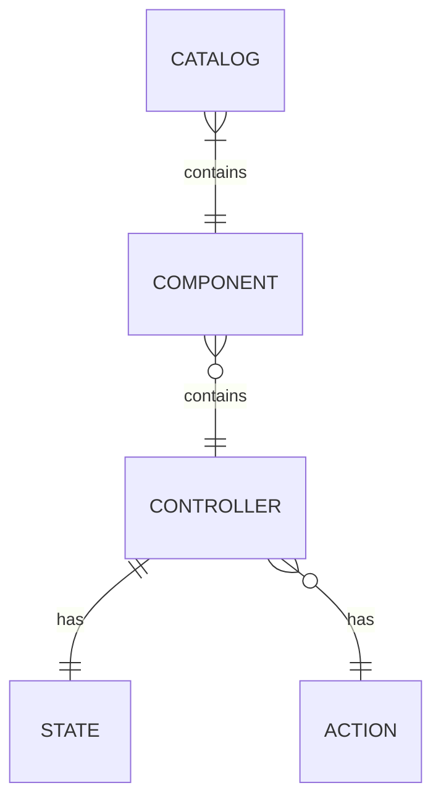
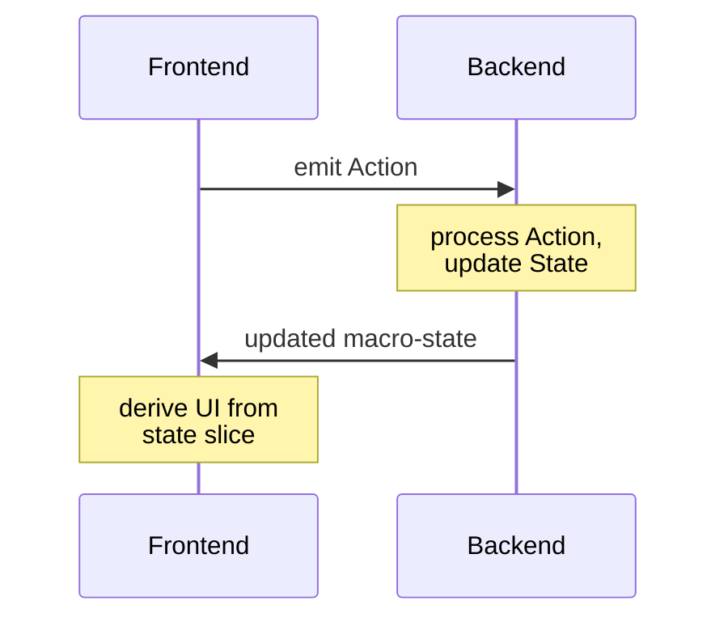

# ADR-001: Thermidor Schema — UI Component Contract

**Status:** Accepted  
**Date:** 2026-07-22  
**Deciders:** Thermidor Stack team  
**Superseded by:** _(none)_

---

## Context and Problem Statement

The Thermidor stack connects a backend (Agent Gateway + AgentSmith services) with a frontend (UI-Kit based). For this integration to work across independently evolving teams and repositories, there needs to be a shared, explicit contract that both producers (backend) and consumers (frontend) can rely on.

Without a formal contract:
- The frontend cannot know what UI components to render, nor what state or operations are available.
- The backend cannot make safe assumptions about how state changes will be consumed.
- Any refactoring on either side risks silent breakage.

This ADR defines the **schema contract**: the data model that describes what UI components exist, what logic structures they use, what data they expose, and what operations they support.

The schema lives as a standalone artifact, versioned independently of both producer and consumer. Both sides pull from it. In the long run, this schema is intended to be made public.

---

## Decision

We adopt a **hierarchical, controller-based schema model** composed of five entity types: **Catalog**, **Component**, **Controller**, **State**, and **Action**.

### Entity Model

### Entity Definitions

#### Catalog

A Catalog is the top-level registry of all available UI Components. It is the entry point of the contract: both the backend and the frontend reference the same Catalog to know what components exist and how they are structured.

For the initial implementation, a Catalog corresponds to an A2-UI catalog. This is considered an acceptable constraint for now and is explicitly left open to revision (see [Future Considerations](#future-considerations)).

#### Component

A Component is a discrete, renderable UI element — a "Lego brick" for composing user experiences. A Component may rely on zero or more Controllers to drive its behavior.

Components are intentionally generic: they describe _what can be rendered_, not _how_ it is rendered. Rendering decisions belong to the consumer.

> Examples of components: SearchBox, Product Carousel, Facets

#### Controller

A Controller is a logic unit associated with a Component. It holds State and exposes Actions. If a Component is a Lego brick, Controllers are its studs: the attachment points through which state flows and interactions occur.

A single Component may have multiple Controllers, each responsible for a distinct concern.

#### State

State is structured, immutable-from-the-frontend data associated with a Controller. It represents what the UI should reflect at any given moment.

Key constraints:
- **The frontend must not mutate State directly.** State is owned and updated exclusively by the backend.
- **State should closely mirror what is displayed.** Derivation logic on the frontend should be kept minimal. If a value needs to be shown, it should be in State rather than computed client-side.
- Multiple Controller States are composed into a single **macro-state** using a slice pattern, where each Controller's state occupies a named slice of the aggregate.

#### Action

An Action represents an allowed operation on a Controller. Actions are the only mechanism through which the frontend can trigger state changes.

- Actions are **emitted by the frontend or the backed** and **processed by the backend**.
- They typically map to user interactions (e.g. a button click triggers an Action).
- The set of available Actions for a Controller is defined in the contract; the frontend must not assume operations outside of it.

### Data Flow Summary

---

## Consequences

### Positive

- **Clear separation of concerns.** The frontend is a pure renderer of server-driven state; the backend is the single source of truth for business logic.
- **Independent evolvability.** Frontend and backend teams can evolve their implementations as long as they conform to the contract.
- **Public-ready.** The schema-as-contract model is suitable for eventual public exposure without structural changes.
- **Predictable UI behavior.** Keeping derivation minimal on the frontend reduces the surface area for inconsistent rendering.

### Negative / Trade-offs

- **Backend owns all state transitions.** This means any UI interaction that changes what is displayed requires a round-trip to the backend. Latency-sensitive interactions need to be accounted for in the transport layer (outside this ADR's scope).

> [!NOTE]
> It is accepted that components may have their own state, partially disjoint from the backend state. While the backend state remains the source of truth, the frontend components may have their own state that reexpose part of the state of its controller, and its own presentation state, dedicated to the frontend specifics (e.g. hover) that wouldn't be tracked in the backend state

- **Schema versioning will be required.** As the contract evolves, a versioning strategy must be defined to avoid breaking producers or consumers. This is deferred to a future RFC.
- **A2-UI catalog coupling.** The initial Catalog definition is tied to A2-UI. This is an acknowledged constraint, not a permanent decision.

---

## Future Considerations

This ADR is intentionally scoped to the **structure** of the contract. The following topics are explicitly deferred and will each be addressed in their own ADR:

- **Transport protocol** — how the macro-state is delivered to the frontend (WebSocket, SSE, REST).
- **Schema versioning strategy** — how breaking and non-breaking changes to the contract are managed.
- **Catalog abstraction** — moving beyond the A2-UI catalog as the only Catalog implementation.
- **Action validation** — whether the backend should validate or reject Actions that are structurally invalid against the contract.

### A note on process

The ADRs in this series are intentionally directive: they record a decision and move forward. Broad consultation is traded for speed. This is a conscious choice given the current pace of the project.

Any ADR may be reopened and superseded through a more expansive process — typically an RFC — once there is bandwidth or when the stakes of a decision warrant wider input. An RFC that supersedes an ADR will reference it explicitly.

---

## References

- [thermidor-schema/adr-note.md](./adr-note.md) — original design notes
- [Thermidor Stack monorepo README](../../README.md)
