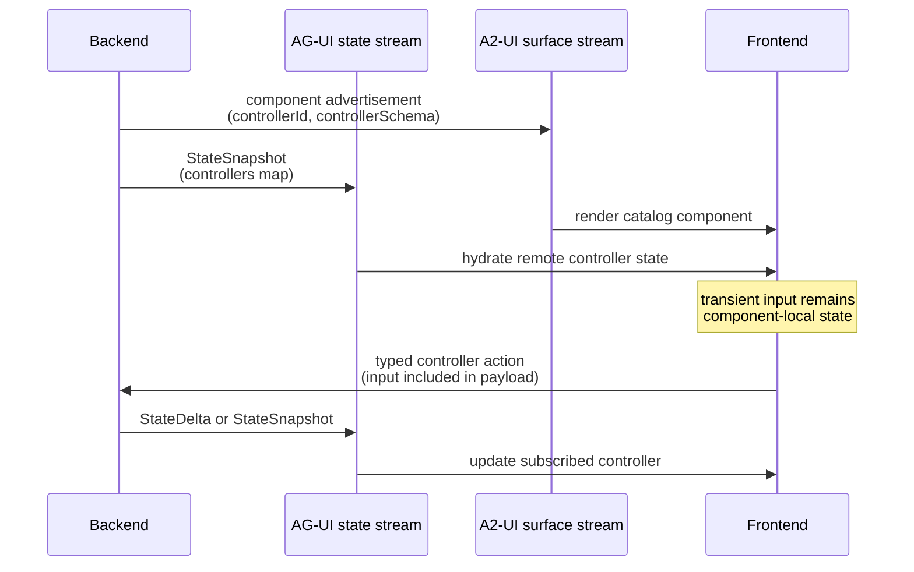

# ADR-002: Use AG-UI Controller State Alongside A2-UI

**Status:** Accepted
**Date:** 2026-07-29
**Deciders:** Thermidor Stack team

## Context

ADR-001 defines a controller-based contract in which the backend owns controller state and the frontend invokes typed controller actions. It also allows components to own transient presentation state, such as hover state or the current value of an input, when that state is not part of the authoritative controller state.

Thermidor additionally needs a protocol for composing the UI. A2-UI provides surface lifecycle, component descriptions, data bindings, and renderer catalogs. The conversation stream already uses AG-UI and can carry `StateSnapshot` and `StateDelta` events independently from those A2-UI activities.

We evaluated two integration models:

1. **AG-UI + A2-UI:** AG-UI transports controller macro-state, while A2-UI transports surface and component composition.
2. **A2-UI only:** A2-UI `updateDataModel` transports controller state and local A2-UI `functionCall` actions bridge controller actions into Thermidor.

The decision must preserve server ownership of controller state without forcing all transient user input into the same state store. It should also keep the Thermidor controller contract usable by renderers that do not implement A2-UI.

## Decision Drivers

- Controller state is authoritative, backend-owned, and immutable from the frontend.
- Interactive components must be able to collect transient input before dispatching an action.
- Controller state and actions should not depend on a particular UI renderer protocol.
- A2-UI should describe what to render without becoming Thermidor's domain state store.
- The frontend should expose typed controller APIs rather than protocol-specific mutation primitives.
- Existing AG-UI conversation state should remain the source consumed by the Thermidor Engine.
- Server state updates and UI layout updates must be independently evolvable.

## Decision

We adopt **AG-UI + A2-UI** with an explicit separation of responsibilities.

### AG-UI responsibilities

- An AG-UI `StateSnapshot` establishes or resynchronizes the complete controller macro-state.
- Its `snapshot` validates against `controller-state-snapshot.schema.json` and contains a `controllers` map keyed by runtime controller ID.
- Subsequent AG-UI [`StateDelta`](https://docs.ag-ui.com/concepts/events#statedelta) events carry RFC 6902 JSON Patch operations and are applied in sequence to the current state.
- If a delta cannot be applied consistently, the client requests or waits for a fresh `StateSnapshot` synchronization point.
- The Thermidor Engine retains the resulting state and notifies subscribers when it changes.

### A2-UI responsibilities

- A2-UI activities carry surface lifecycle and component composition.
- Component advertisements identify a runtime `controllerId` and its static controller schema.
- A2-UI does not transport authoritative Thermidor controller state in its data model.
- A2-UI is used at the catalog-component boundary, such as `SearchBox`, `ProductCarousel`, or `Cart`. A component renderer may use ordinary local state for transient interaction details internal to that component.

### Frontend bridge

The frontend combines the two streams:

1. It receives an A2-UI component advertisement containing `controllerId` and `controllerSchema`.
2. It constructs a typed remote controller from that advertisement.
3. The remote controller selects `controllers[controllerId]` from the active AG-UI snapshot and validates it against the advertised contract.
4. The component subscribes to that controller state.
5. The component may collect transient input locally and pass its current value directly in a typed controller-action payload.
6. The remote controller forwards the action through Thermidor's authenticated conversation transport.
7. The UI reflects authoritative domain changes only after the backend emits an AG-UI state snapshot or delta.

The layout activity and initial state snapshot may arrive in either order. The frontend must correlate them by controller ID and tolerate either stream becoming available first. State deltas are ordered relative to the AG-UI state stream and apply only after a synchronization baseline exists.

## Alternative Considered: A2-UI as the State and Action Substrate

### Evaluated design

The A2-UI-only experiment used the following model:

- The server sent controller state through A2-UI `updateDataModel` operations under `/controllers`.
- Component properties bound to controller slices using A2-UI data-model paths.
- Components invoked a catalog-declared local function named `thermidor.dispatchControllerAction`.
- The function validated `{controllerId, controllerSchema, action, payload}` and forwarded it through Thermidor without mutating controller state.
- A subsequent server `updateDataModel` operation supplied the resulting authoritative state.

This design demonstrated that A2-UI can technically carry controller state and invoke a typed local bridge. It also has the advantage of keeping layout, bindings, and state in one surface model.

### A2-UI's documented transport boundary

A2-UI's own [data-flow documentation](https://a2ui.org/concepts/data-flow/) separates UI delivery from user-action transport. The server streams A2-UI surface and data-model messages to the client, but after a user interaction the diagram sends `userAction` back in a **separate A2A message**. The action does not travel in the original A2-UI stream.

The same documentation describes A2-UI as transport-agnostic and lists A2A, AG-UI, HTTP, and WebSocket as possible transports. A2-UI therefore does not remove the need for a bidirectional interaction protocol; it defines the UI payload exchanged over one. Using AG-UI for state synchronization and Thermidor actions while retaining A2-UI for surface composition follows that documented separation rather than working against A2-UI's architecture.

### Why it is rejected

The design does not remain coherent once a component accepts user input.

A native A2-UI input is controlled through a data-model binding. When a user types, the A2-UI binder writes the new value into the local A2-UI data model. A later event or `functionCall` obtains the current value by resolving a `DynamicValue` path from that model. A2-UI does not provide a native action argument representing the current DOM input value independently of the data model.

Consequently, the A2-UI-only model must choose one of the following compromises:

1. **Mix ownership in the A2-UI data model.** Reserve a server-owned `/controllers` subtree and a client-owned `/drafts` subtree. This requires path-level ownership rules, scoped server updates, merge semantics, and protection against server snapshots overwriting local drafts.
2. **Move input state into a custom renderer.** Keep React or another renderer's local state and invoke Thermidor directly. This avoids data-model writes but bypasses A2-UI's native binding and action model, so A2-UI is no longer the actual state/action substrate.
3. **Read an external store or the DOM from a custom function.** This introduces hidden renderer coupling, weakens deterministic evaluation, and creates a second state mechanism outside the A2-UI contract.

The first compromise is possible, but it turns the A2-UI surface data model into a mixed domain-state and form-state store. Server root replacement becomes unsafe because it can erase in-progress input. Every producer and consumer must agree on ownership namespaces and update granularity. These conventions duplicate concerns already handled by the Thermidor Engine and AG-UI state stream.

The other compromises are escape hatches rather than native A2-UI solutions. They retain the complexity of the A2-UI data model while moving meaningful interaction behavior outside it.

The A2-UI-only design also couples controller hydration to an A2-UI renderer. A non-A2-UI consumer would need to interpret A2-UI operations merely to obtain domain state. That conflicts with the goal of keeping the controller contract renderer-neutral.

We therefore reject **A2-UI as the sole transport and state/action substrate for Thermidor controllers**. We do not reject A2-UI as a surface composition and catalog protocol.

## Consequences

### Positive

- Controller state has one authoritative, renderer-neutral transport.
- A2-UI remains focused on surface and component composition.
- Components can keep transient input local and include it in typed action payloads without mirroring it into A2-UI's data model.
- Transient component-local state intentionally remains outside synchronized and replayable controller state, matching the separation established by ADR-001.
- The same Thermidor controllers can support A2-UI and non-A2-UI renderers.
- The frontend cannot accidentally mutate authoritative controller state through an A2-UI binding.
- State and layout contracts can evolve independently.

### Negative and trade-offs

- The frontend must correlate A2-UI controller advertisements with AG-UI state slices.
- Producers emit layout and state separately, and consumers must tolerate either arrival order.
- The frontend maintains a bridge from the Thermidor Engine to catalog component renderers.
- The Thermidor Engine must apply `StateDelta` JSON Patch operations in order and recover from divergence with a fresh snapshot.
- Arbitrary server-composed A2-UI input primitives still require A2-UI data-model bindings; this decision favors higher-level catalog components with renderer-owned interaction details.

## Scope

This ADR decides controller-state ownership and the boundary between AG-UI and A2-UI. It adopts AG-UI's standard `StateSnapshot`/`StateDelta` synchronization model but does not define offline reconciliation, optimistic controller updates, or schema version negotiation.
