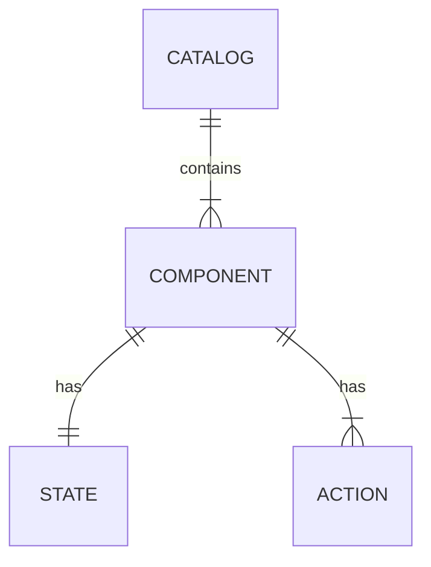

# ADR-006: Remove Controllers from the Public Schema Contract

**Status:** Accepted  
**Date:** 2026-08-19  
**Deciders:** Thermidor Stack team  
**Related:** [ADR-001](./ADR-001-thermidor-schema-contract.md), [ADR-002](./ADR-002-agui-controller-state-transport.md), [Annex A](./ADR-006-annex-a-schema-controllers-analysis.md), [Annex B](./ADR-006-annex-b-option-b-implementation.md)

---

## Context and Problem Statement

ADR-001 established a hierarchical, controller-based schema model with five entity types: Catalog, Component, Controller, State, and Action. The controller was introduced as an intermediate level between Component and State/Actions, mirroring the internal architecture of `@coveo/thermidor`.

Since ADR-001 was accepted, the following observations have emerged:

1. **Every component currently has exactly one controller.** The multi-controller composition case that motivated the intermediate level has not materialized. All existing components in the example catalog exhibit a strict 1:1 relationship.
2. **The controller is an SDK concept, not a domain concept.** The `@coveo/thermidor` package uses controllers internally to encapsulate selectors, subscriptions, and dispatch. This is an implementation detail — external consumers of the schema derive no value from it.
3. **External consumers inherit unnecessary indirection.** A mobile SDK, custom renderer, or third-party integration must navigate `component → controllers → key → state/actions` to reach the observable surface. When the relationship is always 1:1, this is noise.
4. **ADR-001 did not evaluate an alternative without controllers.** It adopted the controller model without comparing it against a flatter structure. This ADR fills that gap.

The schema has no public consumers yet. Once published, the contract structure becomes a breaking-change boundary. This is the window to simplify before that constraint locks in.

### Two "controllers" not to confuse

There is a naming ambiguity that must be addressed upfront:

|                        | SDK Controller                                    | Schema Controller                                             |
| ---------------------- | ------------------------------------------------- | ------------------------------------------------------------- |
| **Nature**             | Runtime object instantiated client-side           | JSON structure in the exchange contract                       |
| **Content**            | reactive state + subscribe + action methods       | `{ controllerSchema, state, actions }`                        |
| **Exists if Option B** | Yes — the package continues to expose controllers | No — the contract only exposes state/actions per component    |
| **Consumer**           | Developer using the `@coveo/thermidor` package    | Any party reading the schema (backend, frontend, third-party) |

The SDK controller **will exist regardless of the schema decision**. The question is solely: should the exchange contract reflect this internal package organization?

### Who consumes what?

| Consumer profile                                | What they use                                                                                      | The controller _in the schema_ brings them...                                              |
| ----------------------------------------------- | -------------------------------------------------------------------------------------------------- | ------------------------------------------------------------------------------------------ |
| Consumer via `@coveo/thermidor`                 | The package instantiates SDK controllers. The schema is transparent — the package maps internally. | Nothing additional (schema-to-SDK mapping is internal to `@coveo/thermidor`)               |
| External consumer (mobile SDK, custom renderer) | Reads the schema directly. Does not use the package or its headless API.                           | An imposed structure they must adopt or traverse without benefit if they want to ignore it |
| Backend (producer)                              | Pushes state, receives actions.                                                                    | An additional envelope level to produce                                                    |

No consumer profile derives value from the controller being in the schema. The `@coveo/thermidor` consumer doesn't see it (internal mapping). The external consumer and backend pay the cost without benefit.

## Decision Drivers

- The public schema should describe the observable interface, not the internal SDK architecture.
- External consumers should not be forced to adopt implementation patterns they did not choose.
- Schema simplicity reduces onboarding cost, cognitive load, and integration effort.
- The 1:1 component-to-controller relationship makes the intermediate level systematically superfluous.
- Cross-catalog reuse is already handled at the component level (via `$ref`); the controller adds no reuse capability the component doesn't already provide.
- A future multi-concern need (if it materializes) can be resolved through component decomposition rather than intra-component structure.
- The SDK controller continues to exist internally regardless of the schema structure.
- The project's component granularity philosophy favors small, specialized components — composition at the catalog level, not internal multi-concern.

## Considered Options

### Option A: Keep Controllers in the Schema (Status Quo — ADR-001)

- **Summary:** The schema exposes a `controllers` map on each component, allowing multiple controllers per component. Components are identified by a `componentId`. Contract resolution uses the `controllerSchema` URI as discriminant. Each controller entry contains a `controllerId`, a `controllerSchema` URI, state, and actions.
- **Pros:**
  - Native multi-concern composition if a component ever needs N independent controllers.
  - Direct alignment with the `@coveo/thermidor` runtime structure.
- **Cons:**
  - Implementation leak: controllers are a concept from the `@coveo/thermidor` runtime imposed on all consumers.
  - Indirection without value in the 1:1 case (which is every case today).
  - Higher cognitive complexity: more concepts to explain (controller, controllerSchema, controller key, slice).
  - Extra envelope level the backend must produce for every component.
  - External consumers are forced into the controller structure and its resolution mechanism without deriving benefit from either.

### Option B: State and Actions Directly on the Component

- **Summary:** The schema exposes `state` and `actions` directly on the component. No controller concept in the public contract. Components are identified by a `componentType` discriminant, which also serves as the contract resolution key. The SDK controller remains an internal implementation detail.
- **Pros:**
  - Flat, readable schema: `component.state`, `component.actions.setItems`.
  - Direct correspondence with the observable surface — what travels on the wire.
  - Better DX: the consumer reads the schema and immediately knows what to receive and emit.
  - Clean separation of contract and implementation.
  - Minimal onboarding: three concepts (Catalog, Component, Action).
  - Consumer-agnostic: no imposed implementation pattern.
- **Cons:**
  - No native multi-concern composition within a single component.
  - If a true multi-controller component becomes necessary after publication, introducing an intermediate level would be a breaking change.

### Comparison Matrix

| Criterion                          | Option A (Controllers)  | Option B (Direct)          |
| ---------------------------------- | ----------------------- | -------------------------- |
| Schema simplicity                  | -                       | ++                         |
| Readability for external consumer  | -                       | ++                         |
| Multi-concern composition          | ++                      | -                          |
| Cross-catalog reuse                | neutral (via component) | neutral (via component)    |
| Contract/implementation separation | -                       | ++                         |
| Onboarding / DX                    | -                       | ++                         |
| Cost of future breaking change     | none (already in place) | moderate (adding a layer)  |
| Alignment with Thermidor runtime   | ++                      | neutral (internal mapping) |
| Third-party consumer adaptability  | -                       | ++                         |

---

## Decision Outcome

We adopt **Option B**: state and actions are exposed directly on the component in the public schema. The controller concept is removed from the contract.

### Revised Entity Model



Three entity types: **Catalog**, **Component** (with State and Actions).

### Revised Schema Structure

```json
{
  "componentType": "Cart",
  "displayName": "Cart",
  "state": {
    "items": []
  },
  "actions": {
    "setItems": {"payload": {}},
    "updateItemQuantity": {"payload": {}}
  }
}
```

### Rationale

The decision hinges on the answers to the fundamental questions raised in the [Schema Controllers Analysis](./ADR-006-annex-a-schema-controllers-analysis.md):

1. **Is there a realistic use case for a multi-controller component?** No. All existing components exhibit a strict 1:1 relationship. In every case examined, the alternative is "we'd make two components."
2. **What is the component granularity philosophy?** Small, specialized components. Composition happens at the catalog level (N components), not internally within a component (N controllers).
3. **Should the schema reflect the implementation or the interface?** The interface. The schema describes the observable surface (state received, actions emitted). Internal implementation (controllers, selectors, slices) remains hidden.
4. **Who is the primary consumer?** The schema is intended for autonomous third-party consumers. The contract should be minimal and not impose internal patterns.
5. **Is the `controllerSchema` as a runtime discriminant necessary?** No. The `componentType` serves as a more natural discriminant. Transport correlation is handled by `componentId`, a globally unique identifier assigned by the backend to each component instance. This replaces `controllerId` as the single correlation key between A2-UI composition messages and AG-UI state messages. This is a transport concern, not a schema structure concern.

Option A is rejected because it imposes an SDK-internal structure on all consumers without delivering value in the 1:1 case. The cost is permanent structural noise for every consumer, every producer, and every integration — paid upfront for a hypothetical need that can be resolved through component decomposition if it ever materializes.

### Reuse Argument

An argument for controllers is the **reuse of logical contracts**: the same controller can be attached to N components. However, reuse already exists at the component level. N catalogs can reference the same component via `$ref`, just as N components could reference the same controller.

The "reuse" argument for controllers only holds if one wants to reuse a _fragment_ of a component across structurally different components. But if two components share the same state and the same actions, the question arises: are they truly different components, or different renders of the same component? The component is already the natural unit of reuse.

### Risk Assessment

**Risk of over-engineering (Option A):** Publishing an abstraction that never proves justified in practice. If the 1:1 pattern persists indefinitely, the controller is a permanent noise level that every consumer must traverse without deriving value.

**Risk of under-engineering (Option B):** Being stuck if a multi-concern component becomes necessary after publication. Adding the controller layer post-publication is a breaking change. This risk is real **if and only if** a multi-concern use case materializes and cannot be resolved by decomposition into distinct components.

We accept the risk of Option B because: (a) no multi-concern case exists today, (b) the component granularity philosophy favors decomposition, and (c) the schema has no public consumers yet — the structural simplification is worth the speculative risk.

---

## Transport Implications

With controllers removed from the schema, transport correlation changes:

| Concern              | ADR-001 (Option A)                                          | This ADR (Option B)                                   |
| -------------------- | ----------------------------------------------------------- | ----------------------------------------------------- |
| Instance identifier  | `controllerId` (from schema props)                          | `componentId` (globally unique, from A2-UI transport) |
| Contract resolution  | `controllerSchema` URI → `ControllerContractsSchema` lookup | `componentType` → `ComponentContractsSchema` lookup   |
| AG-UI state indexing | `state.controllers[controllerId]`                           | `state.components[componentId]`                       |

The AG-UI transport (ADR-002) continues to carry authoritative state via `StateSnapshot` and `StateDelta`. The correlation mechanism changes from `controllerId` to `componentId`, a globally unique identifier assigned by the backend to each component instance. The `componentId` corresponds to the `id` field on component nodes in A2-UI `updateComponents` messages.

---

## SDK Surface

The SDK controller **continues to exist**. `buildRemoteController` remains the consumer-facing API. What changes is its parameters:

```typescript
// Before (Option A)
buildRemoteController({source, controllerId, contract});

// After (Option B)
buildRemoteController({source, componentId, componentType});
```

The `componentId` is the `id` field from the component node in the A2-UI `updateComponents` message. It is globally unique across all surfaces, replacing `controllerId` as the correlation key.

Contract resolution becomes automatic: the SDK looks up the Zod schema in `ComponentContractsSchema` (discriminated union on `componentType`) without requiring the consumer to pass a contract explicitly.

All guarantees from Option A are preserved in Option B: state resolution, Zod validation, reference-based cache, reactive subscribe, state/action type-safety, payload validation, and action routing. The [Option B Implementation Analysis](./ADR-006-annex-b-option-b-implementation.md) verifies each aspect point-by-point and documents the concrete changes to transport messages, consumer hooks, props schemas, and package boundaries.

---

## Consequences

### Positive

- The public schema is flatter and more readable.
- External consumers integrate without adopting the controller concept.
- Onboarding requires fewer concepts (Catalog, Component, Action — no controller, controllerSchema, or slice).
- The SDK consumer API is simplified: pass `componentId` + `componentType`, the SDK resolves the rest.
- The contract cleanly separates the observable interface from the internal implementation.
- The backend produces less structural envelope per component.

### Negative

- If a genuine multi-controller component becomes necessary after publication, introducing an intermediate level will be a breaking change. This risk is accepted per the risk assessment above.
- Decomposition into sub-components may not always be a viable option (rendering, layout, or transport constraints) — though no such case has been identified.

### Neutral

- The `@coveo/thermidor` package retains controllers internally. The SDK API (`buildRemoteController`, `subscribe`, `dispatch`) is unchanged in shape — only the resolution key changes.
- ADR-002's decision (AG-UI for state transport, A2-UI for composition) remains valid. The correlation mechanism adapts from `controllerId` to `componentId` without altering the transport boundary.
- `ControllerContractsSchema` is replaced by `ComponentContractsSchema` in `@coveo/thermidor-schema`. The generation script and discriminated-union pattern remain the same.
- The AG-UI `StateSnapshot` indexes state by `componentId` (globally unique). `StateDelta` JSON Patch paths include the `componentId`. The `componentId` aligns with the existing `id` field on component nodes in A2-UI.

---

## Implementation and Follow-up

Before proceeding to public publication (ADR-003), the revised schema structure will be stabilized through internal usage and the identified risks validated in practice. Publication follows once the contract has proven stable.

1. **Update `@coveo/thermidor-schema`**: Replace `ControllerContractsSchema` with `ComponentContractsSchema` (discriminant: `componentType`). Update the generation script.
2. **Update `@coveo/thermidor`**: Rename `buildRemoteController` params (`componentId` + `componentType`). Adjust state selector to index by `componentId` in `state.components`. Lookup contract via `ComponentContractsSchema`.
3. **Update consumer demos** (`demo-schema-react`): Simplify component props schemas, replace `useAdvertisedController` with `useRemoteController`.
4. **Deprecate ADR-001's entity model**: Mark ADR-001 as superseded by this ADR for the entity model section. The rest of ADR-001 (data flow, state ownership, action semantics) remains valid.
5. **Validate with the demo implementation**: The `demo-schema-react` Option B implementation serves as the reference for the migration.
6. **Validate with facets as a proof-of-concept**: Facets are the strongest stress test for the controller-less model. In current Headless commerce, a facet generator controller exposes an ordered list of heterogeneous facet controllers, each with its own facet search controller — a hierarchical, multi-controller composition where facet order is significant. Implementing facets under Option B (as composed components rather than nested controllers) will validate whether the model holds for genuinely composite, order-sensitive concerns, or whether it surfaces a case that warrants revisiting the decision.

---

## References

- [ADR-001: Thermidor Schema — UI Component Contract](./ADR-001-thermidor-schema-contract.md)
- [ADR-002: Use AG-UI Controller State Alongside A2-UI](./ADR-002-agui-controller-state-transport.md)
- [Annex A — Schema Controllers Analysis](./ADR-006-annex-a-schema-controllers-analysis.md)
- [Annex B — Option B Implementation Analysis](./ADR-006-annex-b-option-b-implementation.md)
