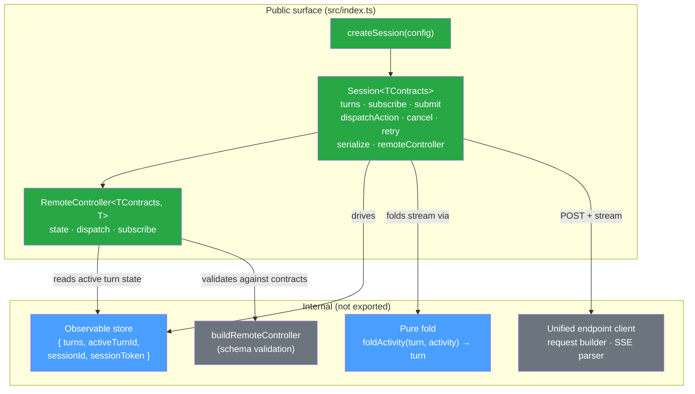
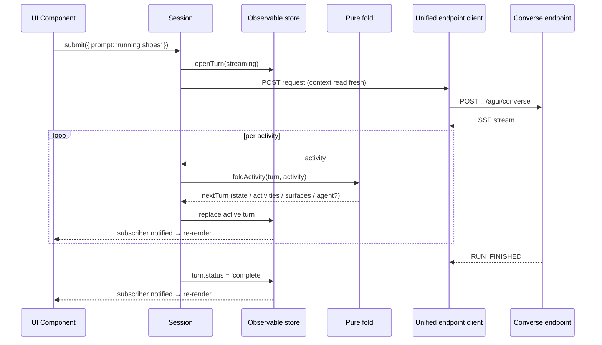

# Architecture Guide

This document explains how the `@coveo/thermidor` library is structured, why each part exists, and how they connect. It is written for Coveo engineers; Coveo context (org IDs, access tokens, the unified converse endpoint) is assumed.

The decisions of record are the accepted ADRs [ADR-009](./internal/adr/ADR-009-architecture-decision-charter-v2.md) (charter v2) through [ADR-015](./internal/adr/ADR-015-surface-and-route-derivation.md). This guide describes the **shipped** architecture; it supersedes the earlier engine/interface/Redux/facade description.

## The core idea

`@coveo/thermidor` is a lean client for a single, stateful, intent-routing **unified converse endpoint**. The server streams its response over AG-UI SSE — conversational messages, reasoning steps, and tool calls, alongside schema-defined A2UI components — and the client renders what the server sends. Thermidor transmits consumer input, folds the streamed result into an observable list of `Turn`s, and vends a schema-validated remote controller — nothing more.

Everything the previous revision described (an `Engine` class, a library-agnostic `interface/` layer, Redux Toolkit slices, per-endpoint facades) has been **removed wholesale** ([ADR-010](./internal/adr/ADR-010-unified-endpoint-session-client.md)). The current package has no engine, no interface layer, no Redux/RTK, and no facades.

## Public surface

The package entry (`src/index.ts`) exports exactly the session-client surface — `createSession`, the `Session` handle, the `Turn` / `TurnResponse` domain model, `SessionConfig`, the versioned `SerializedSession` shape, and the generic `RemoteController` type and its derivation helpers. It is intentionally free of state-library concepts (no store, slice, selector, thunk, or reducer types) and free of raw transport DTO shapes. The internal remote-controller seam (`buildRemoteController`, `RemoteControllerSource`, `selectRemoteControllerState`) is kept out of the public exports.



## Package structure

```
src/
├── index.ts                       # Public surface (ADR-010 / ADR-014)
├── session/
│   ├── create-session.ts          # createSession factory + runtime (submit/dispatch/cancel/retry)
│   ├── types.ts                   # Turn / TurnInput / TurnResponse domain model (ADR-010 model annex)
│   ├── store.ts                   # Plain observable store + subscribe/notify
│   ├── fold.ts                    # Pure fold + surface derivation (ADR-015 interim)
│   └── serialize.ts               # Versioned serialize / restore (ADR-011)
├── remote-controller/
│   ├── types.ts                   # Generic contract type helpers (Zod v4) + RemoteController
│   └── remote-controller.ts       # Internal buildRemoteController (schema validation)
└── internal/
    ├── api/                       # Unified endpoint client, request builder, SSE parser
    └── utils/                     # id generation, navigator-context types
```

## The session factory and runtime

`createSession(config)` (`src/session/create-session.ts`) builds a fresh observable store and returns a `Session`. There are no singletons and no module-level mutable state: two sessions created from identical configuration share nothing mutable ([ADR-009](./internal/adr/ADR-009-architecture-decision-charter-v2.md), charter conformance).

The runtime owns the submit / dispatch / cancel / retry orchestration and the SSE-consumption loop that folds each event into the active turn:

- **`submit({prompt})`** — while any turn is `streaming`, the call is ignored. Otherwise it opens a new `streaming` turn, builds a request (invoking both context providers fresh), POSTs to the endpoint, and folds the streamed response into that turn.
- **`dispatchAction(action)`** — ignored while a turn is streaming. It resolves the target surface from the active turn's typed `response.surfaces`, builds an action request, and drives the stream.
- **`cancel()`** — stops consuming the in-flight stream, retains the partial `response` already folded, and marks the active turn `error` with the message `'Cancelled'`. A no-op when nothing is in flight.
- **`retry(turnId)`** — re-submits only an `error` turn's original input; any other `turnId` (unknown, or non-error) is a no-op.

The runtime holds the in-flight stream's `AbortController` per session instance — never module-level — so two sessions never contend, and a stream superseded by a newer one never touches the turn.

Cancellation is modeled as a terminal `error` turn (message `'Cancelled'`), not a distinct status. A cancelled turn and a failed turn share every lifecycle property — both are terminal, non-streaming, retryable, and preserve their partial `response` — so no runtime branch distinguishes them, and adding a separate `cancelled` status would only widen `TurnStatus` without changing behavior. Consumers that need to tell a user-initiated stop from a genuine failure should not string-match the message; if that distinction is ever required, prefer a structured discriminator (e.g. an error `reason`) over a new status.

## The observable store

`src/session/store.ts` holds `{ turns, activeTurnId?, sessionId?, sessionToken? }`. It exposes `getState`, an internal setter that notifies on change, and `subscribe(listener) → unsubscribe`. Every registered subscriber is notified exactly once per change. This plain store replaces the former RTK slice plus state port ([ADR-010](./internal/adr/ADR-010-unified-endpoint-session-client.md) structure annex); there is no Redux state library anywhere in the package.

## The pure fold

`src/session/fold.ts` exposes `foldActivity(previousTurn, activity) → nextTurn` — the single place a `TurnResponse` is constructed from the stream. It is a pure reduction: folding the same activity sequence twice yields deeply-equal turns.

The fold maps each SSE activity into the active turn's `response`:

- Text-message events accumulate into `response.agent.messages` (the `agent` facet is created lazily, signaling the router invoked an agent).
- Reasoning and tool-call events accumulate into `response.agent.reasoningSteps`.
- `ACTIVITY_SNAPSHOT` events append to `response.activities` and re-derive `response.surfaces`.
- `STATE_SNAPSHOT` events replace the routing-neutral `response.state`.
- Terminal events (`RUN_FINISHED` / `turn_complete`, `RUN_ERROR`) set `status` to `complete` or `error`.

## The Turn / TurnResponse domain model

`src/session/types.ts` defines the canonical runtime model ([ADR-010](./internal/adr/ADR-010-annex-model.md) model annex):

```typescript
interface Turn {
  id: string;
  input: {prompt?: string}; // omitted for a prompt-less action turn
  response: TurnResponse;
  status: 'streaming' | 'complete' | 'error';
  error?: string; // present iff status === 'error'
}

interface TurnResponse {
  state: Record<string, unknown>; // routing-neutral, non-optional, defaults to {}
  activities: Activity[]; // ordered raw event log, defaults to []
  surfaces: DiscoveredSurface[]; // typed projection derived from activities
  agent?: {messages: AgentMessage[]; reasoningSteps: ReasoningStep[]};
}
```

`state` and `activities` are routing-neutral and always present. Only `messages` and `reasoningSteps` are agent-specific; they live under the optional `agent` facet, whose presence signals "the router invoked an agent". Consumers read `turn.input.prompt`, `turn.response.state`, `turn.response.activities`, `turn.response.surfaces`, and `turn.response.agent?.*`.

## The generic remote controller

`session.remoteController(componentId, componentType, options?)` (wired in `create-session.ts`, implemented in `src/remote-controller/remote-controller.ts`) returns a `RemoteController` bound to the active turn's `response.state.components[componentId]`, validated against the injected contract for `componentType`:

- `state` is the validated `StateFor<TContracts, T>`, or `undefined` when the snapshot is missing or validates empty.
- It re-derives and re-validates on snapshot change, and re-points when the active turn changes.
- `dispatch(action, payload)` validates the action name and payload against the contract's action schema, then forwards the validated payload to `session.dispatchAction`. An unknown action or an invalid payload rejects before any network call.
- The `options?` bag carries a reserved `turnId` selector for binding to a specific (historical) turn instead of the active one. It is accepted but not yet honored — binding always targets the active turn today (see [Recorded interim debt](#recorded-interim-debt-and-out-of-scope-items) and [ADR-013](./internal/adr/ADR-013-remote-controller-vending.md)).

### Type threading (Zod v4)

`src/remote-controller/types.ts` derives component-state and action typings from the injected `TContracts` using the Zod v4 discriminated-union spelling ([ADR-014](./internal/adr/ADR-014-annex-schema-typing.md) annex). The helpers — `ComponentTypeOf`, `ContractFor`, `StateFor`, `ActionNameFor`, `ActionPayloadFor` — resolve correctly only when `TContracts` is the concrete type pinned at `createSession`. No internal seam widens it back to the bare `ContractsSchema` constraint (which would collapse `ActionNameFor` to `never`). A compile-time DX type test (`remote-controller.test-d.ts`) pins the real schema and fails CI on any type-threading regression.

## Injected schema, endpoint, and context

- **Contracts schema** ([ADR-014](./internal/adr/ADR-014-consumer-supplied-endpoint-and-schema.md)) — `config.contracts` is the sole source for component-state and action-payload validation. The package declares no dependency on any specific schema package and declares `zod` as a peer dependency, so validation runs through the single `zod` instance resolved by the injected schema.
- **Endpoint** — when `endpoint` is provided the client POSTs to it verbatim (nothing appended); when absent it resolves `https://{orgId}.org.coveo.com` and appends the fixed converse path `/api/preview/organizations/{orgId}/agents/commerce/agui/converse`. A missing/empty org fails before any network call.
- **Context providers** ([ADR-012](./internal/adr/ADR-012-client-owned-context.md)) — `navigatorContextProvider` and `commerceContextProvider` are synchronous and read fresh per request in the request builder. An absent commerce provider sends the structural-empty "absent" encoding (`cart: []`, no `pinnedProducts`/`source`/`custom`); a present-but-empty provider sends `cart: []` distinguishably. Context is never serialized, so a restored session reads today's context from the providers.

## Serialization and restoration

`src/session/serialize.ts` ([ADR-011](./internal/adr/ADR-011-session-serialization.md)) defines a versioned `SerializedSession` (integer `version >= 1`), intentionally distinct from the runtime `Turn` type:

| Field                                       | Persisted | Scope            |
| ------------------------------------------- | --------- | ---------------- |
| `id`, `input`, `status`, `error`            | yes       | all turns        |
| `sessionId`, `sessionToken`, `activeTurnId` | yes       | session-level    |
| `response.activities`                       | yes       | all turns        |
| `response.agent.{messages,reasoningSteps}`  | yes       | turns with agent |
| `response.state`                            | yes       | active turn ONLY |
| `response.surfaces`                         | no        | derived          |

On restore, `surfaces` is re-derived from each turn's persisted `activities`; a turn persisted mid-stream (`streaming`) is downgraded to `error` (`'Stream was interrupted'`) preserving its partial response; non-active turns yield an empty `{}` state; an unsupported `version` is rejected without partially populating a session. `sessionId` / `sessionToken` are used only as continuity keys to continue the same backend conversation.

### Documented invariant: active-turn state scope

Persisting `response.state` for the active turn only is a deliberate coupling with the reserved historical-turn selector. A guard test asserts that a restored historical (non-active) turn yields `undefined` component state, so enabling the `{ turnId }` selector without first widening the persisted `state` scope fails that test ([ADR-011](./internal/adr/ADR-011-session-serialization.md) + [ADR-013](./internal/adr/ADR-013-remote-controller-vending.md) coupling).

## Surface derivation (ADR-015 — recorded interim debt)

`response.surfaces` is a typed projection of `activities`, so no consumer walks raw activities to discover surfaces. Derivation is confined to a single location in `fold.ts`, and that location is the **only** place that knows the `'commerce-search'` root-component-type magic string. Both the raw-activity traversal and the literal are recorded interim debt per [ADR-015](./internal/adr/ADR-015-surface-and-route-derivation.md); they persist until server-surfaced typed routing lands (ADR-015 Option C, a separate future ADR). Because `surfaces` is derived (never persisted), dropping it and recomputing from `activities` reproduces a deeply-equal list.

## Recorded interim debt and out-of-scope items

These are intentionally **not yet implemented**:

- **Interim `response.surfaces` derivation** with the hardcoded `'commerce-search'` literal (ADR-015 interim) — see above.
- **The reserved `{ turnId }` historical-turn selector** on the vended remote controller ([ADR-013](./internal/adr/ADR-013-remote-controller-vending.md)) — only the options-bag seam exists; binding always targets the active turn.
- **The package rename** — deferred as low-stakes; the package remains `@coveo/thermidor`.

## How a turn flows end-to-end



## Comparison with the previous revision

For engineers who worked with the earlier engine-based package:

| Previous revision                                | Shipped session client                                         |
| ------------------------------------------------ | -------------------------------------------------------------- |
| `Engine` class (`read` / `subscribe` / `mutate`) | Plain observable store + `createSession` runtime               |
| `interface/` layer hiding Redux                  | Removed; no state library at all                               |
| Redux Toolkit slices + reducers                  | Pure `foldActivity` reduction                                  |
| Per-endpoint facades / thunks                    | One unified endpoint client                                    |
| Controllers built from an interface handle       | `session.remoteController(id, type)` vended from the session   |
| `turn.prompt` / `turn.agentResponse.*`           | `turn.input.prompt` / `turn.response.*` (agent under `agent?`) |
| Bundled schema, layered exports                  | Consumer-injected `contracts`, endpoint, and context           |
