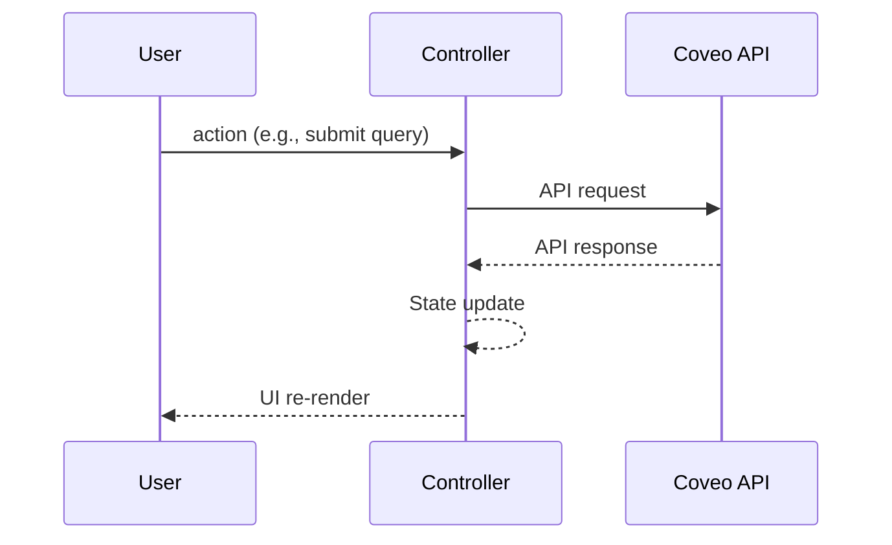
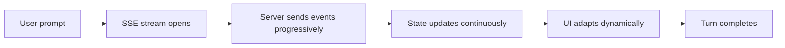
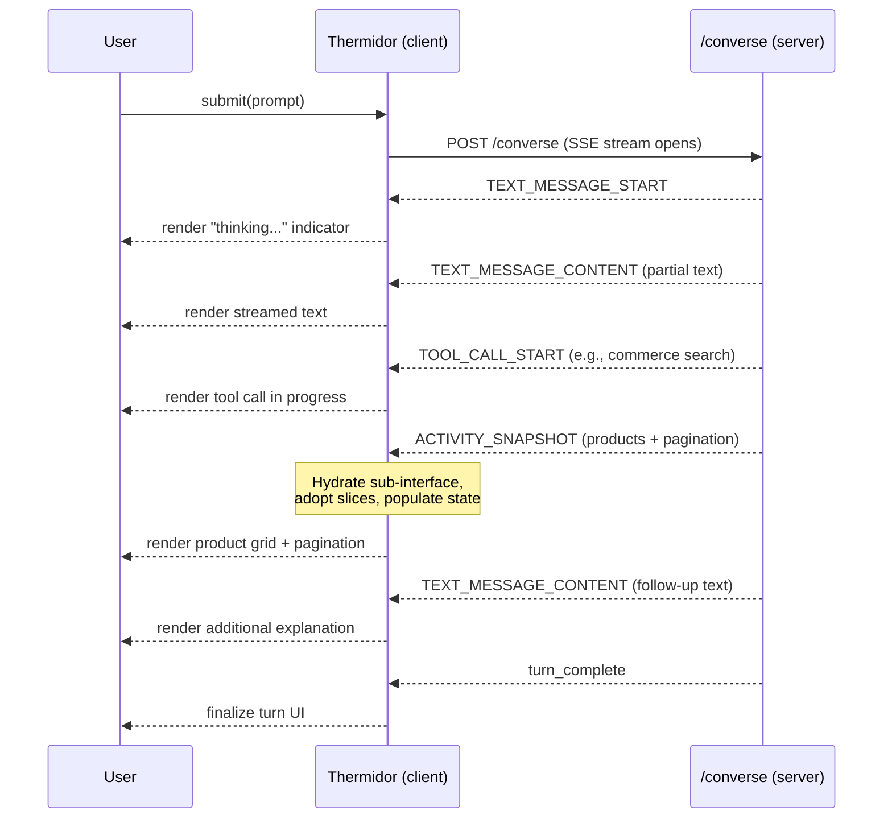

# Why Thermidor?

This document explains the motivations behind `@coveo/thermidor` — what problems it solves, why the current `@coveo/headless` architecture can't address them cleanly, and how thermidor's design responds to each challenge.

## What is `@coveo/headless` today?

[Headless](https://docs.coveo.com/en/headless/latest/) is Coveo's framework-agnostic state management library for building search and commerce UIs. It sits between your UI components (React, Angular, Web Components, Lightning, etc.) and the Coveo Platform APIs. It manages:

- Query state (what the user typed, facets selected, sort criteria, pagination)
- API calls to the Coveo [Search](https://docs.coveo.com/en/13/api-reference/search-api) and [Commerce](https://docs.coveo.com/en/103/api-reference/commerce-api) APIs
- Analytics tracking
- The full logic of a search or commerce experience, with no rendering opinion

It's built on Redux Toolkit and exposes the concept of **engines** and **controllers**:

- **Engine** — a Redux store instance configured for a specific use case (search, commerce, case assist, etc.)
- **Controllers** — objects you attach to an engine that manage a specific UI feature (search box, facets, result list, pagination, etc.)

See the [headless usage documentation](https://docs.coveo.com/en/headless/latest/reference/documents/usage/index.html) for a full reference.

## The Architecture of Headless Today

The current headless library is split by use case:

```
@coveo/headless              — Search/knowledge engine + controllers
@coveo/headless/commerce     — Commerce engine + controllers
@coveo/headless/ssr          — SSR utilities
@coveo/headless/case-assist  — Case assist engine
@coveo/headless/insight      — Insight panel engine
```

Each use case gets its own engine type, its own Redux store, and its own set of controllers. A `SearchEngine` and a `CommerceEngine` are two completely independent Redux stores with independent state, independent API lifecycles, and independent controller sets.

---

## Problem 1: The Multi-Engine Schism

Coveo's platform has evolved. Customers increasingly want experiences that **blend** traditional keyword search (knowledge/content) with commerce product discovery in a single interface — one search box that returns both products from the Commerce API and articles from the Search API, with a [generated answer](https://docs.coveo.com/en/n9de0370/) on top.

Building this today requires:

1. **Multiple independent engines** running side-by-side — violating Redux's [one store per app](https://redux.js.org/style-guide/#only-one-redux-store-per-app) principle
2. **Manual synchronization** of shared concerns (the query string, URL state, tab navigation)
3. **Prefix-namespacing hacks** in URL managers to avoid parameter collisions between engines
4. **Separate facets, pagination, and analytics wiring** per engine
5. **Intent detection logic** layered on top to decide which engine to query

Every controller that needs to work across both worlds must be written twice (or three times with a shim layer). Every new feature compounds this tax.

### The compounding cost

Each feature you want to work "hybrid" must be coded multiple times:

- Once for Search
- Once for Commerce
- Once for the reconciliation shim

This creates a toll today and adds a permanent tax on development velocity — one that compounds as the controller surface area grows. Moreover, offering controllers with the same name that only vary by use case degrades developer experience and undermines the story of a unified platform.

---

## Problem 2: Generative & Conversational UI

Beyond the dual-engine problem, a new UI paradigm is emerging: **conversational product discovery**.

This introduces fundamentally new requirements:

- A streaming endpoint returns an agent's response progressively (text messages, tool calls, product results, comparison tables)
- The UI must **dynamically render different components** based on what the agent returns — sometimes a product grid, sometimes an educational answer, sometimes a comparison
- Product results arrive **pre-hydrated from the server** (not from a client-initiated search)
- The interface is **multi-turn**: each conversational turn can spawn its own sub-interface with its own product list, pagination, and facets
- Multiple content types (products, knowledge articles, generated text) must coexist in a single response

Current headless wasn't designed for this. It assumes the client initiates searches and that the engine owns the full query lifecycle. There's no concept of "receive products from an agent stream and hydrate controllers from a server-pushed snapshot."

---

## The Interaction Model Shift

Underlying both problems above is a fundamental change in how data flows between client and server. This shift is perhaps the single most important thing to understand about why thermidor exists.

### Current Headless: Client-Driven Request/Response

Today's headless follows a strict linear, client-initiated flow:



Every interaction is a single round-trip:

1. The user types a query and clicks Submit
2. The controller dispatches a search request to the Coveo API
3. The API responds with a result set
4. Results are written to state in one batch
5. Subscribers fire and the UI re-renders

The client is always the initiator. The server never pushes state unprompted. The response shape is known upfront — you always get back results, facets, and metadata in a predictable structure. The UI knows exactly what components it needs before the request is sent.

### Thermidor: Server-Progressive Streaming

The generative/conversational flow breaks this model:



The differences are structural:

1. **The server decides what comes back and in what order.** A single user prompt can trigger text messages, then tool calls, then a product result set, then more text — all streamed over one SSE connection. The client doesn't know upfront what UI components it will need to render.

2. **State arrives progressively, not in one batch.** Instead of a single JSON response parsed into state, events trickle in over time. The UI must render intermediate states — a "thinking" indicator, partial text, tool calls in progress — before the final answer is known.

3. **Results can arrive pre-hydrated from the server.** In current headless, the engine builds the search request, sends it, and processes the response. In thermidor's generative mode, products arrive as a snapshot within an agent stream — the client never issued a commerce search, yet it must display product cards with pagination and facets.

4. **Multiple content types coexist in a single response.** One turn can produce text, product grids, comparison tables, category links, and opaque UI surfaces — all interleaved in a single stream.

5. **Multi-step back-and-forth within a single turn.** The agent can call tools, receive results, reason, call more tools, and progressively assemble its answer. This is not one request/response — it's a dialogue between the agent and its tools, with the client observing and rendering the steps.



### Why This Matters Architecturally

Current headless's Redux middleware and thunk model is built around "dispatch an action → run async logic → dispatch result action." That's a single async operation with a known start and end.

The streaming model requires:

- **Progressive state updates** as events arrive, not one big batch at the end
- **Dynamic slice adoption** because the server might return data requiring slices the client hasn't set up yet (e.g., product-list or pagination slices for a sub-interface that didn't exist moments ago)
- **Order-independent hydration** because controllers might be built _after_ data arrives (lazy React components mounting later)
- **Multiple response types from a single prompt** — text, products, tool calls, and opaque surfaces all coexisting in one turn's state

This is the architectural reason behind thermidor's `Engine.adoptSlice()` + snapshot cache + lazy hydration pattern. It's not just a cleaner API over the same model — it's a fundamentally different interaction model where the server is an active participant in driving what the UI renders.

For the full technical detail of how this streaming layer works, see [generative-interface.md](./generative-interface.md).

---

## How Thermidor Responds

Thermidor is a new architecture (in [`packages/thermidor/`](../)) that addresses both challenges by rethinking headless from the ground up. Its two stated goals:

1. **Support Generative UI adequately** — agent-driven, dynamic interfaces where the server decides what to render
2. **Support equally unified/federated or single-purpose interfaces** — one search box powering commerce + knowledge without the dual-engine hack, while easing the transition between standalone and unified modes

### One Store, Multiple APIs

Instead of one engine per use case, thermidor uses a single `Engine` (one Redux store) that can talk to any number of APIs. A search-box controller can trigger both a Commerce API call and a Search API call within the same store, with results going into separate state slices but sharing the query as a single source of truth.

### Redux Hidden Behind an Abstraction

The `Engine` class only exposes four methods: `read()`, `subscribe()`, `mutate()`, and `adoptSlice()`. No Redux concepts leak to consumers. The state management library becomes a swappable implementation detail. See [architecture.md](./architecture.md) for details.

### Lazy Slice Adoption

The store starts empty. Slices (feature state units) are adopted on-demand when a controller is first created. This enables tree-shaking and means features you don't use never exist in the store.

### Interface + Facade Architecture

Instead of coupling controllers to a single engine type, controllers accept an `interface` handle that carries a type discriminant (`'search' | 'commerce' | 'generative'`) and a set of facade resolvers. The facade system lets you:

- Share a single engine across multiple interfaces (e.g., search and commerce interfaces with shared query state)
- Create sub-interfaces for agent turns
- Route API calls to the correct endpoints without reconciliation code

### Generative Interface with Hydration

For conversational UI, thermidor introduces (see [generative-interface.md](./generative-interface.md)):

- A `ConverseController` that manages turn history and streams from an SSE endpoint
- A `GenerativeRuntime` that parses streaming events (text, tool calls, activity snapshots)
- A hydration system that, when the agent returns product results, creates a sub-interface and populates its slices from the server snapshot — controllers built afterward automatically receive the data

---

## Side-by-Side Comparison

| Concern                           | Headless Today                                           | Thermidor                                                                    |
| --------------------------------- | -------------------------------------------------------- | ---------------------------------------------------------------------------- |
| **State stores**                  | One Redux store per use case (Search, Commerce, etc.)    | One store, multiple interfaces                                               |
| **Unified search + commerce**     | Dual-engine manual sync, triple coding, URL hacks        | Single engine, shared state, multiple interfaces                             |
| **Server-pushed / generative UI** | No concept of agent-streamed results                     | Generative Interface with SSE streaming, turn management, snapshot hydration |
| **Redux exposure**                | Concepts (actions, middleware, thunks) leak to consumers | `read/subscribe/mutate` — Redux is hidden                                    |
| **Feature registration**          | All slices registered upfront at engine creation         | Lazy slice adoption, tree-shakeable                                          |
| **Controller coupling**           | Controllers tightly bound to engine types                | Controllers accept any interface that satisfies their facade requirements    |
| **Adding a new API**              | Requires a new engine type and parallel controller set   | Add an API client, wire facades, reuse existing controllers                  |

---

## What This Means for Developers

If you're building a search experience today with `@coveo/headless`, nothing changes — headless remains supported and actively maintained.

Thermidor is the foundation for the next generation of Coveo's frontend libraries, designed to handle the converging demands of unified commerce+knowledge search and agent-driven conversational interfaces. It aims to eventually become headless's successor (or coalesce with it), providing a cleaner developer experience for both simple and complex use cases.

For more detail on the internal architecture, see:

- [architecture.md](./architecture.md) — The four-layer design
- [examples.md](./examples.md) — Consumer-facing TypeScript usage examples
- [feature-walkthrough.md](./feature-walkthrough.md) — End-to-end trace through the search-box feature
- [generative-interface.md](./generative-interface.md) — The conversational/generative layer
- [glossary.md](./glossary.md) — Terminology reference
