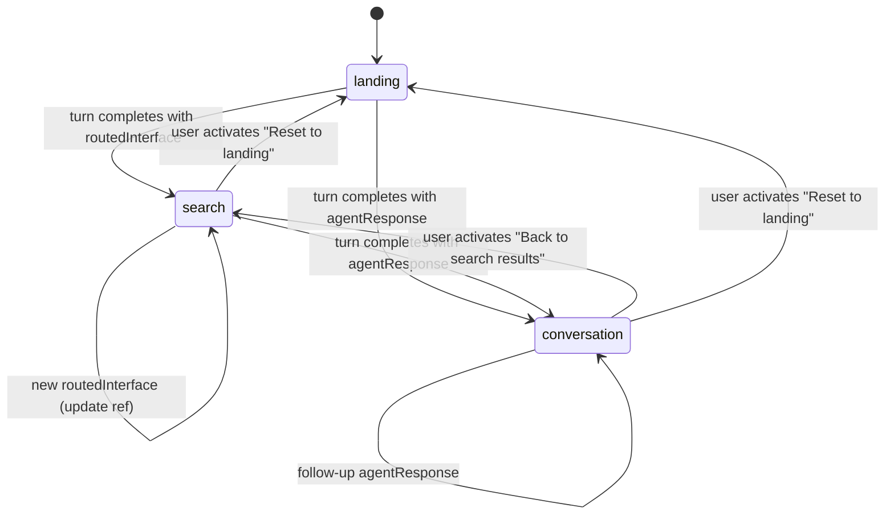
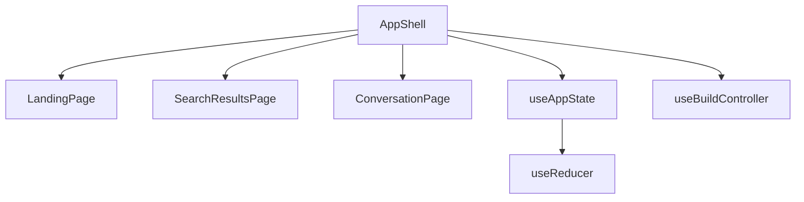

# Design Document: App Shell State Machine

## Overview

The App Shell is the architectural backbone of the `demo-react` sample. It manages a three-state view machine (landing, search, conversation) driven by responses from a single `ConverseController` instance. The shell observes turn completions and transitions views based on response type, manages the lifecycle of routed search interfaces via a React ref, and exposes bidirectional navigation between views.

This design addresses Requirements 1–6 from the requirements document.

## Architecture



The state machine is **event-driven**: view transitions only occur on turn completion events or explicit user navigation actions. The streaming state acts as a guard preventing new submissions but does not trigger transitions.

### Key Architectural Decisions

1. **`useRef` for the persisted interface** — The routed interface is a mutable container that must survive across renders without triggering re-renders. Using state would cause unnecessary render cascades when the interface object mutates internally.

2. **`useReducer` for view state** — A reducer provides a clear, testable state machine with well-defined transitions. It also co-locates the "has search interface" boolean derivation.

3. **Turn observation via `useEffect`** — Comparing the latest completed turn against a previously-observed turn ref detects new completions without reacting to intermediate streaming updates.

4. **Single ConverseController at AppShell level** — The controller is instantiated once via `useBuildController` and its `submit` function is passed down to all views. This ensures conversation session continuity.

## Components and Interfaces



### AppShell

The top-level component that:

- Instantiates the `ConverseController` via `useBuildController`
- Manages view state via `useAppState`
- Observes turn completions and dispatches transitions
- Holds the `persistedInterfaceRef`
- Conditionally renders the active view

### useAppState Hook

A custom hook encapsulating the view state reducer and derived state:

```typescript
type ViewState = 'landing' | 'search' | 'conversation';

type AppAction =
  | {type: 'NAVIGATE_SEARCH'}
  | {type: 'NAVIGATE_CONVERSATION'}
  | {type: 'NAVIGATE_LANDING'};

interface AppState {
  view: ViewState;
}

function appReducer(state: AppState, action: AppAction): AppState {
  switch (action.type) {
    case 'NAVIGATE_SEARCH':
      return {view: 'search'};
    case 'NAVIGATE_CONVERSATION':
      return {view: 'conversation'};
    case 'NAVIGATE_LANDING':
      return {view: 'landing'};
    default:
      return state;
  }
}
```

The hook returns `{view, dispatch, hasSearchInterface}` where `hasSearchInterface` is derived from `persistedInterfaceRef.current !== null`.

### Turn Observation Logic

The AppShell uses a `useEffect` that runs whenever the controller state changes. It compares the latest completed turn against a `lastObservedTurnIdRef`:

```typescript
const lastObservedTurnIdRef = useRef<string | null>(null);

useEffect(() => {
  const latestCompletedTurn = findLatestCompletedTurn(converseState.turns);
  if (!latestCompletedTurn) return;
  if (latestCompletedTurn.id === lastObservedTurnIdRef.current) return;

  lastObservedTurnIdRef.current = latestCompletedTurn.id;

  if (latestCompletedTurn.routedInterface) {
    // Dispose previous interface if exists
    if (persistedInterfaceRef.current) {
      persistedInterfaceRef.current.interface.dispose();
    }
    persistedInterfaceRef.current = latestCompletedTurn.routedInterface;
    dispatch({type: 'NAVIGATE_SEARCH'});
  } else if (latestCompletedTurn.agentResponse) {
    dispatch({type: 'NAVIGATE_CONVERSATION'});
  }
  // Error turns: do nothing (stay on current view)
}, [converseState.turns]);
```

The helper `findLatestCompletedTurn` scans the turns array in reverse for the most recent turn with status `'complete'`.

### Props Contract

| Component           | Props                                                                                                                                                 |
| ------------------- | ----------------------------------------------------------------------------------------------------------------------------------------------------- |
| `LandingPage`       | `onSubmit: (prompt: string) => void`, `isStreaming: boolean`                                                                                          |
| `SearchResultsPage` | `onSubmit: (prompt: string) => void`, `isStreaming: boolean`, `routedInterface: RoutedInterface`                                                      |
| `ConversationPage`  | `onSubmit: (prompt: string) => void`, `isStreaming: boolean`, `turns: Turn[]`, `onBackToSearch: (() => void) \| null`, `onResetToLanding: () => void` |

- `onSubmit` — delegates to `converseController.submit({prompt})`
- `isStreaming` — from `converseState.isStreaming`, used to disable input
- `onBackToSearch` — `null` when no persisted interface exists (disables the action); otherwise dispatches `NAVIGATE_SEARCH`
- `onResetToLanding` — dispatches `NAVIGATE_LANDING`, disposes persisted interface, calls `converseController.clear()`

### Navigation Handlers

```typescript
const handleBackToSearch = persistedInterfaceRef.current
  ? () => dispatch({type: 'NAVIGATE_SEARCH'})
  : null;

const handleResetToLanding = () => {
  if (persistedInterfaceRef.current) {
    persistedInterfaceRef.current.interface.dispose();
    persistedInterfaceRef.current = null;
  }
  converseController.clear();
  dispatch({type: 'NAVIGATE_LANDING'});
};

const handleSubmit = (prompt: string) => {
  converseController.submit({prompt});
};
```

## Data Models

### View State

```typescript
interface AppState {
  view: 'landing' | 'search' | 'conversation';
}
```

### Persisted Interface Ref

```typescript
const persistedInterfaceRef = useRef<RoutedInterface | null>(null);
```

Where `RoutedInterface` is imported from `@coveo/thermidor`:

```typescript
type RoutedInterface = {
  useCase: 'commerceSearch' | 'search';
  interface: CommerceInterface | SearchInterface;
};
```

### ConverseController State (consumed, not owned)

```typescript
interface ConverseControllerState {
  turns: Turn[];
  activeTurn: Turn | undefined;
  isStreaming: boolean;
}
```

## Correctness Invariants

_These are the key behavioral invariants the implementation must uphold. They are validated through example-based unit tests rather than property-based testing, as the state machine's simplicity makes PBT overkill for this demo._

### Property 1: Turn completion drives correct view transition

_For any_ completed turn, if the turn has a `routedInterface`, the view state SHALL become `'search'`; if the turn has an `agentResponse`, the view state SHALL become `'conversation'`.

**Validates: Requirements 1.2, 1.3**

### Property 2: Interface disposal on replacement

_For any_ sequence of two or more routed interfaces arriving via turn completions, the `dispose()` method SHALL be called on the previous interface before the new one is stored in the persisted ref.

**Validates: Requirements 3.2**

### Property 3: Streaming blocks all submissions

_For any_ prompt string attempted while `isStreaming` is `true`, the ConverseController `submit` function SHALL not be invoked.

**Validates: Requirements 5.1**

### Property 4: Error turns preserve view state

_For any_ turn that completes with `status: 'error'`, regardless of the current view state, the view state SHALL remain unchanged.

**Validates: Requirements 5.2, 5.3**

### Property 5: Prompt forwarding integrity

_For any_ non-empty prompt string submitted from any view, the ConverseController `submit` function SHALL be called with that exact string.

**Validates: Requirements 6.4, 2.3**

## Error Handling

| Scenario                                     | Behavior                                                                                                    |
| -------------------------------------------- | ----------------------------------------------------------------------------------------------------------- |
| Turn completes with `status: 'error'`        | View stays unchanged. The error message from `turn.error` is surfaced to the active view for display.       |
| `dispose()` throws on the previous interface | Catch and log. Still store the new interface and transition. The previous interface is released regardless. |
| `submit` called while streaming              | Silently ignored (guard in `handleSubmit` or rely on controller's internal guard).                          |
| Controller instantiation fails               | Caught by React error boundary wrapping `AppShell`.                                                         |

## Testing Strategy

### Unit Tests (Vitest)

- **Reducer tests**: Verify each action produces the correct next state.
- **Turn observation**: Mock controller state sequences, verify correct transitions fire.
- **Navigation handlers**: Verify `dispose()` is called on reset, `clear()` is called, ref is nulled.
- **Render tests**: Each view state renders the correct placeholder component.
- **Props passing**: Each placeholder receives the expected props.

Property-based tests were considered but deemed overkill for a demo sample with a simple 3-state machine. The example-based unit tests provide sufficient coverage.

### Test File Location

`src/hooks/use-app-state.test.ts` — reducer and derived state logic
`src/components/AppShell.test.tsx` — integration of turn observation + rendering

## File Structure

```
src/
├── components/
│   ├── AppShell.tsx              # Top-level shell with state machine
│   ├── LandingPage.tsx           # Placeholder landing view
│   ├── SearchResultsPage.tsx     # Placeholder search view
│   └── ConversationPage.tsx      # Placeholder conversation view
├── hooks/
│   ├── use-build-controller.ts   # (existing) Controller instantiation hook
│   └── use-app-state.ts          # View state reducer + derived state
├── context/
│   ├── engine.tsx                # (existing) Engine provider
│   └── generative-interface.tsx  # (existing) GenerativeInterface provider
├── App.tsx                       # Wraps providers + renders AppShell
├── App.test.tsx                  # (existing) Smoke test
├── index.tsx                     # (existing) Entry point
├── index.css                     # (existing) Global styles
└── env.ts                        # (existing) Environment config
```

New files for this task:

- `src/components/AppShell.tsx`
- `src/components/LandingPage.tsx`
- `src/components/SearchResultsPage.tsx`
- `src/components/ConversationPage.tsx`
- `src/hooks/use-app-state.ts`
