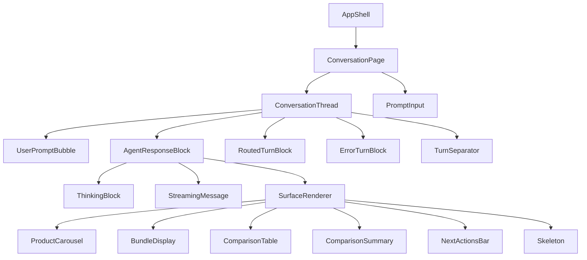
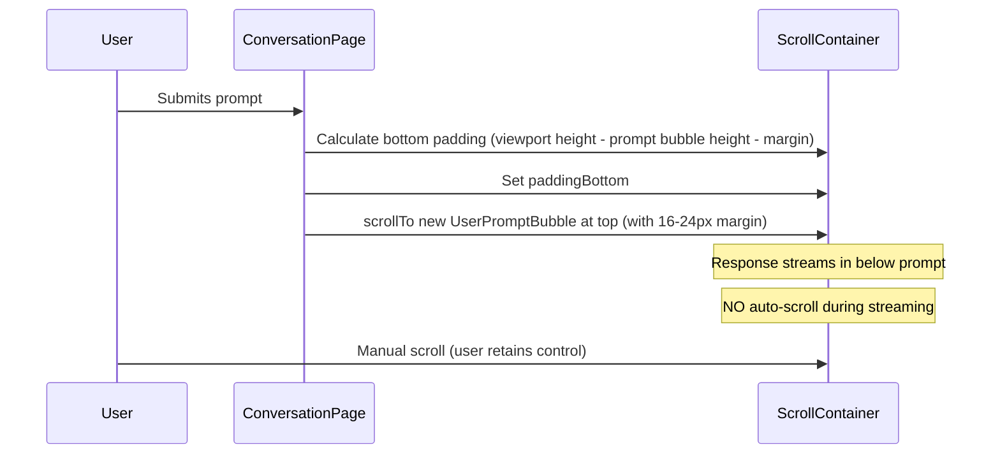

# Design Document: Conversation Mode

## Overview

Conversation Mode transforms the placeholder `ConversationPage` into a fully functional chat-style interface that renders multi-turn agent conversations in a vertical thread layout. The implementation adapts the rendering infrastructure from the `generative-react` sample (A2UI surfaces, streaming messages, thinking blocks) but presents them in a chronological conversation thread rather than a single-turn-with-sidebar approach.

Key architectural concerns:
1. **Thread rendering** — All turns (agent responses and routed turns) rendered chronologically in a scrollable container
2. **Prompt-anchored scrolling** — New prompts scroll to viewport top with dynamic bottom padding; no auto-scroll during streaming
3. **A2UI surface integration** — Copy rendering infrastructure verbatim from `generative-react` (SurfaceRenderer, ProductCarousel, BundleDisplay, etc.)
4. **Redesigned ThinkingBlock** — Collapsed by default with animated dots, nested collapsible tool calls, and markdown in reasoning
5. **Routed interface turns** — Display "See results" links for turns with routed interfaces; clicking navigates to search hydrated with that turn's interface

This design addresses Requirements 1–10 from the requirements document.

## Architecture



### Scrolling & Layout Model



### Key Architectural Decisions

1. **A2UI directory copied verbatim** — The `a2ui/` directory (SurfaceRenderer, ProductCarousel, BundleDisplay, ComparisonTable, ComparisonSummary, NextActionsBar, Skeleton, types.ts) is rendering infrastructure that doesn't need redesign. Copying from `generative-react` avoids duplication drift.

2. **ThinkingBlock redesigned** — The `generative-react` ThinkingBlock uses a flat `<details>` element with a status summary. The conversation mode version requires: collapsed-by-default with animated dots, nested collapsible tool calls, and markdown rendering inside reasoning blocks. This warrants a new implementation.

3. **StreamingMessage reused as-is** — The markdown rendering logic (via `marked`) is identical between samples. Copy the component with no changes.

4. **Prompt-anchored scrolling via refs** — A ref on each `UserPromptBubble` allows measuring position and scrolling to it. Bottom padding is recalculated on submission and viewport resize.

5. **CSS Modules** — All new components use `.module.css` files, consistent with the existing project pattern.

7. **New dependency: `marked`** — Required for markdown rendering in StreamingMessage and ThinkingBlock reasoning. Already used in `generative-react` at the catalog version.

## Components and Interfaces

### ConversationPage

The top-level page component rendered when `view === 'conversation'`. Orchestrates the thread, scroll behavior, and prompt input.

```typescript
interface ConversationPageProps {
  onSubmit: (prompt: string) => void;
  isStreaming: boolean;
  turns: Turn[];
  onBackToSearch: () => void;
  canGoBackToSearch: boolean;
  onResetToLanding: () => void;
}
```

Responsibilities:
- Renders navigation bar (back to search, reset)
- Renders the `ConversationThread`
- Renders `PromptInput` at the bottom
- Manages prompt-anchored scrolling via a scroll container ref and per-turn bubble refs
- Recalculates bottom padding on resize (via `ResizeObserver` or `resize` event)

### ConversationThread

Renders the chronological list of turns with separators.

```typescript
interface ConversationThreadProps {
  turns: Turn[];
  isStreaming: boolean;
  onAction: (text: string, type: string) => void;
  turnRefs: React.MutableRefObject<Map<string, HTMLDivElement>>;
}
```

For each turn, renders:
- `UserPromptBubble` (always, for all turn types)
- Then based on turn content:
  - **Agent response turn**: `AgentResponseBlock` (ThinkingBlock + StreamingMessage + SurfaceRenderer)
  - **Routed turn** (has `routedInterface`, status `'complete'`): `RoutedTurnBlock` with static message
  - **Error turn**: `ErrorTurnBlock`
  - **Streaming turn** (no response yet): `ThinkingBlock` with animated dots
- `TurnSeparator` between consecutive turns

### UserPromptBubble

Displays the user's prompt text, right-aligned.

```typescript
interface UserPromptBubbleProps {
  prompt: string;
}
```

### AgentResponseBlock

Wraps ThinkingBlock + StreamingMessage + SurfaceRenderer for a completed or streaming agent response turn.

```typescript
interface AgentResponseBlockProps {
  agentResponse: AgentResponse;
  isStreaming: boolean;
  onAction: (text: string, type: string) => void;
}
```

Render order (matching Requirement 2.4):
1. `ThinkingBlock` (if reasoning steps exist or turn is still streaming)
2. `StreamingMessage` (if messages with non-empty content exist)
3. `SurfaceRenderer` (if surfaces exist)

### ThinkingBlock (Redesigned)

Collapsed-by-default block showing reasoning progress.

```typescript
interface ThinkingBlockProps {
  reasoningSteps: ReasoningStep[];
  isStreaming: boolean;
}
```

**Summary line behavior (collapsed state):**
- No steps received yet: "Working" + animated "..."
- Reasoning streaming: "Reasoning" + animated "..."
- Tool call active (status `'calling'`): "Calling tool: <tool_name>" + animated "..."
- All done (isStreaming=false): "<N> tool calls" (or "1 tool call" for exactly one; "Done." if zero tool calls) — static, no animation

**Expand/collapse icon:**
- A chevron icon (▶ collapsed / ▼ expanded) rendered before the summary text
- Changes orientation based on `<details>` open state (CSS `details[open]` selector)

**Width constraint:**
- Width: 100% of the available space (borderless section, no box styling)

**Expanded state:**
- Reasoning text rendered as markdown (via `marked`)
- Tool calls rendered inline at their sequence position
- Each tool call is a nested `<details>` (collapsed by default), showing:
  - Summary: "Tool call: <tool_name>" with the same chevron expand/collapse icon
  - Content: JSON arguments + result (if completed)

### StreamingMessage

Renders agent text messages as markdown. Copied from `generative-react` with no changes.

```typescript
interface StreamingMessageProps {
  messages: AgentMessage[];
}
```

Uses `marked` with `breaks: true` and `gfm: true`.

### SurfaceRenderer

Dispatches parsed A2UI surfaces to typed component renderers. Copied verbatim from `generative-react`.

```typescript
interface SurfaceRendererProps {
  surfaces: A2UISurface[];
  onAction?: (text: string, type: string) => void;
}
```

Known component types: `ProductCarousel`, `BundleDisplay`, `NextActionsBar`, `ComparisonTable`, `ComparisonSummary`. Unknown types are skipped. Surfaces with `skeleton-` prefix or `isLoading: true` render as `Skeleton`.

### RoutedTurnBlock

Renders a static message for a routed interface turn (no interaction).

```typescript
function RoutedTurnBlock(): JSX.Element;
```

Renders the text "Search results updated." in an italicized style. Not clickable — the user can only view the latest search results via the "Back to search results" nav link.

### ErrorTurnBlock

Renders an error message in a warning-styled container.

```typescript
interface ErrorTurnBlockProps {
  error?: string;
}
```

Displays `error` string if non-empty, otherwise a generic fallback: "An unknown error occurred."

### TurnSeparator

Visual delimiter between consecutive turns.

```typescript
function TurnSeparator(): JSX.Element;
```

Renders as a styled `<hr>` or spacing element.

### NextActionsBar

Renders follow-up action buttons from a surface. Copied from `generative-react`.

```typescript
interface NextActionsBarProps {
  surface: ParsedSurface;
  onAction?: (text: string, type: string) => void;
}
```

The `onAction` callback is wired to submit through `onSubmit` in the ConversationPage. Buttons with empty/undefined text values are not rendered.

### Navigation Bar

Positioned at the top of ConversationPage.

- "← Back to search results" — shown only when `canGoBackToSearch` is true; calls `onBackToSearch`
- "Reset" button — always visible; calls `onResetToLanding`; enabled even during streaming

Both actions use semantic elements (button or anchor) and are keyboard-accessible.

## Data Models

### Turn (from `@coveo/thermidor`)

```typescript
interface Turn {
  id: string;
  prompt: string;
  status: 'streaming' | 'complete' | 'error';
  routedInterface?: RoutedInterface;
  agentResponse?: AgentResponse;
  error?: string;
}
```

### AgentResponse (from `@coveo/thermidor`)

```typescript
interface AgentResponse {
  messages: AgentMessage[];
  surfaces: A2UISurface[];
  reasoningSteps: ReasoningStep[];
}
```

### ReasoningStep (from `@coveo/thermidor`)

```typescript
type ReasoningStep = ReasoningMessageStep | ToolCallStep;

interface ReasoningMessageStep {
  type: 'reasoning';
  content: string;
}

interface ToolCallStep {
  type: 'tool-call';
  id: string;
  name: string;
  args: string;
  result?: string;
  status: 'calling' | 'completed';
}
```

### AgentMessage (from `@coveo/thermidor`)

```typescript
interface AgentMessage {
  content: string;
  role: string;
}
```

### ParsedSurface (from `a2ui/types.ts`)

```typescript
interface ParsedSurface {
  surfaceId: string;
  rootId: string;
  componentType: string;
  componentProps: Record<string, unknown>;
  data: Record<string, unknown>;
}
```

### Scroll Anchoring State (internal)

```typescript
interface ScrollAnchorState {
  containerRef: React.RefObject<HTMLDivElement>;
  turnRefs: React.MutableRefObject<Map<string, HTMLDivElement>>;
  scrollToPrompt: (turnId: string) => void;
  recalculatePadding: () => void;
}
```

## Error Handling

| Scenario | Behavior |
|----------|----------|
| Turn status `'error'` with message | Display error string in warning-styled `ErrorTurnBlock`; prompt input remains enabled |
| Turn status `'error'` without message | Display "An unknown error occurred." in `ErrorTurnBlock`; prompt input remains enabled |
| Empty prompt submission | Submit button disabled; `onSubmit` not called (handled by PromptInput) |
| Whitespace-only prompt | Submit button disabled (PromptInput trims and checks emptiness) |
| Surface with unknown component type | Silently skipped by SurfaceRenderer (returns `null`) |
| `marked` rendering error | Wrap in try/catch, render raw text as fallback |
| Missing `agentResponse` on streaming turn | Render ThinkingBlock with animated dots (no crash) |
| NextActionsBar action with empty text | Button not rendered (filtered before mapping) |
| Viewport resize during conversation | `ResizeObserver` or `resize` listener recalculates bottom padding |

## Testing Strategy

### Approach

Standard unit tests with **Vitest + @testing-library/react**. Property-based testing is NOT applicable for this feature because it consists of UI rendering, scroll behavior, and component composition — none of which have meaningful universal properties over a wide input space.

### Unit Tests

| Component | Test Focus |
|-----------|-----------|
| `ConversationPage` | Renders thread + prompt input; passes correct props; handles submit; back/reset navigation |
| `ConversationThread` | Renders correct block type per turn (agent/routed/error/streaming); separators between turns |
| `UserPromptBubble` | Displays prompt text; has right-alignment class |
| `AgentResponseBlock` | Renders sub-components in correct order; handles empty arrays gracefully |
| `ThinkingBlock` | Collapsed by default; correct summary text per state; expand shows reasoning as markdown; nested tool calls collapse |
| `StreamingMessage` | Renders markdown from messages; handles empty messages; uses `marked` correctly |
| `SurfaceRenderer` | Dispatches to correct component; skips unknowns; skeleton for loading surfaces; replaces skeleton with real |
| `RoutedTurnBlock` | Renders static "Search results updated." message |
| `ErrorTurnBlock` | Shows error message when provided; shows fallback when empty/undefined |
| `TurnSeparator` | Renders as expected |
| `NextActionsBar` | Renders action buttons; calls onAction with text; filters empty actions |
| Scroll anchoring | Verifies padding calculation and scrollTo behavior (mocking DOM measurements) |

### Integration Tests

- Full ConversationPage with mocked turns array: verify end-to-end rendering of a multi-turn conversation
- Verify streaming state disables prompt input and shows thinking dots
- Verify "Back to search results" visibility tied to `canGoBackToSearch`
- Verify "Reset" always visible and calls handler

### Test File Locations

```
src/components/ConversationPage/ConversationPage.test.tsx
src/components/ConversationPage/ConversationThread.test.tsx
src/components/ConversationPage/ThinkingBlock.test.tsx
src/components/ConversationPage/AgentResponseBlock.test.tsx
src/components/ConversationPage/UserPromptBubble.test.tsx
src/components/ConversationPage/RoutedTurnBlock.test.tsx
src/components/ConversationPage/ErrorTurnBlock.test.tsx
src/a2ui/SurfaceRenderer/SurfaceRenderer.test.tsx
```

## File Structure

```
src/
├── a2ui/                              # Copied verbatim from generative-react
│   ├── BundleDisplay/
│   │   ├── BundleDisplay.tsx
│   │   └── BundleDisplay.module.css
│   ├── ComparisonSummary/
│   │   ├── ComparisonSummary.tsx
│   │   └── ComparisonSummary.module.css
│   ├── ComparisonTable/
│   │   ├── ComparisonTable.tsx
│   │   └── ComparisonTable.module.css
│   ├── NextActionsBar/
│   │   ├── NextActionsBar.tsx
│   │   └── NextActionsBar.module.css
│   ├── ProductCard/
│   │   ├── ProductCard.tsx
│   │   └── ProductCard.module.css
│   ├── ProductCarousel/
│   │   ├── ProductCarousel.tsx
│   │   └── ProductCarousel.module.css
│   ├── Skeleton/
│   │   ├── Skeleton.tsx
│   │   └── Skeleton.module.css
│   ├── SurfaceRenderer/
│   │   ├── SurfaceRenderer.tsx
│   │   └── SurfaceRenderer.module.css
│   └── types.ts
├── components/
│   ├── AppShell.tsx                    # Modified: navigation logic
│   ├── ConversationPage/              # New directory (replaces placeholder)
│   │   ├── ConversationPage.tsx       # Top-level page component
│   │   ├── ConversationPage.module.css
│   │   ├── ConversationThread.tsx     # Turn list rendering
│   │   ├── ConversationThread.module.css
│   │   ├── UserPromptBubble.tsx
│   │   ├── UserPromptBubble.module.css
│   │   ├── AgentResponseBlock.tsx
│   │   ├── AgentResponseBlock.module.css
│   │   ├── ThinkingBlock.tsx          # Redesigned (collapsed, animated, nested)
│   │   ├── ThinkingBlock.module.css
│   │   ├── StreamingMessage.tsx       # Adapted from generative-react
│   │   ├── StreamingMessage.module.css
│   │   ├── RoutedTurnBlock.tsx
│   │   ├── RoutedTurnBlock.module.css
│   │   ├── ErrorTurnBlock.tsx
│   │   ├── ErrorTurnBlock.module.css
│   │   ├── TurnSeparator.tsx
│   │   ├── TurnSeparator.module.css
│   │   └── index.ts                   # Re-exports ConversationPage
│   ├── LandingPage/
│   ├── SearchResultsPage/
│   ├── PromptInput/                    # Existing, extended with clearOnSubmit prop and loading spinner
│   └── SuggestionsDropdown/            # Existing, reused as-is
├── hooks/
│   ├── use-app-state.ts               # Existing
│   ├── use-build-controller.ts        # Existing
│   └── use-scroll-anchor.ts           # New: scroll anchoring logic
├── utils.ts                            # New: assembleMessages, formatPrice (from generative-react)
├── context/
├── App.tsx
├── env.ts
└── index.tsx
```

### AppShell Changes

The `AppShell` needs a new `onSeeResults` handler, updated `ConversationPage` props, and immediate navigation on submit:

```typescript
const handleSubmit = (prompt: string) => {
  if (!prompt.trim() || converseState.isStreaming) return;
  controller.submit({prompt});
  // From landing: wait for signal (reasoning → converse, routedInterface → search)
  // From search: immediately go to conversation (follow-up prompt)
  // From conversation: already there
  if (view === 'landing') {
    pendingLandingNavigationRef.current = true;
  } else if (view !== 'conversation') {
    dispatch({type: 'NAVIGATE_CONVERSATION'});
  }
};

// In the turns useEffect, when pendingLandingNavigationRef is true:
// - If latest turn gains routedInterface → NAVIGATE_SEARCH
// - If latest turn gains reasoning steps → NAVIGATE_CONVERSATION

const handleSeeResults = (turnId: string) => {
  const turn = converseState.turns.find((t) => t.id === turnId);
  if (turn?.routedInterface) {
    if (persistedInterfaceRef.current) {
      persistedInterfaceRef.current.interface.dispose();
    }
    persistedInterfaceRef.current = turn.routedInterface;
    persistedInterfaceTurnIdRef.current = turn.id;
    dispatch({type: 'NAVIGATE_SEARCH'});
  }
};

// In conversation case:
<ConversationPage
  onSubmit={handleSubmit}
  isStreaming={converseState.isStreaming}
  turns={converseState.turns}
  onBackToSearch={handleBackToSearch}
  canGoBackToSearch={canGoBackToSearch}
  onResetToLanding={handleResetToLanding}
  onSeeResults={handleSeeResults}
/>
```

### New Dependency

Add to `package.json` dependencies:

```json
"marked": "catalog:"
```

The `catalog:` protocol resolves from the pnpm workspace catalog (same version as `generative-react`).

### Scroll Anchoring Hook

```typescript
interface UseScrollAnchorOptions {
  containerRef: React.RefObject<HTMLDivElement>;
  turnRefs: React.MutableRefObject<Map<string, HTMLDivElement>>;
}

interface UseScrollAnchorReturn {
  scrollToPrompt: (turnId: string) => void;
  recalculatePadding: () => void;
}

function useScrollAnchor(options: UseScrollAnchorOptions): UseScrollAnchorReturn;
```

**`scrollToPrompt(turnId)`**:
1. Get the target element from `turnRefs.current.get(turnId)`
2. Calculate its offset from container top
3. Set container `paddingBottom` = container client height - bubble height - margin (ensures the bubble can reach viewport top)
4. Call `container.scrollTo({ top: elementOffset - MARGIN_TOP })` where `MARGIN_TOP` is 16–24px

**`recalculatePadding()`**:
- Called on resize
- Recomputes padding based on current container dimensions
- Does NOT scroll (preserves user position)
