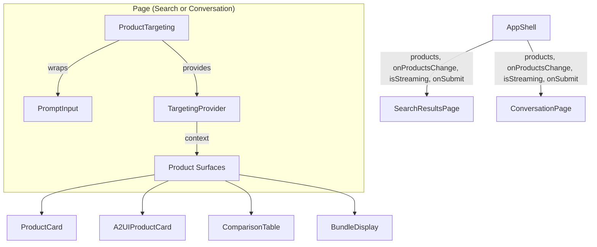

# Design Document: Product Context Attachment

## Overview

The Product Context Attachment feature enables users to attach products as context to their prompts via an interactive "targeting mode." The architecture prioritizes self-containment: the `ProductTargeting` component owns all targeting logic, state management, and submit-with-context behavior. Pages only need to provide a content area wrapped in `TargetingProvider` and pass through persistence props.

## Architecture



### Key Architectural Principle

`ProductTargeting` is a **self-contained orchestrator**. It:
- Owns the targeting boolean state (via internal `useTargetingMode` hook)
- Owns the submit-with-context logic (appends `[ADDITIONAL CONTEXT: ...]` before calling parent `onSubmit`)
- Provides `TargetingContext` to its content area children
- Renders the toolbar UI (attach button, pills, clear, hints)
- Manages the toggle/deduplication logic for adding/removing products
- Auto-exits targeting on submit or when streaming starts

Pages do NOT contain any targeting logic — they just render ProductTargeting and pass it the content area as a render prop or context consumer.

## Components and Interfaces

### File Structure

```
src/
├── hooks/
│   └── use-targeting-mode.ts              # Internal: boolean toggle + Escape listener
├── context/
│   └── targeting.tsx                      # TargetingContext type + Provider + useTargeting hook
├── components/
│   └── ProductTargeting/
│       ├── ProductTargeting.tsx           # Self-contained orchestrator component
│       └── ProductTargeting.module.css    # All targeting-related styles
```

### Component Interfaces

```typescript
// ProductTargeting.tsx — the only public API surface
interface TargetedProduct {
  id: string;
  name: string;
  thumbnail?: string;
}

interface ProductTargetingProps {
  /** Current list of attached products (lifted state for persistence) */
  products: TargetedProduct[];
  /** Callback when the product list changes (add/remove/clear) */
  onProductsChange: (products: TargetedProduct[]) => void;
  /** Parent's submit handler — ProductTargeting wraps it to append context */
  onSubmit: (prompt: string) => void;
  /** Whether the backend is currently streaming (disables targeting) */
  isStreaming: boolean;
  /** Whether the PromptInput is disabled (passed through) */
  disabled?: boolean;
  /** PromptInput props forwarded through */
  promptProps?: {
    initialValue?: string;
    clearOnSubmit?: boolean;
    placeholder?: string;
    suggestions?: SuggestionSection[];
    onSuggestionSelect?: (item: SuggestionItem, sectionId: string) => void;
  };
  /** Content area that contains targetable product surfaces */
  children: React.ReactNode;
}
```

```typescript
// targeting.tsx — React Context consumed by product surfaces
interface TargetingContext {
  isTargeting: boolean;
  onProductTargeted: (productId: string, productName: string, productThumbnail?: string) => void;
  selectedProductIds: Set<string>;
}
```

```typescript
// use-targeting-mode.ts — internal hook (not exported publicly)
interface UseTargetingModeReturn {
  isTargeting: boolean;
  startTargeting: () => void;
  stopTargeting: () => void;
  toggleTargeting: () => void;
}
```

### Design Decisions

1. **Single propagation mechanism: React Context everywhere.** Both search and conversation views use `TargetingProvider` to propagate targeting state to product surfaces. This eliminates the need for `onProductTargeted`/`selectedProductIds` props on `ProductGrid` and `ProductCard`. All product components consume `useTargeting()` from context.

2. **ProductTargeting owns submit-with-context logic.** The context-appending (`[ADDITIONAL CONTEXT: ...]`) happens inside `ProductTargeting` before calling the parent's `onSubmit`. Pages never see or construct the context format — they just pass their `onSubmit` to `ProductTargeting`.

3. **ProductTargeting owns targeting state internally.** The `useTargetingMode` hook is used internally by `ProductTargeting` — not by the pages. The hook is not exported. Pages don't need to know whether targeting is active; they just render the component.

4. **ProductTargeting auto-manages streaming interactions.** It receives `isStreaming` and internally handles: disabling the attach button, preventing pill removal, auto-exiting targeting mode. No `useEffect` needed in the pages.

5. **Products state is lifted for persistence, not for logic.** AppShell holds `targetedProducts` state and passes it as `products`/`onProductsChange`. But all mutation logic (add, remove, toggle, clear) lives inside `ProductTargeting`. The parent only sees the final list.

6. **No modifications to PromptInput.** ProductTargeting renders its own PromptInput internally (not as `children`). It controls focus detection via a ref on the compound container and handles dropdown positioning purely through CSS (`position: relative` on the container). No `externalPositioning` or `onFocusChange` props needed on PromptInput.

7. **Deduplication uses `id` field uniformly.** The caller passes the product `id` (which may be `permanentid` from search or `ec_name` from A2UI). `ProductTargeting` deduplicates based on the `id` field of `TargetedProduct` — it doesn't care what the value represents.

8. **Muting via CSS overlay pattern.** Instead of manually applying `.muted` to individual elements, the ProductTargeting container applies a `cursor: crosshair` class to a parent wrapper. Individual page elements that should be muted during targeting receive a shared `.muted` class — but this is applied by the page layout, not by ProductTargeting itself. ProductTargeting only controls its own UI and the targeting context. Muted elements include sidebar, pagination, and sort controls.

9. **PromptInput rendered internally, not as children.** ProductTargeting renders the PromptInput as part of its own template, forwarding relevant props via `promptProps`. This gives it full control over the compound box layout (textarea + toolbar) without requiring PromptInput to know about external positioning. The `children` prop is used for the targetable content area that gets wrapped in `TargetingProvider`.

10. **Navigation between views uses floating action buttons.** Instead of inline navigation buttons taking up layout space, each page renders a `position: fixed` circular icon button. In search mode it floats bottom-right (chat bubble icon → conversation). In conversation mode it floats top-right (list icon → search results). Both use semi-transparency with hover-to-opaque transitions.

11. **No top navigation bar in conversation mode.** The conversation page uses the full height for the thread and prompt. Navigation back to search is handled by the floating button.

12. **Reset feature removed.** There is no "Reset to landing" action. Users stay in the search/conversation flow.

## Component Rendering Structure

```tsx
// SearchResultsPage:
<div className={styles.searchLayout}>
  <ProductTargeting
    products={targetedProducts}
    onProductsChange={onTargetedProductsChange}
    onSubmit={onSubmit}
    isStreaming={isStreaming}
    promptProps={{ initialValue: query, suggestions, onSuggestionSelect }}
  >
    <SearchResultsPageContent ... />
  </ProductTargeting>
  <button className={styles.floatingBackButton} title="Back to conversation" ...>
    {/* chat bubble SVG */}
  </button>
</div>

// ConversationPage:
<section className={styles.page}>
  <div className={styles.promptAtBottom}>
    <ProductTargeting
      products={targetedProducts}
      onProductsChange={onTargetedProductsChange}
      onSubmit={onSubmit}
      isStreaming={isStreaming}
      promptProps={{ suggestions, onSuggestionSelect }}
    >
      <div className={styles.scrollContainer}>...</div>
    </ProductTargeting>
  </div>
  {canGoBackToSearch && (
    <button className={styles.floatingBackButton} title="Back to search results" ...>
      {/* list SVG */}
    </button>
  )}
</section>
```

```tsx
// Internal rendering of ProductTargeting:
<div className={styles.container}>
  <div className={styles.promptArea}>
    <PromptInput {...promptProps} onSubmit={handleSubmitWithContext} />
    <div className={styles.toolbar}>
      <button className={styles.attachButton} />
      <span className={styles.separator} />
      <span className={styles.pillsArea}>{/* pills, hint, done, clear */}</span>
    </div>
  </div>
  <TargetingProvider value={targetingContextValue}>
    <div className={isTargeting ? styles.targetingActive : ''}>
      {children}
    </div>
  </TargetingProvider>
</div>
```

When targeting is active, a "Done" button replaces the "Clear" button (right-aligned in the pills area) to provide an explicit exit action. If no products are selected yet, the Done button appears alongside the hint text.

## Data Flow

### Attaching a product

```
User activates targeting (clicks paperclip)
  → ProductTargeting.toggleTargeting() → isTargeting = true
  → TargetingContext updates → all product surfaces re-render as targetable

User clicks product (any surface)
  → Product component reads useTargeting()
  → Calls targeting.onProductTargeted(id, name, thumbnail)
  → ProductTargeting.handleProductTargeted()
  → Checks if id already in products list
    → If yes: removes it (toggle off)
    → If no: adds it
  → Calls onProductsChange(newList)
  → AppShell state updates → ProductTargeting re-renders with new products
  → Pill appears in toolbar, product highlighted in surface
```

### Submitting with context

```
User presses Enter in PromptInput
  → PromptInput calls onSubmit(trimmedText)
  → ProductTargeting.handleSubmitWithContext(prompt)
  → if products.length > 0:
      finalPrompt = `${prompt} [ADDITIONAL CONTEXT: ${names.join(', ')}]`
    else:
      finalPrompt = prompt
  → Calls parent onSubmit(finalPrompt)
  → Exits targeting mode
  → Products remain (NOT cleared)
```

### Rendering in conversation history

```
Turn completes → UserPromptBubble receives turn.prompt
  → parsePrompt(prompt) extracts text + product names via regex
  → Renders: text + <hr> + "Products:" + <ul> of names
```

## Styling Strategy

- **Compound box:** ProductTargeting's `.promptArea` div has `position: relative`. Textarea has no bottom radius; toolbar has no top border. Shared side borders create a unified container.
- **Focus ring:** Detected via `:focus-within` on the `.promptArea` container — no JavaScript needed. Applies `box-shadow` to the container when any child (textarea, buttons) has focus.
- **Targeting highlight on products:** `box-shadow: 0 0 0 2px var(--color-border-active)` on hover, persistent for selected. Uses `inset` for table cells.
- **Carousel overflow fix:** Track gets `padding: 4px; margin: -4px` so box-shadows aren't clipped.
- **Dropdown positioning:** Since `.promptArea` has `position: relative`, the `SuggestionsDropdown` (rendered inside PromptInput with `position: absolute; top: 100%`) naturally positions below the textarea. The toolbar sits between, but the dropdown's `z-index` places it above.
- **Floating nav buttons:** `position: fixed`, circular (44px), `opacity: 0.7` default, `opacity: 1` on hover. Box-shadow for elevation. `z-index: 100`.
- **Conversation layout:** Uses `column-reverse` on ProductTargeting container to place prompt at the bottom. A `border-bottom` on the scroll area section creates the visual separator.
- **Prompt area sizing:** Container has `max-width: 560px`, `margin: 0 auto`. Textarea has `min-height: 44px`, `padding: 10px` (reduced from original 52px/14px). Icons vertically centered with `top: 50%; transform: translateY(-50%)`.
- **Disabled state:** `.promptArea:has(textarea:disabled)` applies `opacity: 0.6` and secondary background to the entire compound box.
- **Pill badge:** Gray circle (`var(--color-text-secondary)`), not red. Uses flexbox centering.
- **Hint text:** Italic, uses `var(--color-text-muted)` for a paler appearance.
- **Done button:** Right-aligned in toolbar during targeting. Light blue background with primary text color, transitions to filled primary on hover. Same positioning as Clear button.
- **Tab order:** PromptInput clear/submit buttons get `tabIndex={-1}` when textarea is empty; Tab key immediately closes suggestions dropdown.

Wait — this means the dropdown would appear between textarea and toolbar. To fix: the dropdown should position relative to the `.promptArea` container, not the textarea. This requires PromptInput to NOT have `position: relative` on its own wrapper. Since ProductTargeting renders PromptInput internally, it can control this via a CSS override:

```css
.promptArea :global(.promptWrapper) { position: static; }
```

Or simpler: ProductTargeting passes a `className` to PromptInput that overrides the wrapper positioning. This is an internal implementation detail — PromptInput's public API doesn't change.

## Error Handling

| Scenario | Behavior |
|----------|----------|
| Product has no thumbnail | Grey placeholder square rendered in pill |
| Product already in context (duplicate click) | Removed from context (toggle behavior) |
| Streaming starts while targeting | Targeting auto-exits, attach button disabled |
| No products attached on submit | Prompt submitted as-is, no suffix added |
| User presses Escape outside targeting mode | No effect (listener only active when targeting) |
| Product name contains comma | Still works — the regex captures everything between `[ADDITIONAL CONTEXT:` and `]`, then splits by `,`. Product names with commas would be incorrectly split. This is a known limitation of the string format. |

## Testing Strategy

| Component / Utility | Key assertions |
|---------------------|----------------|
| ProductTargeting | Renders toolbar with attach button; toggling shows hint text; clicking products adds pills; clear removes all; submit appends context; auto-exits on streaming |
| useTargeting() in product surfaces | Returns null outside provider; returns context values inside provider; clicking calls onProductTargeted |
| UserPromptBubble | Parses context suffix correctly; renders product list; handles no-context prompts; handles empty product list |
| useTargetingMode (internal) | Toggle works; Escape exits; does not exit when not active |
