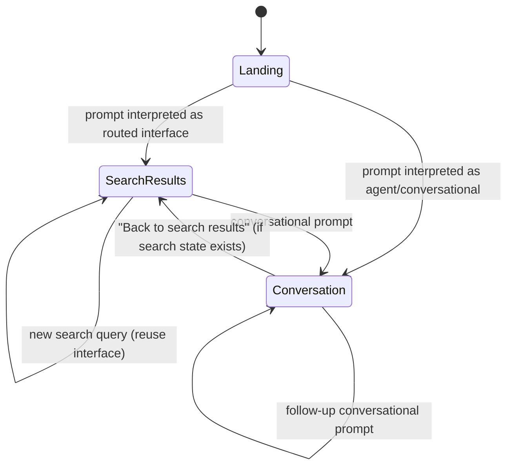

# Implementation Plan — `demo-react` (Generative Experience Demo)

## Problem Statement

Create a new React sample under `samples/thermidor/demo-react/` that realizes the UX vision for a unified generative/conversational commerce experience. It combines a landing page, search results, and conversation mode into a single-page application. The demo uses Thermidor's existing controllers and gracefully handles missing features with placeholders, iterating incrementally.

## Requirements

- SPA with state-based view switching (landing → search results → conversation)
- Bidirectional navigation between search and conversation modes
- Single persistent search interface (first routed interface reused, previous disposed)
- All prompt routing decisions made by the backend via `ConverseController`
- Grouped query suggestions (Search, Conversational, Search refinements) — hardcoded initially
- CSS Modules for styling
- Same dev tooling as `generative-react` (Vite, Vitest, Playwright, proxy config)
- Incremental phasing: hardcoded → real backend where available → future backends
- URL state serialization for browser history navigation on the search page

## Background

- Thermidor currently provides: `Engine`, `GenerativeInterface`, `CommerceInterface`, `SearchInterface`, `ConverseController`, `SearchBoxController`, `ProductListController`, `PaginationController`
- Missing from Thermidor: facet controllers, breadcrumb controllers, query summary controller, sort controller, query suggest controller
- The `ConverseController` creates a new sub-interface for each routed response. The demo manages reuse at the component level: keep a ref to the latest routed interface, dispose the previous one when a new one arrives
- A2UI surface rendering can be largely copied from `generative-react`
- The backend decides routing: `commerce_search_api_response` → search mode, agent response → conversation mode

## Proposed Solution

A state machine-driven SPA with three views:

The app holds a single `ConverseController`. All prompts go through `controller.submit()`. The demo observes turns and transitions views based on response type.

## Task Breakdown

### Task 1: Project scaffolding ✅

**Objective:** Initialize the `demo-react` project with the same tooling as `generative-react`.

**Implementation guidance:**

- Create `samples/thermidor/demo-react/` with `package.json`, `tsconfig.json`, `vite.config.ts`, `vitest.config.ts`, `playwright.config.ts`, `index.html`, `.env.example`, `.gitignore`
- Copy the vite proxy config (supports both admin and platform endpoints)
- Set up the `src/` folder with `index.tsx`, `App.tsx`, `index.css`, `env.ts`
- Create the `EngineProvider` and `GenerativeInterfaceProvider` contexts (same pattern as `generative-react`)
- Create the `useBuildController` hook
- Render a minimal "Hello World" in `App.tsx`

**Test requirements:** App renders without errors. `pnpm run build` succeeds. `pnpm run test` passes (a trivial smoke test).

**Demo:** Running `pnpm dev` opens the app with "Hello World" displayed. Build succeeds.

---

### Task 2: App shell and view state machine

**Objective:** Implement the top-level state machine that switches between Landing, SearchResults, and Conversation views.

**Implementation guidance:**

- Define a `ViewState` type: `'landing' | 'search' | 'conversation'`
- Create an `AppShell` component that renders the active view based on state
- Create placeholder components for each view (`LandingPage`, `SearchResultsPage`, `ConversationPage`) that just render their name
- Add a `useAppNavigation` hook (or context) that exposes `currentView` and transition functions (`goToSearch`, `goToConversation`, `goToLanding`)
- Wire up the `ConverseController` at the `AppShell` level. Observe turns: when a new turn completes with a `routedInterface`, transition to search. When it completes with an `agentResponse`, transition to conversation
- Implement "Back to search results" as a state transition (only enabled when a search interface exists)

**Test requirements:** Unit test the view state transitions (given a turn with routedInterface → view becomes 'search'; given agentResponse → view becomes 'conversation'; back button works).

**Demo:** Submitting a hardcoded test prompt transitions between placeholder views.

---

### Task 3: Landing page — input and suggestion pills

**Objective:** Build the landing page UI with the centered textarea input and hardcoded suggestion pills.

**Implementation guidance:**

- Create `LandingPage` component with centered layout (logo/title, input, pills)
- Create a `PromptInput` component (this one is a textarea styled as a search box, with a magnifier icon on the right that acts as submit button)
- Create `SuggestionPills` component — hardcoded suggestions displayed as pill buttons below the input
- Use the same prompt suggestions as in `generative-react`'s `ConversePage` (surf shop theme)
- Clicking a pill or pressing Enter submits through the `ConverseController`
- Input should be full-width on the landing page, visually prominent

**Test requirements:** Unit test that clicking a pill calls the submit handler with the correct text. Test that pressing Enter submits.

**Demo:** Landing page renders with the input and pills. Clicking a pill triggers submission (view transitions to placeholder search/conversation page depending on backend response).

---

### Task 4: Query suggestions dropdown (hardcoded, Phase 1)

**Objective:** When the landing page input is focused, show a dropdown with grouped suggestions (Search and Conversational).

**Implementation guidance:**

- Extend the `PromptInput` component to show a dropdown on focus
- The dropdown has two sections: "Search" (with magnifier icons) and "Conversational" (with sparkle icons)
- All suggestions hardcoded for Phase 1
- Conversational suggestions include a subtitle line (category / description) as shown in capture 2
- Clicking a suggestion submits it
- Dropdown closes on blur or after submission
- Keyboard navigation (up/down arrows, Enter to select) is a nice-to-have but not required for this task

**Test requirements:** Test that focusing the input shows the dropdown. Test that clicking a suggestion calls submit. Test that the dropdown has both sections.

**Demo:** Focus the input on the landing page → dropdown appears with grouped suggestions. Click one → it submits.

---

### Task 5: Search results page — basic layout with product grid

**Objective:** Build the search results page that renders when a routed commerce interface is received.

**Implementation guidance:**

- Create `SearchResultsPage` component with the layout: header bar (logo + input), sidebar (placeholder for facets), main content area (product grid + pagination)
- Persist the routed interface: use a ref at the `AppShell` level. When a new turn has a `routedInterface`, store it (dispose the previous one). Pass it down to `SearchResultsPage`
- Reuse/adapt `ProductListController` and `PaginationController` on the persisted interface
- Create a `ProductCard` component (adapt from `commerce-react` or `generative-react` — show image, name, price, rating)
- Create a `Pagination` component
- Sidebar shows a static placeholder: "Facets (coming soon)"
- Header shows a compact version of the `PromptInput` (no pills, just the search box)

**Test requirements:** Test that `SearchResultsPage` renders products from the controller state. Test pagination controls. Test that the facet placeholder renders.

**Demo:** Submit a search-type query from landing → search results page renders with a product grid, pagination, and a placeholder facet sidebar.

---

### Task 6: Search results page — query summary and "smart filters" placeholder

**Objective:** Add a query summary ("Showing results for X") and placeholder breadcrumb/smart filter pills.

**Implementation guidance:**

- Create a `QuerySummary` component that reads the query from the `SearchBoxController` state and the total count from the product list state (if available in `ProductListControllerState`)
- Display: `Showing results for "query"` + result count
- Below it, add placeholder "Smart filters" pills (hardcoded, non-functional) with a sparkle icon label — these represent the AI-suggested filters from the UX mockup
- Clicking a smart filter shows a toast: "Smart filters not yet supported"

**Test requirements:** Test that the query summary displays the current query. Test that clicking a smart filter pill shows the toast.

**Demo:** Search results page now shows "Showing results for 'surfboards'" and non-functional filter pills.

---

### Task 7: Search results page — header input with three-section suggestions

**Objective:** When the search results page input is focused, show suggestions grouped as "Search refinements", "Search", and "Conversational".

**Implementation guidance:**

- Reuse/extend the dropdown logic from Task 4
- Add a third group: "Search refinements" (with a filter/sparkle icon) — hardcoded placeholder values (e.g., "Show boards under $400", "Beginner-friendly only", "Sort by price low to high")
- Selecting a "Search refinement" shows a warning toast ("Not supported yet")
- Selecting a "Search" suggestion submits through the converse controller (results in updated search results on the same page)
- Selecting a "Conversational" suggestion submits and transitions to conversation mode
- The input should pre-fill with the current query when the page loads

**Test requirements:** Test dropdown shows three sections. Test refinement selection triggers toast. Test search/conversational selections route correctly.

**Demo:** On the search results page, focus the input → three-section dropdown. Select a search suggestion → results update. Select a conversational one → transitions to conversation mode.

---

### Task 8: Conversation mode — basic implementation

**Objective:** Implement conversation mode, largely mirroring the `generative-react` sample's approach.

**Implementation guidance:**

- Create `ConversationPage` component
- Show the user's prompt as a bubble/message at the top
- Render the `AgentResponse` (messages + surfaces) below
- Copy/adapt the a2ui rendering infrastructure from `generative-react` (SurfaceRenderer, ProductCarousel, NextActionsBar, ComparisonTable, ComparisonSummary, BundleDisplay, Skeleton, StreamingMessage, ThinkingBlock)
- Show a "← Back to search results" link at the top-left (only visible if a search interface exists)
- Show the `PromptInput` at the bottom of the page for follow-up prompts
- Follow-up prompts in conversation mode continue the conversation (new turns)
- The `NextActionsBar` "Follow-up Questions" should submit through the converse controller

**Test requirements:** Test that conversation page renders the prompt and agent response. Test that "Back to search results" navigates back. Test that follow-up submission works.

**Demo:** Submit a conversational prompt → conversation page renders with streaming agent response, surfaces, and follow-up questions. Click "Back to search results" → returns to search page (if it exists).

---

### Task 9: Conversation mode — turn history and navigation

**Objective:** Support multiple conversation turns with a visible history.

**Implementation guidance:**

- Show conversation history as a vertical thread (user prompt → agent response, repeated)
- Auto-scroll to the latest turn
- When navigating back to conversation from search, restore the conversation thread
- Handle the streaming state indicator (thinking dots / tool call visualization)

**Test requirements:** Test that multiple turns render in order. Test that streaming indicator shows during active turn.

**Demo:** Have a multi-turn conversation. Each turn is visible in the thread. Streaming shows a thinking indicator.

---

### Task 10: Search → Conversation → Search bidirectional flow

**Objective:** Ensure smooth bidirectional navigation and proper state management.

**Implementation guidance:**

- When in conversation mode and "Back to search results" is clicked, the search page renders with the last known search state (the persisted interface)
- When in search mode and a conversational suggestion is selected, transition to conversation mode with the full turn history preserved
- Ensure the converse controller's session continuity works across view transitions (it should — it's always the same controller instance)
- Dispose the search interface only when the user explicitly navigates back to landing or when the session is reset

**Test requirements:** Test the full flow: landing → search → conversation → back to search (state preserved) → new search → conversation.

**Demo:** Full bidirectional navigation works. Search state survives a trip to conversation and back.

---

### Task 11: URL state serialization for search

**Objective:** Serialize search state into URL parameters so the browser's back/forward buttons navigate search history.

**Implementation guidance:**

- Define URL param schema: `q`, `page`, `perPage` (extend with `sort`, `f-{field}` as controllers become available)
- When the search results page renders with new state (new query, page change), push history via `window.history.pushState`
- On `popstate` events (back/forward), read URL params and re-hydrate the search state — call `searchBoxController.setQuery()` + `submit()` on the persisted interface, or re-submit through the converse controller depending on session continuity needs
- When the app loads with URL params present, skip the landing page and go directly to search results with those params
- Conversation mode doesn't affect the URL for now (it lives "on top of" the search URL state)
- Use `replaceState` for the initial hydration and `pushState` for user-initiated navigation

**Test requirements:** Test that a search submission pushes a URL entry. Test that pressing back restores the previous query/page. Test that loading the app with `?q=surfboards&page=2` skips landing and shows search results.

**Demo:** Search "surfboards" → URL shows `?q=surfboards`. Search "wetsuits" → URL updates. Click browser back → "surfboards" results restore. Refresh with `?q=kayaks` → app loads directly into search results.

---

### Task 12: Query suggestions Phase 2 — real backend for "Search" suggestions

**Objective:** Replace hardcoded "Search" suggestions with real query suggestions from the backend (when/if Thermidor adds a query suggest controller).

**Implementation guidance:**

- If a `QuerySuggestController` or similar becomes available in Thermidor, wire it up
- If not available yet, leave this as a documented placeholder with a clear TODO and interface boundary (e.g., a `useSuggestions` hook that currently returns hardcoded data but has the right shape for real data)
- The hook should accept the current input text and return grouped suggestions
- "Conversational" and "Search refinements" remain hardcoded

**Test requirements:** Test the `useSuggestions` hook returns the expected shape. If real backend is available, integration test.

**Demo:** (If backend available) Type in the input → real search suggestions appear alongside hardcoded conversational ones.

---

### Task 13: Sort control

**Objective:** Add a sort dropdown to the search results page.

**Implementation guidance:**

- If Thermidor adds a sort controller, use it
- If not, build a minimal sort UI that's non-functional with a "coming soon" indicator, or implement it at the fetch level if the commerce search endpoint supports sort params
- Place it in the top-right of the results area (near the "Per page" dropdown shown in the mockup)

**Test requirements:** Test sort UI renders. If functional, test that selecting a sort option changes result order.

**Demo:** Sort dropdown visible on search results page. (Functional or placeholder depending on Thermidor support.)

---

### Task 14: Polish and responsive design

**Objective:** Ensure the demo looks presentable and works on different screen sizes.

**Implementation guidance:**

- Responsive breakpoints for the search results grid (5 columns → 3 → 2 → 1)
- Mobile-friendly input and suggestion dropdown
- Smooth transitions between views (optional CSS transitions)
- Loading states for all async operations
- Error handling (toast notifications for failures)
- Accessibility basics: proper ARIA labels, focus management, keyboard navigation for suggestions

**Test requirements:** Visual regression tests or manual verification at key breakpoints.

**Demo:** Demo looks polished on desktop and tablet. Error states are handled gracefully.

---

## Implementation Approach

Each task is categorized by the level of upfront specification needed before implementation.

### Direct implementation (no spec needed)

These tasks are mechanical, pattern-copying, or iterative refinement. The plan guidance is sufficient.

| Task | Reason                                                                  |
| ---- | ----------------------------------------------------------------------- |
| 1    | Scaffolding — copying established patterns from `generative-react`      |
| 3    | Landing page — UX is clear from mockup, straightforward component       |
| 6    | Query summary + smart filters — small scope, well-defined behavior      |
| 12   | Query suggestions Phase 2 — mostly defining a hook interface boundary   |
| 13   | Sort control — small scope, placeholder vs functional decision is clear |
| 14   | Polish — iterative refinement, no architectural decisions               |

### Full spec-driven development (spec required before implementation)

These tasks have complex interactions, architectural decisions, or edge cases that benefit from a formal specification upfront.

| Task(s) | Spec scope                                       | Reason                                                                                                                                                                                        |
| ------- | ------------------------------------------------ | --------------------------------------------------------------------------------------------------------------------------------------------------------------------------------------------- |
| 2       | App shell + view state machine                   | Architectural backbone. State transitions, turn observation logic, and interface persistence strategy — errors here cascade everywhere.                                                       |
| 4 + 7   | Suggestion dropdown component                    | Shared component supporting multiple configurations (2 vs 3 sections, different item types, different actions per section). Spec ensures extensibility from the start.                        |
| 5       | Search results page + routed interface lifecycle | Introduces the routed interface persistence pattern — when to capture, when to dispose, what controllers to build, how pagination interacts with the persisted reference.                     |
| 8 + 9   | Conversation mode (basic + turn history)         | Large surface area (a2ui rendering, streaming, turn threading). Spec defines what to copy verbatim vs. adapt from `generative-react`.                                                         |
| 10      | Bidirectional navigation flow                    | Edge cases in preserving both search and conversation state simultaneously, disposal rules, re-entry behavior.                                                                                |
| 11      | URL state serialization                          | Interaction between URL params, persisted interface, and converse controller session needs clear rules (e.g., does browser back trigger a new converse submission or a local state restore?). |

---

## PR Strategy

| PR   | Tasks       | Scope                                                               |
| ---- | ----------- | ------------------------------------------------------------------- |
| PR 1 | Tasks 1–2   | Project init + app shell with view state machine                    |
| PR 2 | Tasks 3–4   | Landing page with input, pills, and suggestion dropdown             |
| PR 3 | Tasks 5–6   | Search results page (grid, pagination, query summary, placeholders) |
| PR 4 | Task 7      | Three-section suggestions on search page                            |
| PR 5 | Tasks 8–9   | Conversation mode (basic + turn history)                            |
| PR 6 | Task 10     | Bidirectional navigation flow                                       |
| PR 7 | Task 11     | URL state serialization                                             |
| PR 8 | Tasks 12–13 | Query suggestions Phase 2 + sort control                            |
| PR 9 | Task 14     | Polish and responsive design                                        |
